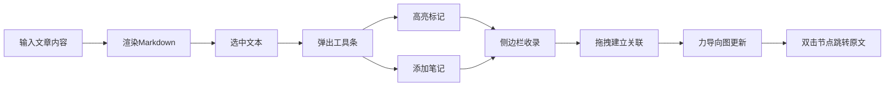

## 1. 产品概述

阅读笔记与高亮管理应用——帮助技术读者在阅读文章时快速摘录重点、记录想法，并将碎片笔记自动整理为结构化知识图谱的纯前端工具。解决阅读时高亮与笔记分散、难以建立关联的痛点，目标用户为技术文章深度读者与知识工作者。

## 2. 核心功能

### 2.1 功能模块

1. **笔记采集模块**：文章渲染、文本选中浮动工具条、高亮标记、笔记编辑
2. **知识关联模块**：高亮/笔记列表侧边栏、拖拽建立关联、力导向关系图可视化
3. **导出分享模块**：数据持久化（IndexedDB）

### 2.2 页面详情

| 页面名称 | 模块名称 | 功能描述 |
|----------|----------|----------|
| 主工作区 | 文章展示与高亮 | 渲染Markdown文章，鼠标选中文本弹出浮动工具条（高亮/笔记按钮），高亮区域黄色背景可叠加，悬停显示删除按钮 |
| 主工作区 | 笔记编辑 | 点击笔记按钮弹出圆角输入框，Enter提交笔记，笔记以卡片形式展示 |
| 右侧边栏 | 高亮与笔记列表 | 按文章段落顺序排列高亮和笔记卡片，卡片可拖拽排序、点击"关联到"按钮建立连线 |
| 左下角 | 力导向关系图 | 节点显示前20字符，大小随关联数变化，颜色随机静态，节点可拖拽固定，双击跳转原文位置，箭头连线带端点圆点 |

## 3. 核心流程

用户输入文章 → 阅读时选中文本 → 点击高亮/添加笔记 → 右侧边栏自动收录 → 拖拽建立高亮间关联 → 左下角实时更新力导向图 → 双击节点跳转原文

## 4. 用户界面设计

### 4.1 设计风格

- **主色调**：柔和暖色系，高亮黄 `rgba(255,255,0,0.3)`，悬停加深金黄
- **辅助色**：浅蓝边框 `#93c5fd`，磨砂玻璃半透明白
- **按钮风格**：圆角扁平，150ms缓动过渡
- **字体**：衬线字体 Georgia 用于文章正文，行高1.8，首行缩进2字符，段落间距1.5em
- **布局风格**：左右分栏（2/3主区 + 1/3侧边栏），移动端底部抽屉
- **动效**：悬停微过渡、卡片弹性动画、节点光晕闪烁

### 4.2 页面设计概览

| 页面名称 | 模块名称 | UI元素 |
|----------|----------|--------|
| 主工作区 | 文章区域 | 衬线字体、段落首行缩进、黄色高亮叠加、悬停金黄+删除按钮 |
| 主工作区 | 浮动工具条 | 高亮按钮、笔记按钮、跟随选中文本定位 |
| 主工作区 | 笔记输入框 | 浅灰背景、浅蓝边框、圆角、Enter提交 |
| 右侧边栏 | 卡片列表 | 磨砂玻璃背景、自定义滚动条、卡片拖拽阴影副本、弹性插入动画 |
| 左下角 | 关系图 | 力导向布局、可拖拽节点、箭头连线、双击跳转+光晕闪烁 |

### 4.3 响应式

桌面优先设计，屏幕宽度 < 768px 时侧边栏收窄为底部抽屉，点击展开按钮从底部滑入。

### 4.4 性能指标

- 高亮/笔记添加响应时间 ≤ 50ms
- 拖拽创建关联时力导向图帧率 ≥ 30fps
