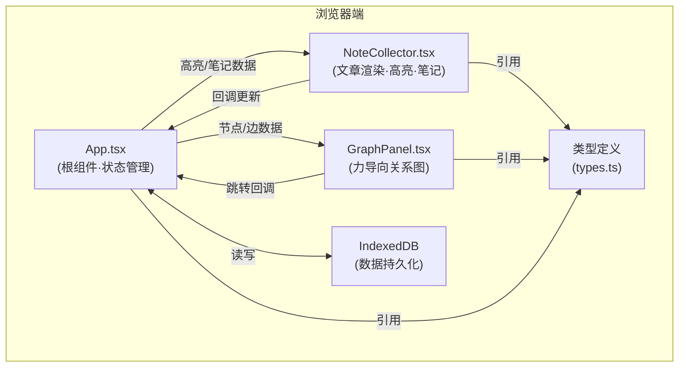
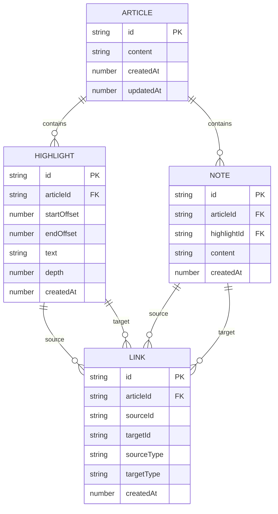

## 1. 架构设计



## 2. 技术说明

- **前端框架**：React 18 + TypeScript 5
- **构建工具**：Vite 5 + @vitejs/plugin-react
- **状态管理**：React useState/useReducer（组件内）
- **力导向图**：d3-force
- **唯一ID**：uuid
- **数据持久化**：IndexedDB（原生API封装）
- **样式方案**：原生CSS（CSS Modules）
- **后端**：无（纯前端应用）

## 3. 文件结构与调用关系

```
src/
├── main.tsx              # 入口，渲染App
├── App.tsx               # 根组件：文章state、高亮/笔记/关联管理、IndexedDB同步
├── types.ts              # 类型定义：Highlight, Note, Link, Article
├── db.ts                 # IndexedDB封装：初始化、CRUD操作
├── NoteCollector.tsx     # 子组件：文章渲染、文本选中、高亮、笔记编辑、侧边栏列表
├── GraphPanel.tsx        # 子组件：d3-force力导向图、节点拖拽、双击跳转
└── styles/
    ├── App.css           # 全局布局样式
    ├── NoteCollector.css # 高亮、工具条、笔记卡片样式
    └── GraphPanel.css    # 关系图SVG样式
```

**调用关系与数据流：**
1. `main.tsx` → `App.tsx`：挂载根组件
2. `App.tsx` → `NoteCollector.tsx`：props传递 articleText, highlights, notes, links 及回调 onAddHighlight, onAddNote, onRemoveHighlight, onCreateLink
3. `App.tsx` → `GraphPanel.tsx`：props传递 highlights, notes, links 及回调 onJumpToHighlight
4. `NoteCollector.tsx` → `App.tsx`：用户操作触发回调更新state
5. `GraphPanel.tsx` → `App.tsx`：双击节点触发跳转回调
6. `App.tsx` ↔ `db.ts`：组件挂载/state变更时读写IndexedDB
7. 所有组件 → `types.ts`：引用类型定义

## 4. 数据模型

### 4.1 数据模型定义



### 4.2 类型定义

```typescript
interface Article {
  id: string;
  content: string;
  createdAt: number;
  updatedAt: number;
}

interface Highlight {
  id: string;
  articleId: string;
  startOffset: number;
  endOffset: number;
  text: string;
  depth: number;
  createdAt: number;
}

interface Note {
  id: string;
  articleId: string;
  highlightId: string;
  content: string;
  createdAt: number;
}

interface Link {
  id: string;
  articleId: string;
  sourceId: string;
  targetId: string;
  sourceType: 'highlight' | 'note';
  targetType: 'highlight' | 'note';
  createdAt: number;
}
```

## 5. 性能优化策略

- 高亮渲染使用 CSS 类切换而非 DOM 重建
- d3-force simulation 在拖拽创建关联时仅更新 links 数据，不重建 simulation
- 侧边栏卡片使用 transform 过渡实现弹性动画
- IndexedDB 读写使用 requestIdleCallback 避免阻塞主线程
- 关系图节点数量过多时启用 canvas 渲染降级（预留扩展点）
