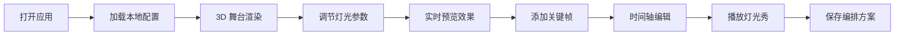

## 1. 产品概述

虚拟音乐节舞台灯光编排工具，让用户以 DJ 的方式通过可视化面板实时控制舞台多组灯光参数，并自动编排灯光秀动画循环播放。

- 面向创意工作者、音乐节爱好者、舞台灯光设计师
- 提供沉浸式 3D 舞台灯光编排体验，支持实时预览与关键帧动画

## 2. 核心功能

### 2.1 功能模块

1. **舞台渲染模块**：3D 透视立体舞台模型，6 组环绕式灯光组（聚光灯 + 点光源）
2. **灯光控制模块**：色相环选色、亮度调节、闪烁模式切换（常亮/呼吸/频闪/波浪）
3. **编排控制模块**：关键帧录制（最多 10 个）、时间轴编辑、过渡曲线、自动播放
4. **保存加载模块**：localStorage 持久化、随机方案生成

### 2.2 页面详情

| 页面名称 | 模块名称 | 功能描述 |
|---------|---------|---------|
| 主页面 | 3D 舞台区 | Three.js 渲染的立体舞台，6 组灯光实时响应控制 |
| 主页面 | 左侧控制面板 | 色相环选色器、亮度滑块、闪烁模式下拉、随机生成按钮 |
| 主页面 | 时间轴区域 | 关键帧缩略图列表、拖拽排序、时长调节、播放控制 |

## 3. 核心流程

用户打开应用 → 自动加载上次保存的编排方案 → 通过控制面板调节灯光参数 → 点击"添加关键帧"记录当前状态 → 在时间轴上调整关键帧顺序与过渡曲线 → 点击播放预览灯光秀 → 保存方案到本地

## 4. 用户界面设计

### 4.1 设计风格

- 主背景：深空灰 `#1a1a2e`
- 舞台区域：渐变蓝色光晕点缀
- 控制面板：半透明磨砂玻璃效果（毛玻璃质感 + 微边框）
- 交互元素：悬停时柔和光晕反馈 + 轻微上浮动画（位移 + 阴影）
- 时间轴：暗色卡片式布局，关键帧缩略图显示灯光快照

### 4.2 页面设计概述

| 页面名称 | 模块名称 | UI 元素 |
|---------|---------|---------|
| 主页面 | 整体布局 | 左右分栏，左侧控制面板 + 时间轴，右侧舞台渲染区 |
| 主页面 | 控制面板 | 色相环、滑块、下拉菜单、按钮，毛玻璃效果 |
| 主页面 | 时间轴 | 卡片式关键帧列表、拖拽排序、播放控件 |
| 主页面 | 3D 舞台 | 透视立体舞台、6 组彩色灯光、蓝色光晕 |

### 4.3 响应式

- 桌面端优先设计
- 左侧控制面板固定宽度，右侧舞台自适应

### 4.4 3D 场景指引

- 环境：深空背景，蓝色渐变雾气
- 灯光：6 组彩色灯光组（聚光灯 + 点光源），环绕舞台布置
- 相机：透视相机，固定视角，微幅摆动增加沉浸感
- 舞台：多个几何体拼接的立体舞台结构
- 后处理：光晕效果、轻微泛光
