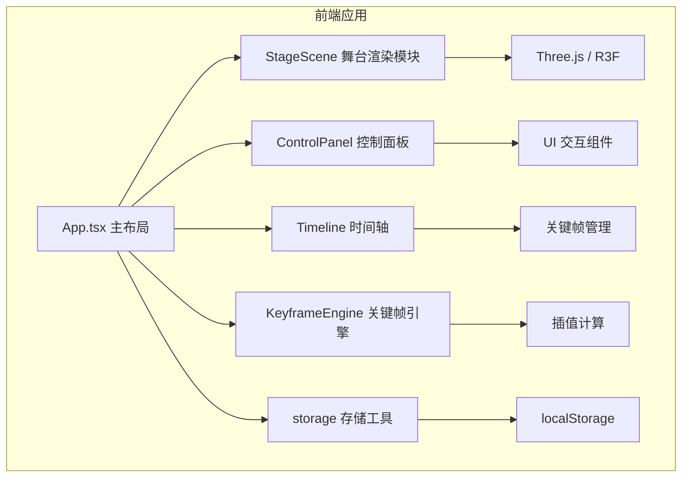

## 1. 架构设计



## 2. 技术描述

- **前端框架**：React 18 + TypeScript
- **构建工具**：Vite + @vitejs/plugin-react
- **3D 渲染**：Three.js + @react-three/fiber + @react-three/drei
- **状态管理**：React Hooks（useState、useRef、useEffect）
- **唯一 ID**：uuid
- **数据持久化**：localStorage

## 3. 模块划分

| 模块 | 文件路径 | 职责 |
|-----|---------|-----|
| 舞台渲染 | `src/stage/StageScene.tsx` | Three.js 场景搭建、灯光组管理、实时渲染 |
| 控制面板 | `src/control/ControlPanel.tsx` | 色相环选色、亮度滑块、闪烁模式、随机生成 |
| 时间轴 | `src/control/Timeline.tsx` | 关键帧列表、拖拽排序、时长调节、播放控制 |
| 关键帧引擎 | `src/control/KeyframeEngine.ts` | 关键帧存储、插值计算（线性/缓入缓出）、播放控制 |
| 存储工具 | `src/utils/storage.ts` | localStorage 读写、随机方案生成 |
| 主应用 | `src/App.tsx` | 整体布局、状态管理、模块间数据流 |

## 4. 数据模型

### 4.1 灯光参数 (LightParams)

```typescript
interface LightParams {
  hue: number;        // 色相 0-360
  saturation: number; // 饱和度 0-100
  brightness: number; // 亮度 0-100
  pattern: 'static' | 'breathing' | 'strobe' | 'wave'; // 闪烁模式
  patternSpeed: number; // 闪烁速度
}
```

### 4.2 关键帧 (Keyframe)

```typescript
interface Keyframe {
  id: string;
  duration: number;      // 持续时间 ms
  easing: 'linear' | 'easeInOut'; // 过渡曲线
  lights: LightParams[]; // 6 组灯光参数
}
```

### 4.3 编排方案 (LightShowProject)

```typescript
interface LightShowProject {
  version: string;
  createdAt: number;
  keyframes: Keyframe[];
  currentLightIndex: number;
}
```

## 5. 数据流

1. **控制流向**：用户操作 ControlPanel → 更新 App 状态 → 同步到 StageScene 实时渲染
2. **关键帧录制**：点击添加关键帧 → 捕获当前灯光状态 → 推入 keyframes 数组 → Timeline 重新渲染
3. **播放流向**：点击播放 → KeyframeEngine 按时间轴插值计算 → 回调更新灯光参数 → StageScene 实时响应
4. **存储流向**：保存 → 序列化到 localStorage；加载 → 从 localStorage 反序列化 → 恢复应用状态
