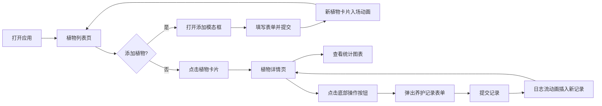

## 1. 产品概述

智能植物养护管理与日志分析应用，帮助阳台养花爱好者系统记录植物的浇水、施肥和光照情况，生成养护历史图表，实现科学养护管理。

- 核心价值：解决用户养护计划混乱的问题，提供可视化养护记录和智能提醒
- 目标用户：个人阳台养花爱好者、园艺初学者
- 产品定位：纯前端本地运行的轻量级植物养护管理工具

## 2. 核心功能

### 2.1 功能模块

1. **植物管理模块**：添加、查看、管理多盆植物，支持植物卡片展示
2. **养护记录模块**：记录浇水、施肥、修剪、转盆等养护操作
3. **统计分析模块**：浇水频率分布、施肥趋势、光照时长统计图表
4. **搜索过滤模块**：全局搜索植物，支持多种排序和筛选方式
5. **提醒通知模块**：浇水/施肥周期提醒，逾期标记和通知

### 2.2 页面详情

| 页面名称 | 模块名称 | 功能描述 |
|---------|---------|----------|
| 主页面（植物列表） | 顶部搜索栏 | 植物名称/种类搜索，过滤按钮（浇水周期排序、最近养护、按种类分组） |
| 主页面（植物列表） | 添加植物按钮 | 弹出顶部滑入的添加植物表单模态框 |
| 主页面（植物列表） | 植物卡片网格 | 瀑布流卡片展示，显示植物图标、名称、下次提醒倒计时、逾期标记 |
| 植物详情页 | 顶部毛玻璃头图 | 渐变色块背景，植物名和品种水印 |
| 植物详情页 | 统计图表区 | 三个可切换图表（浇水柱状图、施肥折线图、光照饼图） |
| 植物详情页 | 养护日志流 | 时间线展示养护记录，新记录带动画插入 |
| 植物详情页 | 底部操作栏 | 四个圆形操作按钮（浇水/施肥/修剪/转盆） |
| 全局 | 添加植物模态框 | 从顶部滑入，表单包含名称、种类、购买日期、浇水/施肥周期、光照需求 |
| 全局 | 养护记录迷你表单 | 从底部上滑，毛玻璃背景，选择时间和备注 |

## 3. 核心流程

用户打开应用 → 查看植物列表（含提醒状态）→ 添加新植物或点击进入详情 → 在详情页记录养护操作 → 查看统计图表分析养护趋势

## 4. 用户界面设计

### 4.1 设计风格

- **主色调**：草木绿 #4CAF50（生机、自然）
- **辅助色**：土棕 #8D6E63（土地、温暖）
- **背景色**：米白 #F5F0E8（柔和、舒适）
- **卡片样式**：白色圆角 12px，阴影 0 2px 8px rgba(0,0,0,0.08)，宽高比 3:2
- **字体**：Inter 字体，移动端自适应字号
- **动画风格**：250ms cubic-bezier 平滑过渡，悬停上浮 4px 加深阴影

### 4.2 页面设计概览

| 页面名称 | 模块名称 | UI 元素 |
|---------|---------|--------|
| 主页面 | 搜索栏 | 圆角输入框、金色虚线高亮、三个过滤按钮 |
| 主页面 | 植物卡片 | 左 SVG 图标、右名称+倒计时、右上角脉冲红点逾期标记 |
| 详情页 | 顶部头图 | 毛玻璃渐变背景、水印文字 |
| 详情页 | 图表区 | 半透明磨砂色块、300ms 渐变切换动画 |
| 详情页 | 日志流 | 时间线布局、淡入+左侧滑入动画 |
| 详情页 | 操作栏 | 圆形按钮（蓝/绿/橙/紫）、悬停缩放动画 |

### 4.3 响应式设计

- 桌面端：卡片瀑布流多列布局
- 移动端（480px 以下）：卡片单列布局
- 触屏优化：按钮最小尺寸 44px，操作区域充足

### 4.4 动效设计

- 卡片入场：缩放入场动画（从顶部添加时）
- 悬停效果：translateY(-4px) + 阴影加深
- 图表切换：300ms 平滑渐变过渡
- 搜索过滤：渐隐淡出 + 弹性重排
- 逾期提醒：红色脉冲圆点（4px-8px 循环）
- 日志插入：淡入 + 左侧滑入
