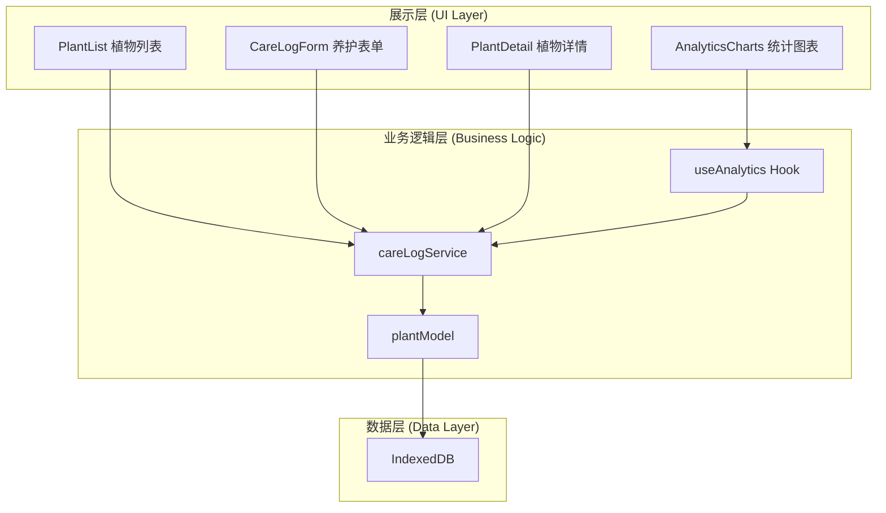
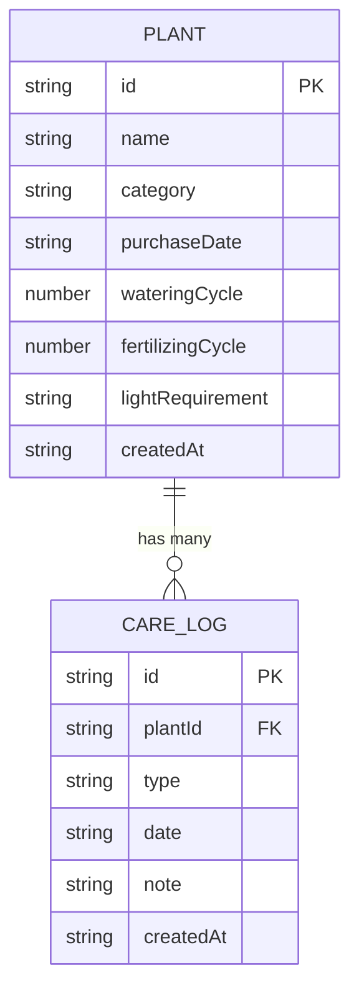

## 1. 架构设计

纯前端单页应用，数据通过 IndexedDB 本地持久化，无需后端服务。



## 2. 技术选型

- **前端框架**：React 18 + TypeScript
- **构建工具**：Vite + @vitejs/plugin-react
- **路由管理**：react-router-dom
- **图表库**：recharts（Canvas 模式渲染）
- **数据持久化**：IndexedDB（原生 API 封装）
- **工具库**：uuid（唯一ID）、date-fns（日期处理）
- **样式方案**：原生 CSS + CSS Modules（按组件组织）

## 3. 目录结构

```
src/
├── main.tsx                    # 应用入口，初始化 IndexedDB
├── plantManager/
│   ├── core/
│   │   ├── plantModel.ts       # 植物数据模型与接口定义
│   │   └── careLogService.ts   # 养护记录服务（IndexedDB CRUD）
│   ├── components/
│   │   ├── PlantList.tsx       # 植物列表组件
│   │   ├── PlantCard.tsx       # 植物卡片组件
│   │   └── AddPlantModal.tsx   # 添加植物模态框
│   └── pages/
│       └── PlantDetail.tsx     # 植物详情页
├── analyticsModules/
│   ├── hooks/
│   │   └── useAnalytics.ts     # 统计分析 Hook
│   └── components/
│       └── AnalyticsCharts.tsx # 图表组件
├── shared/
│   ├── types.ts                # 共享类型定义
│   └── utils.ts                # 工具函数
└── styles/
    └── global.css              # 全局样式与 CSS 变量
```

**调用关系和数据流向**：
1. `main.tsx` → 初始化 IndexedDB → 挂载根组件
2. `PlantList.tsx` → 调用 `careLogService` 获取植物列表 → 渲染 `PlantCard`
3. `PlantDetail.tsx` → 调用 `careLogService` 获取单植物及日志 → 渲染图表和日志流
4. `CareLogForm.tsx` → 接收 plantId → 提交时调用 `careLogService.addLog()`
5. `useAnalytics.ts` → 从 `careLogService` 读取数据 → 计算聚合结果 → 供 recharts 消费
6. `careLogService.ts` → 封装 IndexedDB 操作 → 使用 `plantModel` 定义的数据结构

## 4. 数据模型

### 4.1 数据结构定义



### 4.2 Plant 接口字段

| 字段 | 类型 | 说明 |
|-----|------|------|
| id | string | UUID 唯一标识 |
| name | string | 植物名称 |
| category | string | 种类（多肉/观叶/开花/其他） |
| purchaseDate | string | 购买日期（ISO 格式） |
| wateringCycle | number | 浇水周期（天） |
| fertilizingCycle | number | 施肥周期（天） |
| lightRequirement | string | 光照需求（低/中/高） |
| lastWateringDate | string | 上次浇水时间 |
| lastFertilizingDate | string | 上次施肥时间 |
| createdAt | string | 创建时间 |

### 4.3 CareLog 接口字段

| 字段 | 类型 | 说明 |
|-----|------|------|
| id | string | UUID 唯一标识 |
| plantId | string | 关联植物 ID |
| type | string | 类型（watering/fertilizing/pruning/rotating） |
| date | string | 操作时间（ISO 格式） |
| note | string | 备注 |
| createdAt | string | 创建时间 |

## 5. 性能优化策略

1. **IndexedDB 查询优化**：使用索引加速按 plantId、date、type 的查询
2. **图表计算性能**：聚合计算在 20ms 内完成，使用 memoization 缓存结果
3. **Canvas 渲染**：recharts 使用 Canvas 模式，1000 条记录保持 30fps+
4. **虚拟列表**：养护日志流使用虚拟滚动（如数据量大时）
5. **React 优化**：使用 useMemo/useCallback 避免不必要重渲染
6. **动画性能**：优先使用 transform 和 opacity 属性实现动画

## 6. 路由定义

| 路由 | 页面 | 说明 |
|-----|------|------|
| / | 植物列表页 | 首页，展示所有植物卡片 |
| /plant/:id | 植物详情页 | 展示单植物详情、图表、日志 |
