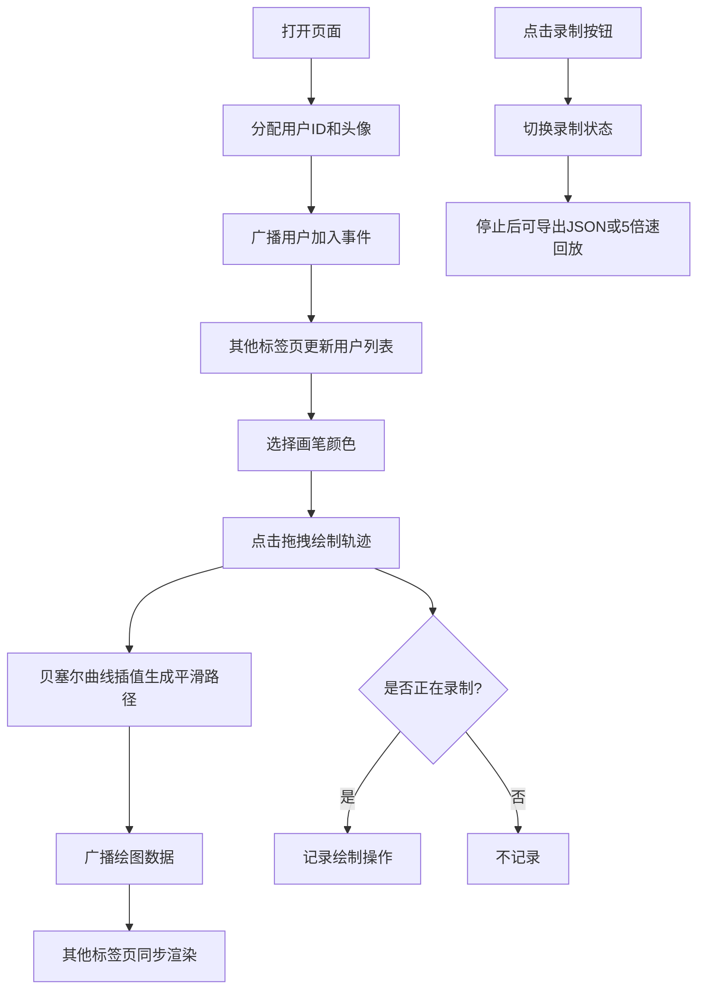

## 1. 产品概述
多人在线协作涂鸦画板，支持同一浏览器多个标签页用户在同一张画布上实时涂鸦，看到彼此的画笔轨迹，并支持录制与回放涂鸦过程。
- 主要用途：多人协作绘画、教学演示、头脑风暴可视化
- 目标用户：设计师、教师、学生、创意工作者
- 产品价值：零配置即时协作，支持涂鸦过程录制回放，便于复盘和分享

## 2. 核心功能

### 2.1 用户角色
无需登录注册，每个标签页自动分配一个用户身份。

| 角色 | 注册方式 | 核心权限 |
|------|---------|---------|
| 访客用户 | 打开页面自动分配 | 绘制、查看他人轨迹、录制、导入导出、回放 |

### 2.2 功能模块
1. **主画布区域**：Canvas绘图、颜色选择、画笔预览、实时绘制
2. **在线用户列表**：用户头像、用户名、加入/离开动画
3. **录制与回放控制**：录制按钮、进度条、导入导出、5倍速回放

### 2.3 页面详情

| 页面名称 | 模块名称 | 功能描述 |
|---------|---------|---------|
| 主页面 | 画布绘图 | 鼠标移动显示预览光标，点击拖拽绘制贝塞尔曲线轨迹，松开后带光晕效果，接收其他标签页的实时绘制数据 |
| 主页面 | 颜色选择器 | 12种预设色块，点击平滑切换颜色（100ms过渡），选中色块外圈发光 |
| 主页面 | 在线用户列表 | 右上角显示，自动生成几何头像，用户进出淡入淡出动画（300ms） |
| 主页面 | 录制控制 | 点击开始/停止录制，进度条显示录制进度，支持导出JSON、导入JSON、5倍速回放 |

## 3. 核心流程

用户打开页面 → 自动分配用户ID和头像 → 通过BroadcastChannel广播加入事件 → 其他标签页更新在线用户列表 → 用户选择颜色 → 在画布上点击拖拽绘制 → 绘制数据实时广播到其他标签页 → 用户点击录制按钮开始记录 → 绘制操作被记录 → 再次点击停止录制 → 可选择导出JSON文件或在画布上5倍速回放

## 4. 用户界面设计

### 4.1 设计风格
- 主色调：浅灰色背景 (#f5f5f5)，白色画布，深灰色文字
- 强调色：12种预设画笔颜色（黑、红、橙、黄、绿、青、蓝、紫、粉、棕、灰、深灰）
- 按钮样式：圆角矩形（8px圆角），悬停背景变深，150ms ease-out过渡
- 字体：系统默认无衬线字体，简洁现代
- 布局：顶栏 + 居中画布 + 底栏控制区
- 图标：简单的SVG图标，风格统一

### 4.2 页面设计概述

| 页面名称 | 模块名称 | UI元素 |
|---------|---------|--------|
| 主页面 | 顶栏 | 白色背景，应用标题，右上角在线用户列表（头像缩略图+用户名，300ms淡入淡出动画） |
| 主页面 | 画布区域 | 居中显示，1px浅灰色边框，细微阴影，纯白色背景，光标旁圆形画笔预览 |
| 主页面 | 颜色选择器 | 12个色块横排，选中时外圈发光，颜色切换100ms平滑过渡 |
| 主页面 | 底栏 | 白色背景，录制按钮（状态切换），进度条，导入/导出按钮，回放控制 |

### 4.3 响应性
- 桌面端优先设计
- 画布自适应可用空间，最小尺寸 800x600
- 颜色选择器在窄屏下自动换行

### 4.4 动效细节
- 颜色切换：100ms平滑过渡
- 用户进出：300ms淡入淡出动画
- 按钮悬停：150ms ease-out背景色过渡
- 画笔轨迹光晕：200ms渐变消失
- 回放动画：流畅帧率 >= 30fps
