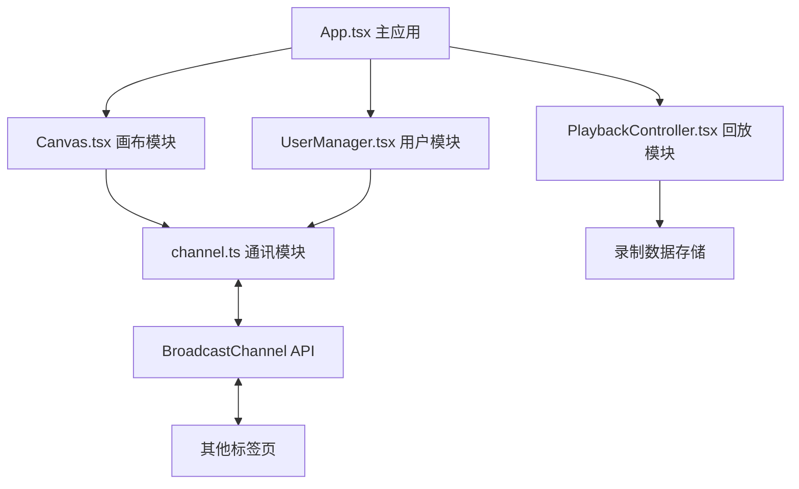

## 1. 架构设计



## 2. 技术描述
- 前端框架：React@18 + TypeScript
- 构建工具：Vite
- 通信机制：BroadcastChannel API（浏览器原生，支持同域多标签页通信）
- 绘图技术：HTML5 Canvas 2D API
- 状态管理：React useState/useRef（轻量级状态，无需额外状态库）

## 3. 文件结构
```
d:\P\tasks\auto93/
├── package.json
├── index.html
├── tsconfig.json
├── vite.config.js
└── src/
    ├── main.tsx
    ├── App.tsx
    ├── canvas/
    │   └── Canvas.tsx
    ├── broadcast/
    │   └── channel.ts
    ├── users/
    │   └── UserManager.tsx
    └── playback/
        └── PlaybackController.tsx
```

## 4. 数据格式定义

### 4.1 绘图点数据
```typescript
interface DrawPoint {
  x: number;
  y: number;
  color: string;
  size: number;
  timestamp: number;
}
```

### 4.2 绘图轨迹（消息格式）
```typescript
interface DrawStrokeMessage {
  type: 'draw';
  userId: string;
  points: DrawPoint[];
  strokeId: string;
}
```

### 4.3 用户进出消息
```typescript
interface UserJoinMessage {
  type: 'user-join';
  user: OnlineUser;
}

interface UserLeaveMessage {
  type: 'user-leave';
  userId: string;
}
```

### 4.4 在线用户数据
```typescript
interface OnlineUser {
  id: string;
  name: string;
  avatarColor: string;
  avatarPattern: number[]; // 用于生成几何图案的种子数据
}
```

### 4.5 录制数据
```typescript
interface RecordingData {
  strokes: {
    strokeId: string;
    userId: string;
    points: DrawPoint[];
  }[];
  startTime: number;
  endTime: number;
}
```

## 5. 核心算法

### 5.1 贝塞尔曲线插值
使用二次贝塞尔曲线对鼠标移动点进行平滑处理：
- 以相邻三点的中点作为控制点
- 每段曲线点数不超过20个
- 保证轨迹平滑且性能可控

### 5.2 头像生成算法
- 基于用户ID生成伪随机数种子
- 生成 5x5 的对称几何图案
- 每个用户有独特的配色方案

### 5.3 回放控制
- 使用 requestAnimationFrame 实现平滑动画
- 5倍速播放：将时间戳差值乘以5
- 旧轨迹淡出：根据时间进度调整 globalAlpha
- 目标帧率：>= 30fps

## 6. 性能指标
- 实时广播延迟：<= 150ms（BroadcastChannel原生支持，通常<50ms）
- 重放帧率：>= 30fps
- 单次绘制轨迹点数：<= 20点（贝塞尔插值后）
- 内存占用：录制数据存储在内存中，支持导出清理
