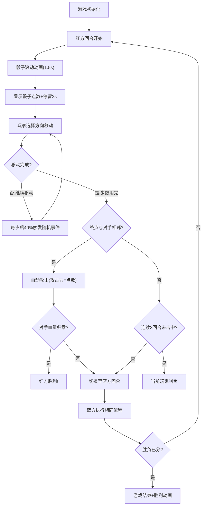

## 1. 产品概述
骰子争锋是一款融合运气与策略的回合制棋盘对战游戏，两位玩家在8x8魔幻棋盘上通过掷骰子进行移动与攻击，平衡随机惊喜与策略决策。
- 核心目标：解决纯随机游戏缺乏策略性、纯策略游戏缺少惊喜的痛点，打造兼具深度与乐趣的对战体验
- 目标用户：桌面游戏爱好者、休闲对战玩家、策略游戏玩家

## 2. 核心特性

### 2.1 用户角色
| 角色 | 注册方式 | 核心权限 |
|------|----------|----------|
| 红方玩家 | 本地双人模式 | 操控红色角色，执行回合操作 |
| 蓝方玩家 | 本地双人模式 | 操控蓝色角色，执行回合操作 |

### 2.2 功能模块
1. **游戏主界面**：Canvas棋盘渲染、玩家角色显示、血条UI、回合信息栏、事件日志
2. **骰子系统**：3D感骰子滚动动画、音效生成、点数决定移动与攻击
3. **移动系统**：格点移动、路径高亮、轨迹线绘制、自动攻击判定
4. **随机事件系统**：陷阱(扣血)、加速(保底骰子)、回血(恢复生命)
5. **战斗系统**：相邻攻击、伤害计算、攻击特效、角色受击反馈
6. **胜负判定**：生命归零判负、连续3回合未击中判负、胜利动画

### 2.3 功能详情
| 模块名称 | 子功能 | 功能描述 |
|-----------|-------------|---------------------|
| 骰子系统 | 骰子动画 | 骰子从屏幕上方旋转落入棋盘中央，持续1.5秒，停留2秒后显示点数 |
| 骰子系统 | 音效生成 | 使用Web Audio API生成短促咔哒声，伴随骰子滚动播放 |
| 移动系统 | 路径高亮 | 移动时角色格子高亮，路径显示半透明虚线轨迹 |
| 移动系统 | 自动攻击 | 移动终点与对手相邻时自动触发攻击，攻击力=骰子点数 |
| 随机事件 | 事件触发 | 每步移动后40%概率触发三类事件之一 |
| 随机事件 | 视觉反馈 | 格子闪烁对应颜色图标，持续整个回合 |
| 战斗系统 | 攻击特效 | 彩色光球飞射+粒子爆炸，受击角色闪红抖动0.3秒 |
| 战斗系统 | 低血量警示 | 生命值<3时角色周围脉动红色光环，周期1秒 |
| 胜负判定 | 胜利结算 | 全屏蒙层+胜者文字放大弹出+彩色粒子散落 |
| UI系统 | 响应式缩放 | 棋盘整体随视口等比例缩放，保持长宽比 |

## 3. 核心流程
游戏启动后，红方先手开始回合：自动播放骰子动画→显示点数→玩家根据点数移动→每步检查随机事件→终点判断是否相邻攻击→回合结束切换玩家。循环直至一方生命归零或连续3回合未击中。

## 4. 用户界面设计

### 4.1 设计风格
- **主题风格**：深色魔幻风格，营造神秘棋盘对战氛围
- **主色调**：深褐色木纹(#3E2723, #4E342E) + 金色边线(#FFD700) + 暖色调格子渐变
- **玩家色**：胭脂红(#C0392B) vs 矢车菊蓝(#2980B9)
- **字体**：标题使用奇幻风格衬线体，正文使用清晰无衬线体，白色为主
- **质感层次**：Canvas绘制木纹渐变纹理、格子金边包裹、起始格金色皇冠标记

### 4.2 界面布局
| 区域 | 元素 | UI细节 |
|-----------|-------------|-------------|
| 顶部栏 | 回合信息 | 当前玩家名称+骰子点数，居中醒目显示 |
| 顶部栏 | 双方生命值 | 左右两侧显示玩家头像+血条数值 |
| 顶部栏 | 事件日志 | 左侧滚动条，半透明黑色背景白色文字，左对齐 |
| 中央区域 | 8x8棋盘 | 深褐木纹背景+暖色调格子+细金边线，起始格四角金色皇冠 |
| 棋盘上 | 玩家角色 | 圆形头像+中心白色眼睛高光+头顶40x6px血条 |
| 棋盘上 | 路径轨迹 | 红/蓝色2px宽虚线，半透明显示移动路径 |
| 游戏结束 | 胜利蒙层 | 全屏半透明遮罩+中央放大弹出的"胜者"文字+彩色粒子 |

### 4.3 响应式设计
- 桌面优先设计，棋盘整体以Canvas容器为基准等比例缩放
- 保持1:1长宽比，最大程度利用视口空间，左右或上下居中显示
- 顶部UI栏采用flex布局自适应宽度，事件日志区域支持垂直滚动

### 4.4 动画与特效
- **骰子动画**：Canvas模拟3D旋转+透视投影，从上方抛物线下落
- **攻击特效**：光球使用径向渐变，爆炸粒子带随机速度和生命周期
- **陷阱闪光**：格子填充红色闪烁遮罩+警告图标缩放动画
- **低血量光环**：sin函数驱动半径脉动，外扩5px周期1秒
- **胜利文字**：scale从0.3弹至1.2再回至1.0，配合彩色粒子喷发
