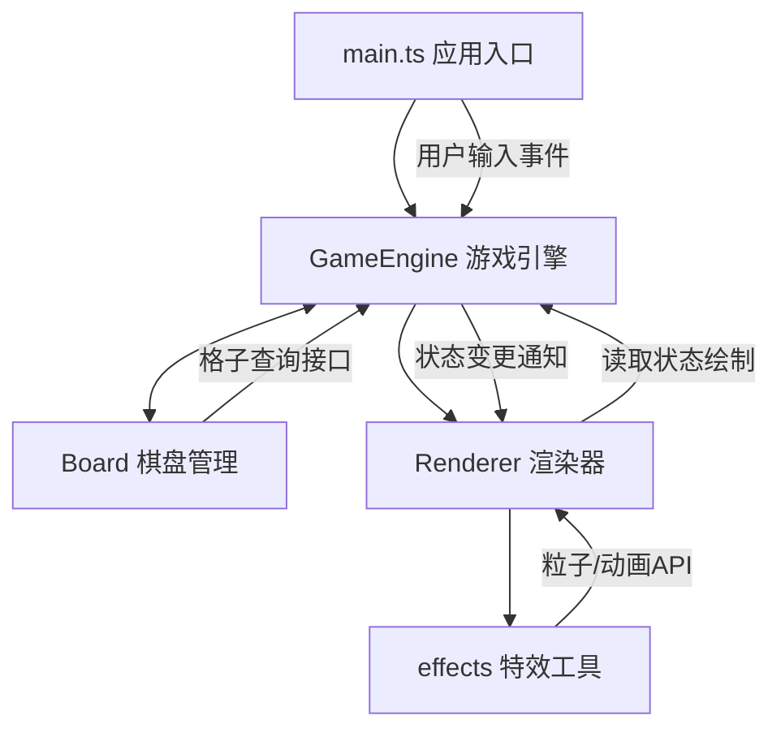
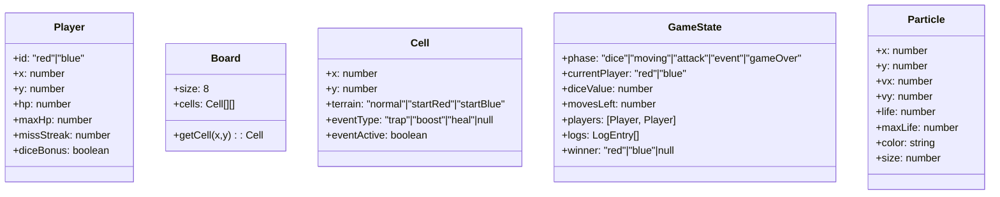

## 1. 架构设计
采用模块化分层架构，职责分离明确：入口层(main) → 逻辑层(GameEngine, Board) → 渲染层(Renderer, effects)，数据单向流动，通过状态订阅通知重绘。



## 2. 技术栈说明
- **前端框架**：TypeScript 5 + Vite 5，无需额外UI框架，原生HTML5 Canvas渲染
- **构建工具**：Vite 5，使用默认esbuild构建器，TypeScript严格模式
- **TypeScript配置**：target ES2020，strict模式，moduleResolution bundler
- **音频系统**：原生Web Audio API，程序化合成骰子咔哒声
- **渲染系统**：HTML5 Canvas 2D Context，无第三方图形库，自行实现粒子系统
- **性能优化**：Canvas离屏缓存木纹背景，requestAnimationFrame节流粒子更新

## 3. 目录结构
```
auto95/
├── package.json              # 依赖配置: typescript, vite
├── vite.config.js            # Vite构建配置
├── tsconfig.json             # TS严格模式, ES2020
├── index.html                # 入口页面, Canvas容器+viewport
└── src/
    ├── main.ts               # 应用入口: 初始化引擎+事件绑定+渲染循环
    ├── game/
    │   ├── GameEngine.ts     # 核心逻辑: 状态机/回合/骰子/移动/攻击/事件/胜负
    │   └── Board.ts          # 棋盘: 8x8格子/地形/事件位置/查询接口
    └── rendering/
        ├── Renderer.ts       # 渲染主模块: 每帧draw, 从Engine读状态绘制
        └── effects.ts        # 特效工具: 骰子动画/攻击粒子/陷阱闪光等
```

## 4. 数据流向定义

| 阶段 | 数据流方向 | 说明 |
|------|-----------|------|
| 初始化 | main → GameEngine → Board → Renderer | main创建Engine，Engine创建Board并注册Renderer |
| 用户输入 | main(事件监听) → GameEngine.handleInput() | 键盘/点击输入传递给引擎处理 |
| 骰子阶段 | GameEngine 内部状态机 | 生成1-6随机数，通知Renderer播放骰子动画 |
| 移动阶段 | GameEngine → Board.getCell() → 更新玩家坐标 | 引擎查询棋盘合法性，更新玩家状态 |
| 事件触发 | GameEngine → Board.getEvent() → 更新玩家HP/状态 | 每步后40%概率，引擎计算事件影响 |
| 攻击判定 | GameEngine 计算坐标距离 → 扣血 | 曼哈顿距离=1时触发，攻击力=骰子点数 |
| 渲染更新 | GameEngine.state → Renderer.draw() → effects.* | 每帧Renderer读取最新状态并调用特效绘制 |
| 胜负判定 | GameEngine 状态机 → 通知渲染胜利蒙层 | 血量≤0 或 连续3回合未命中 → gameOver |

## 5. 数据模型

### 5.1 核心类型定义



### 5.2 关键算法说明
1. **骰子动画**：使用CSS 3D变换思想在Canvas中模拟，每帧更新旋转角度(rotateX/Y)，透视投影计算顶面显示数字
2. **移动路径**：玩家每选择方向更新坐标，将每步坐标存入path数组，Renderer绘制虚线连接path点集
3. **随机事件**：Math.random() < 0.4 触发，事件类型再次随机三等分概率
4. **相邻判定**：`Math.abs(p1.x-p2.x) + Math.abs(p1.y-p2.y) === 1`
5. **粒子系统**：对象池复用Particle，每帧update(life--, x+=vx, y+=vy)，life<=0回收
6. **血条动画**：记录previousHp与targetHp，每帧线性插值更新displayHp，动画时长0.5秒
7. **棋盘缩放**：监听resize，计算min(viewportW, viewportH)，设置canvas.width/height并save/restore scale变换

## 6. 性能保障策略
- **背景缓存**：木纹棋盘只绘制一次到离屏Canvas，主循环直接drawImage贴图
- **粒子上限**：同时活跃粒子数控制在200以内，超出优先淘汰最老的
- **日志裁剪**：事件日志仅保留最近20条，超出删除队首
- **状态节流**：用户输入防抖，骰子动画期间忽略移动输入防止误操作
- **帧率监控**：通过Date.now()计算帧间隔，低于30FPS时减少粒子数量和动画复杂度
