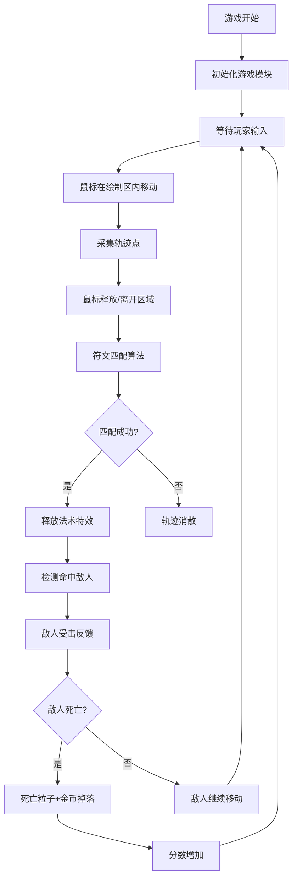

## 1. 产品概述

魔法符文战斗游戏是一款基于鼠标轨迹绘制的休闲动作游戏。玩家通过在圆形绘制区内按照特定图案滑动鼠标来绘制能量符文，成功绘制后释放对应法术攻击从左侧出现的敌人。游戏融合了手势识别、粒子特效和策略元素，为玩家提供沉浸式的魔法战斗体验。

## 2. 核心功能

### 2.1 符文绘制系统
- 中央圆形绘制区域，带淡金色发光圆环
- 鼠标移动产生发光轨迹，带粒子拖尾效果
- 轨迹颜色根据法术类型变化（火焰红、冰霜蓝、雷电黄）
- 轨迹1.5秒后逐渐消散

### 2.2 符文识别与法术系统
- 6种基础符文图案：三角形、正方形、五角星、螺旋、闪电、新月
- 每种符文对应一个法术，右侧法术栏以半透明卡牌形式展示
- 可用符文有明亮边框，不可用符文呈灰色并带锁链旋转动画
- 绘制成功后卡牌闪烁金光，伴随法杖敲击音效（Web Audio生成）
- 绘制区向外扩散对应颜色冲击波（0.6秒）
- 绘制精度和速度决定法术威力

### 2.3 敌人系统
- 敌人从屏幕左侧随机间隔出现
- 骷髅或元素生物轮廓的浮动实体
- 头顶显示生命值条，受击后200ms平滑减少
- 受击时向后弹退，半透明红色闪烁两次（每次100ms）
- 击败后碎成彩色粒子消散，掉落旋转金币飞向分数栏

### 2.4 UI与视觉效果
- 中世纪羊皮纸风格，深褐色主色调
- 背景颗粒纹理和缓慢飘动的魔法粒子
- 分数栏数字弹跳放大动画（bounce 0.4s）
- 60FPS流畅度，粒子数量不超过500个

## 3. 核心流程

## 4. 用户界面设计

### 4.1 设计风格
- **主色调**：深褐色（#2d1f0f）羊皮纸风格
- **辅助色**：淡金色（#d4a84b）装饰边框
- **法术颜色**：火焰红（#ff4500）、冰霜蓝（#00bfff）、雷电黄（#ffd700）
- **字体**：中世纪风格衬线字体
- **背景**：颗粒纹理 + 漂浮魔法粒子

### 4.2 页面布局
| 区域 | 位置 | 功能描述 |
|------|------|----------|
| 绘制区 | 屏幕中央 | 圆形符文绘制区域，带金色光环 |
| 法术栏 | 屏幕右侧 | 6张法术卡牌，竖向排列 |
| 分数栏 | 屏幕右上角 | 金币图标 + 分数数字 |
| 敌人生成区 | 屏幕左侧 | 敌人从左向右移动 |
| 背景层 | 全屏 | 羊皮纸纹理 + 漂浮粒子 |

### 4.3 动画效果
- 轨迹消散：1.5秒淡出
- 冲击波：0.6秒向外扩散
- 受击闪烁：2次×100ms红色半透明
- 金币飞行动画：曲线飞向分数栏
- 分数弹跳：bounce 0.4s放大动画
- 卡牌金光：成功绘制时闪烁
- 锁链旋转：不可用法术的动画

### 4.4 响应式
- 桌面端优先，Canvas自适应窗口大小
- 绘制区保持正圆形，居中显示
