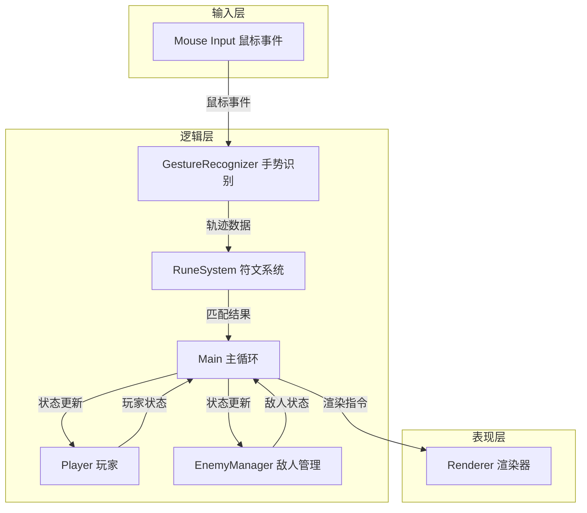

## 1. 架构设计



## 2. 技术栈描述

- **前端框架**：原生 TypeScript + HTML5 Canvas 2D
- **构建工具**：Vite 5.x
- **语言标准**：TypeScript 5.x (strict mode, target ES2020, module ESNext)
- **音频**：Web Audio API（生成法杖敲击音效）
- **动画**：requestAnimationFrame 驱动
- **状态管理**：模块化事件通信

## 3. 模块文件结构

```
project/
├── package.json          # 项目依赖与脚本
├── vite.config.js        # Vite 配置
├── tsconfig.json         # TypeScript 配置
├── index.html            # 入口页面
└── src/
    ├── main.ts           # 游戏主循环、全局状态、帧率控制
    ├── input/
    │   └── gesture-recognizer.ts  # 鼠标事件、轨迹采集、符文匹配
    ├── entities/
    │   ├── player.ts     # 玩家状态、法术选择、法力值
    │   ├── enemy.ts      # 敌人生成、移动、生命值、受击反馈
    │   └── rune-system.ts # 符文定义、验证、法术效果计算
    └── rendering/
        └── renderer.ts   # 场景渲染、粒子系统、UI绘制
```

## 4. 核心数据结构

### 4.1 符文定义
```typescript
interface Rune {
  id: string;
  name: string;
  icon: string;
  color: string;
  type: 'fire' | 'ice' | 'lightning';
  pattern: Point[];
  damage: number;
  cooldown: number;
  unlocked: boolean;
}
```

### 4.2 轨迹点
```typescript
interface Point {
  x: number;
  y: number;
  timestamp: number;
}
```

### 4.3 敌人
```typescript
interface Enemy {
  id: number;
  x: number;
  y: number;
  hp: number;
  maxHp: number;
  speed: number;
  type: 'skeleton' | 'fire_elemental' | 'ice_elemental';
  hitFlashTime: number;
  knockback: number;
  alive: boolean;
}
```

### 4.4 粒子
```typescript
interface Particle {
  x: number;
  y: number;
  vx: number;
  vy: number;
  life: number;
  maxLife: number;
  color: string;
  size: number;
  type: 'trail' | 'death' | 'coin' | 'ambient';
}
```

## 5. 核心算法

### 5.1 符文匹配算法
1. **轨迹归一化**：将采集的轨迹点缩放到标准尺寸并居中
2. **重采样**：将轨迹重采样为固定数量的点（如64个）
3. **特征提取**：计算轨迹的方向序列、角度变化
4. **相似度计算**：与预设符文模板进行点集匹配（使用DTW或Fréchet距离简化版）
5. **阈值判断**：相似度超过阈值则匹配成功

### 5.2 法术威力计算
```
威力 = 基础伤害 × 精度系数 × 速度系数
精度系数 = 0.5 + 0.5 × 相似度
速度系数 = max(0.5, min(2.0, 最优时间 / 实际绘制时间))
```

## 6. 性能优化策略

- **粒子池**：对象池复用粒子，避免频繁GC
- **粒子上限**：最多500个粒子，超出则回收最老的
- **离屏Canvas**：背景纹理预渲染
- **空间分区**：敌人碰撞检测优化
- **requestAnimationFrame**：统一动画驱动
- **增量渲染**：仅更新变化区域

## 7. 事件通信

模块间通过自定义事件解耦：
- `runeMatched`：符文匹配成功
- `enemyHit`：敌人被击中
- `enemyDeath`：敌人死亡
- `scoreAdded`：分数增加
- `spellCast`：法术释放
