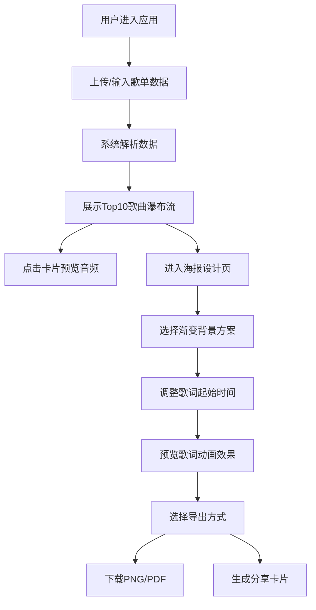

## 1. 产品概述
年度听歌报告海报生成器 - 让用户通过上传歌单数据，自动分析听歌偏好并生成具有动态光效和歌词排版的个性化视觉海报，支持分享和下载。

- 核心价值：将用户的音乐记忆转化为可分享的视觉艺术作品
- 目标用户：音乐爱好者、Spotify/网易云音乐等流媒体平台用户
- 市场价值：满足用户年度总结、社交分享的情感需求

## 2. 核心功能

### 2.1 功能模块
1. **数据输入页**：歌单数据上传/手动输入、Top10歌曲展示、15秒音频预览
2. **海报设计页**：画布渲染、渐变背景选择、歌词动画、文字排版、风格标签云
3. **导出分享页**：PNG/PDF下载、分享预览卡片生成

### 2.2 页面详情
| 页面名称 | 模块名称 | 功能描述 |
|-----------|-------------|---------------------|
| 数据输入页 | 顶部标题栏 | 带光晕应用标题、音乐波动动画 |
| 数据输入页 | 数据上传区域 | 拖拽TXT/JSON文件、手动输入歌曲名和歌手 |
| 数据输入页 | 歌曲瀑布流 | Top10歌曲卡片展示、点击播放15秒音频 |
| 海报设计页 | 渐变背景选择器 | 5种预设渐变方案切换 |
| 海报设计页 | 歌词动画控制 | 滑动调整起始时间、打字机效果逐词出现 |
| 海报设计页 | 海报画布 | 1080x1920竖版画布、艺术字歌名、歌手名、年份标签、听歌时长、风格标签云 |
| 海报设计页 | 导出功能 | PNG透明背景下载、PDF A4比例下载、分享预览卡片 |

## 3. 核心流程

用户进入应用 → 上传或手动输入歌单数据 → 系统解析并展示Top10歌曲卡片 → 用户可点击卡片预览音频 → 进入海报设计页 → 选择渐变背景 → 调整歌词起始时间 → 预览歌词打字机动画效果 → 选择导出格式（PNG/PDF）或生成分享卡片 → 完成

## 4. 用户界面设计

### 4.1 设计风格
- **主色调**：深色渐变背景 #0f0c29 → #302b63 → #24243e
- **强调色**：紫色系渐变 #6c5ce7 → #a29bfe
- **字体**：Playfair Display（艺术字标题）、系统无衬线字体（正文）
- **按钮风格**：圆角按钮，悬停渐变过渡，按压缩放效果
- **布局风格**：卡片式布局，瀑布流展示，居中画布
- **动效风格**：fade+scale过渡（0.8→1.0, 300ms ease-out），平滑过渡

### 4.2 页面设计概述
| 页面名称 | 模块名称 | UI元素 |
|-----------|-------------|-------------|
| 数据输入页 | 顶部标题 | 柔和光晕文字、右侧三条动态波动竖线 |
| 数据输入页 | 上传区域 | 虚线边框、拖拽高亮、文件格式提示 |
| 数据输入页 | 歌曲卡片 | 圆形专辑色块、歌曲名、歌手名、悬停动效 |
| 海报设计页 | 背景选择器 | 5个渐变色块、选中高亮边框 |
| 海报设计页 | 画布区域 | 1080x1920竖版、渐变背景、艺术字排版 |
| 海报设计页 | 歌词动画 | 打字机逐词出现、当前词放大1.05倍、颜色渐变上浮 |
| 海报设计页 | 标签云 | 不同字号、旋转角度的风格标签 |
| 海报设计页 | 导出按钮 | 渐变背景、按压动效、图标提示 |

### 4.3 响应式
- 桌面端优先设计
- iPad横屏适配（≥1024px）
- 画布区域保持固定比例缩放

### 4.4 性能要求
- 歌词动画FPS稳定在55以上
- 海报渲染耗时不超过3秒
- 所有过渡动画流畅无卡顿
