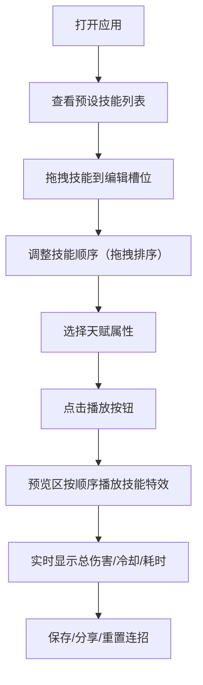

## 1. 产品概述
本应用是一个在线角色技能特效组合预览与连招编辑器，主要解决玩家在构建角色技能体系时难以直观对比不同技能特效组合效果和连招顺序的问题。用户可以通过拖拽技能、调整顺序、选择天赋，实时预览技能特效组合和连招效果。

- 核心目标：为游戏玩家提供直观的技能组合与连招预览工具
- 目标用户：MOBA、MMORPG等游戏玩家，角色构建爱好者
- 产品价值：降低技能组合试错成本，提升角色构建效率和趣味性

## 2. 核心功能

### 2.1 用户角色
| 角色 | 注册方式 | 核心权限 |
|------|----------|----------|
| 普通用户 | 无需注册 | 完整使用所有功能，可保存和分享连招配置 |

### 2.2 功能模块
1. **技能编辑器**：技能选择列表、编辑槽位、拖拽排序
2. **连招预览**：技能特效展示、播放控制、数据统计
3. **属性面板**：天赋选择、组合效果展示、实时联动

### 2.3 页面详情
| 页面名称 | 模块名称 | 功能描述 |
|----------|----------|----------|
| 主页面 | 顶部导航栏 | 应用标题、重置/保存/分享操作按钮 |
| 主页面 | 技能选择区 | 展示预设技能列表，支持拖拽到编辑槽位 |
| 主页面 | 技能编辑槽位 | 最多6个槽位，支持拖拽排序和删除，显示技能信息 |
| 主页面 | 连招预览区 | 400x300预览窗口，播放技能粒子特效，显示统计数据 |
| 主页面 | 属性面板 | 天赋选择卡片，展示组合效果标签 |

## 3. 核心流程
用户从预设技能列表中拖拽技能到编辑槽位，通过拖拽调整连招顺序，可选择天赋属性，点击播放按钮后预览区按顺序展示技能特效和组合效果，同时实时显示总伤害、冷却时间和连招耗时。用户可重置、保存或分享连招配置。

## 4. 用户界面设计

### 4.1 设计风格
- **整体风格**：暗黑奇幻风格，营造游戏氛围
- **主色调**：深灰背景 #1a1a2e，工具条 #16213e，卡片 #0f3460
- **品牌色**：#e94560（用于高亮、按钮、描边）
- **卡片样式**：4px圆角，0.5px #e94560 描边
- **技能图标**：32x32彩色矢量图标
- **按钮交互**：悬停时背景变为品牌色，文字变白

### 4.2 页面设计概述
| 页面名称 | 模块名称 | UI元素 |
|----------|----------|--------|
| 主页面 | 顶部导航栏 | 应用标题居左，重置/保存/分享按钮居右，背景 #16213e |
| 主页面 | 技能选择区 | 水平排列预设技能卡片，显示图标+名称+冷却+伤害 |
| 主页面 | 技能编辑槽位 | 6个60x60圆角方块，空槽位虚线边框，拖入时绿色高亮 |
| 主页面 | 连招预览区 | 400x300居中，背景 #0a0a1a，右上角统计卡片 |
| 主页面 | 属性面板 | 200px宽半透明白色卡片，悬浮于预览区左侧，标签式导航 |

### 4.3 响应式设计
- **桌面端（≥768px）**：属性面板固定在预览区左侧，技能槽位水平排列
- **移动端（<768px）**：属性面板折叠为底部抽屉式，技能槽位变为竖向滚动列表
- **触摸优化**：增大可点击区域，支持触摸拖拽操作

### 4.4 2D粒子特效设计
- **火球术**：橙色爆裂粒子，30-50个粒子，持续1.5秒
- **冰霜新星**：蓝色扩散冰晶，40-60个粒子，持续1.5秒
- **闪电链**：白色贯穿闪电，50-80个粒子，持续1.5秒
- **过渡动画**：技能间0.5秒过渡，特效消失渐隐效果
- **性能要求**：帧率不低于30fps，连招播放无卡顿

## 5. 数据模型
- **Skill**：技能数据（id, name, icon, cooldown, damage, color, particleCount）
- **Talent**：天赋数据（id, name, icon, description, effectType, relatedSkills）
- **ComboSlot**：连招槽位（id, skillId, order, combinationEffects）
- **PlaybackState**：播放状态（isPlaying, currentIndex, startTime, stats）
