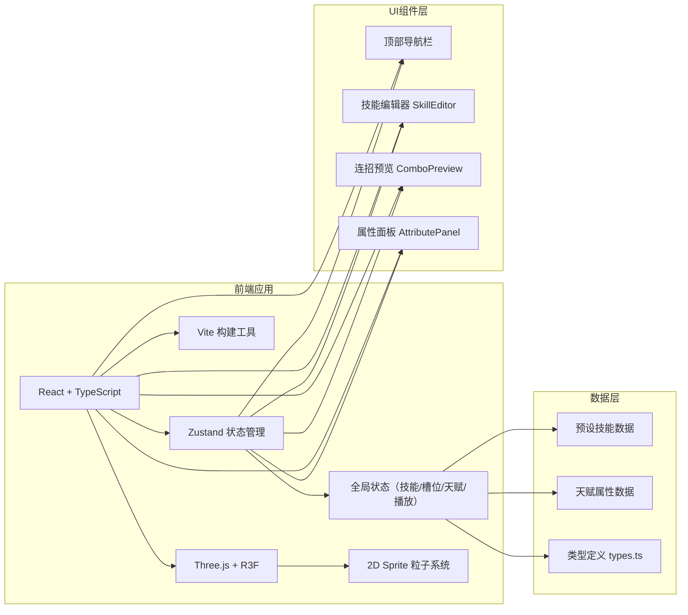

## 1. 架构设计



## 2. 技术描述

### 2.1 前端技术栈
- **框架**: React 18 + TypeScript 5
- **构建工具**: Vite 5
- **状态管理**: Zustand 4
- **2D/3D渲染**: Three.js + @react-three/fiber + @react-three/drei
- **工具库**: uuid（唯一ID生成）
- **类型定义**: @types/react, @types/react-dom, @types/three

### 2.2 核心技术方案
- **粒子特效**: 使用 @react-three/fiber 的 2D Sprite 系统实现技能粒子效果
- **拖拽交互**: 原生 HTML5 Drag and Drop API 实现技能拖拽排序
- **动画系统**: Three.js Frame Loop + requestAnimationFrame 控制粒子动画
- **响应式布局**: CSS Media Queries + 条件渲染实现移动端适配

## 3. 项目文件结构

| 文件路径 | 用途说明 |
|----------|----------|
| `package.json` | 项目依赖和脚本配置 |
| `vite.config.js` | Vite 构建配置，启用 React 插件 |
| `tsconfig.json` | TypeScript 配置，strict 模式 |
| `index.html` | 入口 HTML，引入 CSS 重置和字体 |
| `src/types.ts` | 数据类型定义（Skill, Talent, ComboSlot, PlaybackState） |
| `src/store.ts` | Zustand 全局状态管理 |
| `src/App.tsx` | 主应用组件，整体布局 |
| `src/SkillEditor.tsx` | 技能编辑槽位组件 |
| `src/ComboPreview.tsx` | 连招预览区域组件 |
| `src/AttributePanel.tsx` | 天赋属性面板组件 |
| `src/NavBar.tsx` | 顶部导航栏组件 |
| `src/SkillParticle.tsx` | 技能粒子特效组件 |

## 4. 数据模型定义

### 4.1 TypeScript 类型定义

```typescript
// 技能类型
interface Skill {
  id: string;
  name: string;
  icon: string;
  cooldown: number; // 1-10秒
  damage: number; // 50-500
  color: string; // 粒子颜色
  particleCount: [number, number]; // 粒子数量范围
  effectType: 'fire' | 'ice' | 'lightning' | 'wind' | 'shadow';
}

// 天赋类型
interface Talent {
  id: string;
  name: string;
  icon: string;
  description: string;
  effectType: 'fire_boost' | 'ice_shield' | 'lightning_charge' | 'shadow_drain';
  relatedSkillTypes: Array<'fire' | 'ice' | 'lightning' | 'wind' | 'shadow'>;
  bonusEffect: {
    damageMultiplier?: number;
    extraDuration?: number;
    cooldownReduction?: number;
  };
}

// 连招槽位
interface ComboSlot {
  id: string;
  skillId: string | null;
  order: number;
  combinationEffects: string[];
}

// 播放状态
interface PlaybackState {
  isPlaying: boolean;
  currentIndex: number;
  startTime: number;
  stats: {
    totalDamage: number;
    totalCooldown: number;
    totalDuration: number;
  };
}
```

### 4.2 预设技能数据
```typescript
const PRESET_SKILLS: Skill[] = [
  {
    id: 'fireball',
    name: '火球术',
    icon: '🔥',
    cooldown: 3,
    damage: 200,
    color: '#ff6b35',
    particleCount: [30, 50],
    effectType: 'fire'
  },
  {
    id: 'frost_nova',
    name: '冰霜新星',
    icon: '❄️',
    cooldown: 5,
    damage: 150,
    color: '#4ecdc4',
    particleCount: [40, 60],
    effectType: 'ice'
  },
  {
    id: 'lightning_chain',
    name: '闪电链',
    icon: '⚡',
    cooldown: 4,
    damage: 180,
    color: '#ffffff',
    particleCount: [50, 80],
    effectType: 'lightning'
  },
  {
    id: 'wind_blade',
    name: '风刃',
    icon: '🌀',
    cooldown: 2,
    damage: 120,
    color: '#95e1d3',
    particleCount: [35, 55],
    effectType: 'wind'
  },
  {
    id: 'shadow_strike',
    name: '暗影冲击',
    icon: '🌑',
    cooldown: 6,
    damage: 280,
    color: '#9b59b6',
    particleCount: [45, 70],
    effectType: 'shadow'
  }
];
```

### 4.3 预设天赋数据
```typescript
const PRESET_TALENTS: Talent[] = [
  {
    id: 'fire_boost',
    name: '火焰强化',
    icon: '🔥',
    description: '火焰技能额外燃烧持续伤害+2秒',
    effectType: 'fire_boost',
    relatedSkillTypes: ['fire'],
    bonusEffect: { extraDuration: 2 }
  },
  {
    id: 'ice_shield',
    name: '冰霜护盾',
    icon: '🛡️',
    description: '冰霜技能触发时获得护盾',
    effectType: 'ice_shield',
    relatedSkillTypes: ['ice'],
    bonusEffect: { damageMultiplier: 1.1 }
  },
  {
    id: 'lightning_charge',
    name: '雷电充能',
    icon: '⚡',
    description: '闪电技能伤害+15%',
    effectType: 'lightning_charge',
    relatedSkillTypes: ['lightning'],
    bonusEffect: { damageMultiplier: 1.15 }
  },
  {
    id: 'shadow_drain',
    name: '暗影汲取',
    icon: '💀',
    description: '暗影技能冷却-1秒',
    effectType: 'shadow_drain',
    relatedSkillTypes: ['shadow'],
    bonusEffect: { cooldownReduction: 1 }
  }
];
```

## 5. 核心功能实现方案

### 5.1 状态管理（Zustand）
```typescript
interface AppState {
  skills: Skill[];
  talents: Talent[];
  comboSlots: ComboSlot[];
  selectedTalents: string[];
  playback: PlaybackState;
  setSkillToSlot: (slotId: string, skillId: string | null) => void;
  reorderSlots: (fromIndex: number, toIndex: number) => void;
  toggleTalent: (talentId: string) => void;
  startPlayback: () => void;
  stopPlayback: () => void;
  resetCombo: () => void;
  saveCombo: () => void;
  shareCombo: () => void;
}
```

### 5.2 粒子特效渲染
- 使用 `@react-three/fiber` 的 `<Canvas>` 组件创建 2D 渲染场景
- 使用 `@react-three/drei` 的 `<Sprite>` 和 `<PointMaterial>` 实现粒子
- 每个技能创建30-80个粒子，随机初速度和方向
- 使用 `useFrame` Hook 更新粒子位置，实现动画效果
- 粒子寿命 1.5 秒，透明度渐隐

### 5.3 连招播放控制
- 播放时按顺序触发技能特效，每个技能间隔 0.5 秒
- 使用 `requestAnimationFrame` 控制播放帧率
- 实时计算总伤害、总冷却、总耗时
- 播放完成后自动停止，重置状态

### 5.4 组合效果计算
- 根据选中的天赋和技能类型，计算额外效果
- 火焰强化：增加火焰技能持续伤害 2 秒
- 冰霜护盾：冰霜技能伤害 × 1.1
- 雷电充能：闪电技能伤害 × 1.15
- 暗影汲取：暗影技能冷却 -1 秒

## 6. 性能优化策略

1. **粒子池化**: 预创建粒子对象，避免频繁创建销毁
2. **帧率控制**: 使用 `useFrame` 的 delta 参数控制动画速度，确保 30fps+
3. **按需渲染**: 仅在播放状态时更新粒子位置
4. **状态分片**: Zustand 选择器避免不必要的重渲染
5. **CSS 硬件加速**: 使用 `transform` 和 `opacity` 实现动画，避免回流

## 7. 构建与部署

- **开发命令**: `npm run dev` - 启动 Vite 开发服务器
- **构建命令**: `npm run build` - 生产环境构建
- **预览命令**: `npm run preview` - 预览生产构建
- **类型检查**: `npx tsc --noEmit` - TypeScript 类型检查
