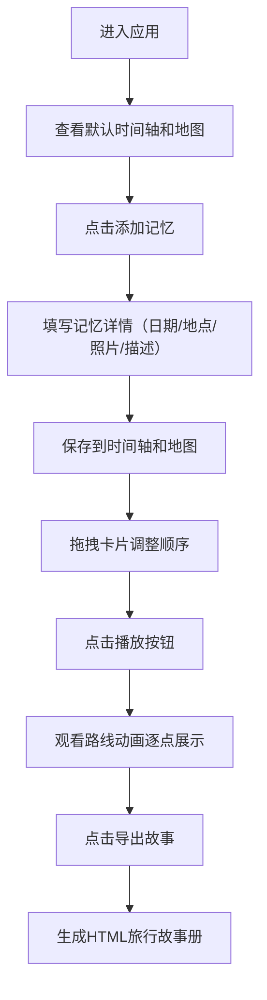

## 1. 产品概述

旅行记忆时间轴与故事地图生成器，帮助用户按时间顺序整理旅行中的照片、笔记和地点标记，自动生成交互式时间轴和地图路线动画，输出可分享的HTML旅行故事册。

- 核心目的：将零散的旅行记忆（照片、地点、笔记）组织成可视化的时间轴和地图故事
- 目标用户：旅行爱好者、摄影爱好者、喜欢记录生活的个人用户
- 市场价值：提供独特的旅行记录方式，将时间和空间维度结合，创造沉浸式旅行回忆体验

## 2. 核心功能

### 2.1 功能模块

1. **导航栏**：应用名称、导入数据、添加记忆、导出故事按钮
2. **时间轴编辑面板**：记忆卡片列表、拖拽排序、编辑功能
3. **地图预览面板**：Leaflet地图、旅行路线曲线、光点流动动画、地点标记、播放控制
4. **详情编辑浮层**：文本输入、图片上传、坐标编辑

### 2.2 页面详情

| 页面名称 | 模块名称 | 功能描述 |
|-----------|-------------|---------------------|
| 主页面 | 导航栏 | 半透明毛玻璃效果，三个功能按钮（导入/添加/导出） |
| 主页面 | 时间轴面板 | 虚拟滚动记忆卡片列表，拖拽排序，卡片连接线 |
| 主页面 | 地图面板 | CartoDB暖色调底图，贝塞尔曲线路线，光点动画，逐点播放 |
| 主页面 | 编辑浮层 | 文本编辑、图片上传预览删除、坐标编辑 |

## 3. 核心流程

用户从添加记忆开始，填写地点、日期、照片和描述，系统自动在时间轴和地图上展示。用户可拖拽调整顺序，点击播放按钮观看旅行路线动画，最后导出为可分享的HTML文件。

## 4. 用户界面设计

### 4.1 设计风格

- **主色调**：#2d6a4f（深绿）、#40916c（中绿）、#95d5b2（浅绿）
- **辅助色**：#fdf6e3（淡米色画布背景）、#d8f3dc（浅绿连接线）
- **文字色**：#1a1a2e（标题深色）、#4a4a6a（描述灰紫）
- **按钮风格**：圆角胶囊按钮，悬停渐变为品牌主色淡色背景
- **布局**：桌面端左右双栏，移动端上下堆叠
- **卡片风格**：白色圆角16px，柔和盒阴影
- **毛玻璃导航**：rgba(255,255,255,0.8) 背景 + 10px 模糊

### 4.2 页面设计概览

| 页面名称 | 模块名称 | UI元素 |
|-----------|-------------|-------------|
| 主页面 | 导航栏 | 毛玻璃背景、浅灰边框、圆角按钮、悬停过渡 |
| 主页面 | 时间轴面板 | 360px宽白色卡片、圆形缩略图(48px)、绿色连接线、拖拽缩放动画 |
| 主页面 | 地图面板 | CartoDB Positron暖色调、绿色贝塞尔曲线、6px流动光点、12px标记点、8px圆角气泡 |
| 主页面 | 编辑浮层 | 320px宽白色面板、2px绿色边框输入框、聚焦变色、拖拽上传区 |

### 4.3 响应式设计

- **桌面端 (>768px)**：左右双栏布局，时间轴面板360px固定宽度，地图占剩余空间
- **移动端 (<768px)**：上下堆叠布局，时间轴在上地图在下，每个面板至少50%视口高度
- **触控优化**：按钮最小触摸区域44px，卡片间距适配拇指操作
- **字号自适应**：移动端卡片标题14px，描述12px
