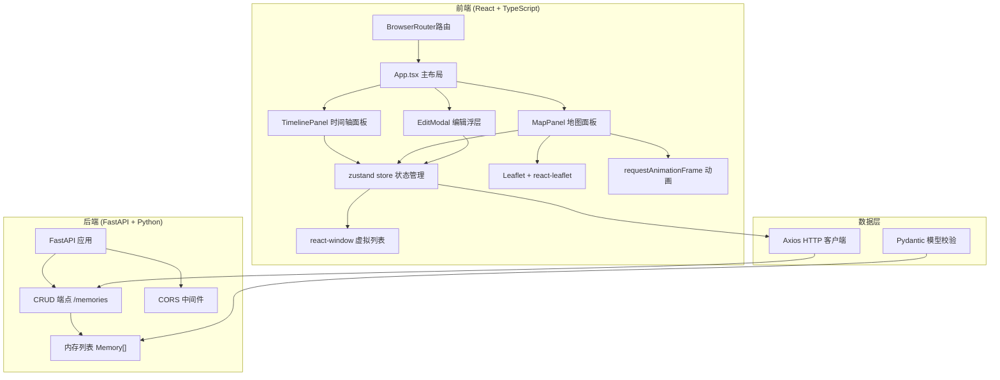
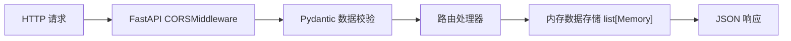
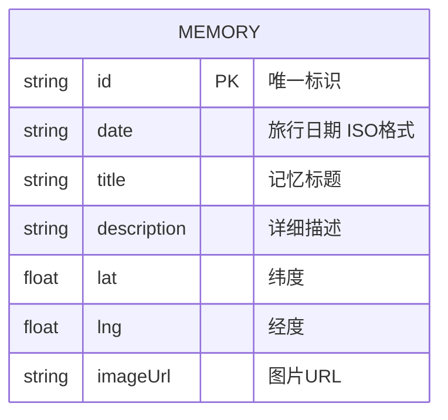

## 1. 架构设计



## 2. 技术说明

- **前端框架**：React 18 + TypeScript 5 + Vite 5
- **路由管理**：react-router-dom v6 (BrowserRouter)
- **状态管理**：zustand v4
- **地图组件**：leaflet + react-leaflet，底图使用 CartoDB Positron
- **虚拟列表**：react-window (FixedSizeList) 优化长列表性能
- **HTTP客户端**：axios
- **日期处理**：dayjs
- **唯一ID**：uuid
- **后端框架**：FastAPI + Uvicorn
- **数据校验**：Pydantic
- **跨域支持**：FastAPI CORSMiddleware
- **后端端口**：8000
- **前端端口**：5173
- **代理配置**：Vite 代理 /api 到 http://localhost:8000

## 3. 路由定义

| 路由 | 用途 |
|-------|---------|
| / | 主页面，包含时间轴和地图双栏布局 |

## 4. API 定义

### Memory 数据模型

```typescript
interface Memory {
  id: string;
  date: string;
  title: string;
  description: string;
  lat: number;
  lng: number;
  imageUrl: string;
}
```

### 端点列表

| 方法 | 路径 | 请求体 | 响应 | 描述 |
|------|------|--------|------|------|
| GET | /memories | - | Memory[] | 获取所有记忆列表 |
| POST | /memories | Memory (无id) | Memory | 创建新记忆 |
| PUT | /memories/{id} | Partial\<Memory\> | Memory | 更新指定记忆 |
| DELETE | /memories/{id} | - | {success: boolean} | 删除指定记忆 |

## 5. 服务端架构



## 6. 数据模型

### 6.1 数据模型定义



### 6.2 初始数据

应用启动时后端预加载 3-5 条示例记忆数据，涵盖不同城市的坐标，便于用户理解功能。
