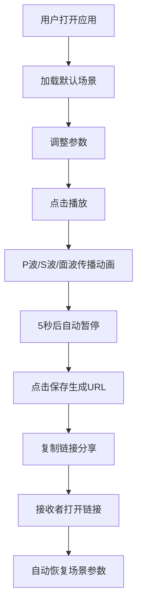

## 1. 产品概述

在线交互式3D地震波传播可视化与参数编辑应用，为数据新闻和科普领域提供直观展示地震波传播过程的工具。

- 主要目的：让用户能创建和编辑三维地震场景，调整震源位置、震级和地质层参数，实时观看地震波在不同介质中的传播动画
- 目标用户：数据新闻从业者、科普工作者、教育工作者、地震学爱好者
- 市场价值：填补浏览器端可编辑、可共享的3D地震波可视化工具空白

## 2. 核心功能

### 2.1 用户角色

| 角色 | 注册方式 | 核心权限 |
|------|----------|----------|
| 普通用户 | 无需注册 | 创建、编辑场景，播放动画，导出共享URL |

### 2.2 功能模块

1. **3D地震场景**: 地质层可视化、震源标记、波前渲染
2. **地震波模拟**: P波/S波/面波传播计算、反射折射效果、地形起伏
3. **参数控制面板**: 震源位置、震级、介质参数调整
4. **场景共享**: URL编码、场景恢复

### 2.3 页面详情

| 页面名称 | 模块名称 | 功能描述 |
|----------|----------|----------|
| 主页面 | 3D场景渲染 | 展示半透明立方体地质块，内含三层结构（地壳、地幔、地核），红色脉动震源标记 |
| 主页面 | 波动画模块 | 播放P波（蓝色）、S波（绿色）、面波（橙色）传播动画，含反射折射效果 |
| 主页面 | 控制面板 | 6个参数滑块（震源X/Y/Z、震级、密度、弹性模量），带数值显示和微调按钮 |
| 主页面 | 播放控制 | 圆形播放/暂停按钮，状态动画指示 |
| 主页面 | 共享模块 | 保存按钮，参数编码为URL片段 |

## 3. 核心流程

用户打开应用 → 查看默认3D地震场景 → 调整参数（震源位置、震级、介质参数）→ 点击播放按钮观看地震波传播动画 → 动画自动暂停 → 点击保存按钮生成共享URL → 复制链接分享 → 接收者打开链接自动恢复场景

## 4. 用户界面设计

### 4.1 设计风格

- 主色调：深蓝黑渐变背景（#0a0a1a到#1a1a3a）
- 品牌色：#4fc3f7（滑块把手），#66bb6a（播放状态），#ffa726（暂停状态）
- 文字色：淡蓝灰色#c8d6e5
- 控制面板：半透明毛玻璃效果（rgba(30,30,60,0.85)，模糊12px，白色微边框）
- 参数卡片：背景rgba(255,255,255,0.05)，圆角12px
- 滑块轨道：半透明#3a3a6a
- 字体：采用现代无衬线字体，标题清晰，数值醒目

### 4.2 页面设计概述

| 页面名称 | 模块名称 | UI元素 |
|----------|----------|--------|
| 主页面 | 3D场景区域 | 全屏3D渲染，UnrealBloomPass泛光效果，相机可旋转缩放 |
| 主页面 | 左侧控制面板 | 固定宽度320px，毛玻璃效果，分组参数卡片，播放按钮，保存按钮 |
| 主页面 | 播放按钮 | 直径48px圆形，播放状态绿色脉冲动画，暂停状态橙色呼吸动画 |
| 主页面 | 参数滑块 | 品牌色把手，悬停变色，数值显示，加减微调按钮 |

### 4.3 响应式设计

- 桌面端（1024px+）：左侧固定控制面板，右侧3D场景区域
- 移动端（1024px以下）：控制面板折叠为左侧图标按钮，点击展开覆盖层
- 触摸优化：滑块支持触摸拖动，按钮尺寸适合触控

### 4.4 3D场景指导

- **环境**: 深蓝黑渐变背景，轻微环境光晕
- **光照**: 环境光 + 方向光，突出地质层和波前的半透明效果
- **相机**: 透视相机，初始角度略微俯视，支持OrbitControls交互
- **组成**: 半透明立方体地质块（20x20x10），三层水平结构，红色脉动震源球，扩展的波前球壳
- **交互**: 鼠标拖动旋转场景，滚轮缩放，右键平移
- **动画**: 震源脉动（周期0.5秒），波前扩展动画，面波地形起伏
- **后期处理**: UnrealBloomPass泛光效果，高亮波前传播路径
- **性能预算**: 帧率30FPS以上，粒子/波前不超过5000个

## 5. 性能约束

- 3D场景渲染帧率：≥30FPS
- 粒子数量（含波前）：≤5000个
- URL编码后字符串长度：≤200字符
