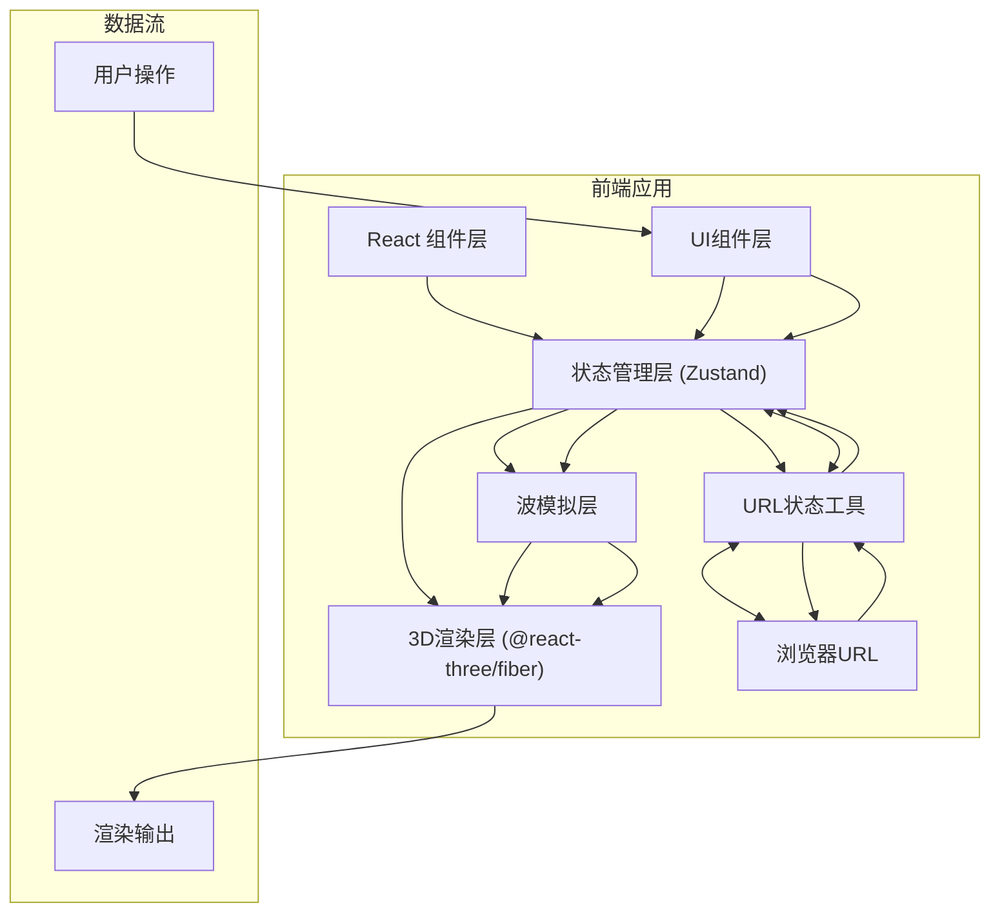
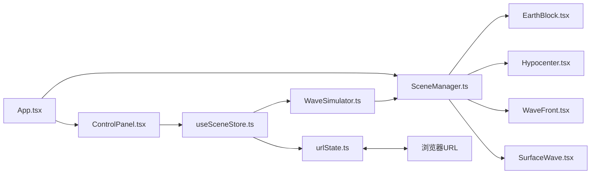

## 1. 架构设计



## 2. 技术描述

- **前端框架**: React@18 + TypeScript
- **构建工具**: Vite@5
- **3D渲染**: Three@0.160 + @react-three/fiber@8 + @react-three/drei@9 + @react-three/postprocessing@2
- **状态管理**: Zustand@4
- **其他依赖**: uuid@9

## 3. 目录结构

```
src/
├── scene/
│   └── SceneManager.ts      # 3D场景管理器
├── simulation/
│   └── WaveSimulator.ts     # 波传播模拟器
├── ui/
│   ├── ControlPanel.tsx     # 控制面板组件
│   └── SliderInput.tsx      # 滑块输入组件
├── store/
│   └── useSceneStore.ts     # Zustand状态管理
├── utils/
│   └── urlState.ts          # URL状态编解码
├── components/
│   ├── EarthBlock.tsx       # 地质块组件
│   ├── Hypocenter.tsx       # 震源组件
│   ├── WaveFront.tsx        # 波前组件
│   └── SurfaceWave.tsx      # 面波组件
├── types/
│   └── index.ts             # TypeScript类型定义
├── App.tsx                  # 主应用组件
├── main.tsx                 # 入口文件
└── index.css                # 全局样式
```

## 4. 模块调用关系



**数据流向**:
1. `ControlPanel.tsx` → `useSceneStore.ts`: 用户调整参数写入状态
2. `useSceneStore.ts` → `WaveSimulator.ts`: 参数变化触发模拟重置
3. `WaveSimulator.ts` → `SceneManager.ts`: 波形数据驱动3D渲染
4. `useSceneStore.ts` ↔ `urlState.ts` ↔ `浏览器URL`: 状态持久化与共享

## 5. 数据模型

### 5.1 场景状态类型

```typescript
interface SceneState {
  hypocenter: { x: number; y: number; z: number };  // 震源位置 (-5到5)
  magnitude: number;        // 震级 (1-9)
  density: number;          // 介质密度 (1000-5000 kg/m³)
  elasticity: number;       // 弹性模量 (1-20 GPa)
  isPlaying: boolean;       // 播放状态
  currentTime: number;      // 当前动画时间
}
```

### 5.2 波数据类型

```typescript
interface WaveData {
  pWaveRadius: number;      // P波半径
  sWaveRadius: number;      // S波半径
  surfaceWaveRadius: number;// 面波半径
  pWaveSpeed: number;       // P波速度
  sWaveSpeed: number;       // S波速度
  reflections: Reflection[];// 反射点
  refractions: Refraction[];// 折射点
}

interface Reflection {
  position: [number, number, number];
  normal: [number, number, number];
}

interface Refraction {
  position: [number, number, number];
  direction: [number, number, number];
  angle: number;
}
```

### 5.3 地质层定义

```typescript
interface GeologicLayer {
  name: string;
  yMin: number;
  yMax: number;
  color: string;
  density: number;
}

const GEOLOGIC_LAYERS: GeologicLayer[] = [
  { name: '地壳', yMin: -5, yMax: -1.67, color: '#8B7355', density: 2700 },
  { name: '地幔', yMin: -1.67, yMax: 1.66, color: '#D2B48C', density: 4500 },
  { name: '地核', yMin: 1.66, yMax: 5, color: '#FFD700', density: 13000 },
];
```

## 6. 核心算法

### 6.1 波速计算

```
P波速度 = sqrt( (弹性模量 * (1 - ν)) / (密度 * (1 + ν) * (1 - 2ν)) )
S波速度 = P波速度 * 0.6

其中 ν 为泊松比，默认取 0.25
```

### 6.2 URL编码 (Base62)

使用自定义Base62编码压缩参数，确保URL长度 ≤ 200字符：
- 震源X/Y/Z：各12位精度
- 震级：8位精度
- 密度：12位精度
- 弹性模量：10位精度

## 7. 性能优化策略

1. **波前复用**: 使用单个球壳网格，通过缩放实现波前扩展
2. **对象池**: 反射/折射点使用对象池管理，避免频繁创建销毁
3. **材质复用**: 半透明材质全局单例
4. **帧率控制**: 使用 `useFrame` 的 delta 时间，确保动画速度一致
5. **渲染优化**: 波前使用 `transparent: true` 但关闭 `depthWrite` 减少绘制调用
