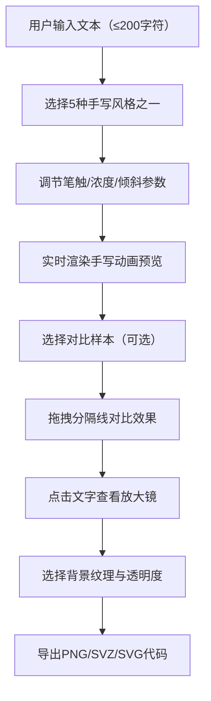

## 1. 产品概述

手写体风格模拟与字体效果对比应用是一款面向非专业设计人员的在线工具，帮助用户快速生成具有个性手写风格的文字排版，并直观对比不同手写风格、笔触粗细和背景纹理的组合效果。

- 解决问题：非专业设计人员难以快速生成具有个性手写体风格的文字排版，无法直观对比多种风格组合
- 目标用户：设计师、教师、学生、手账爱好者、文创从业者
- 核心价值：降低手写体设计门槛，提供实时预览与对比，一键导出高质量成果

## 2. 核心功能

### 2.1 功能模块

1. **手写风格生成器**：文本输入、风格选择、参数调节、动画预览
2. **双栏对比与细节放大**：左右分栏对比、分隔线拖拽、放大镜功能
3. **背景纹理与导出**：背景纹理选择、不透明度调节、多格式导出

### 2.2 页面详情

| 页面名称 | 模块名称 | 功能描述 |
|-----------|-------------|---------------------|
| 主页面 | 顶部导航栏 | 应用标题、保存风格、导出图片、重置编辑按钮 |
| 主页面 | 左侧控制面板 | 文本输入、风格选择、笔触参数滑块、背景纹理选项 |
| 主页面 | 右侧预览画布 | 手写动画渲染、双栏对比、放大镜交互 |
| 主页面 | 导出弹窗 | PNG导出、SVZ导出、SVG代码复制 |

## 3. 核心流程

用户输入文本 → 选择手写风格 → 调节笔触参数 → 实时预览手写动画 → 选择对比样本 → 拖拽分隔线对比效果 → 点击查看细节放大 → 选择背景纹理 → 调节不透明度 → 导出成果

## 4. 用户界面设计

### 4.1 设计风格

- **主色调**：暖色调怀旧风格，默认背景 #f4ecd8（淡米色）
- **强调色**：#8b7355（棕色系，用于滑块圆点、交互元素），#6b5b3e（深棕色，用于选中标记）
- **辅助色**：#e8dcc8（浅米色，滑块轨道），#d4c5a9（悬停背景），#f0e6d3（菜单项悬停）
- **按钮风格**：圆角8px，悬停时背景从透明渐变为 #d4c5a9，0.2秒 ease-out 过渡
- **字体**：采用印刷品与手写体混合风格，搭配衬线体与手写字体
- **布局**：顶栏 + 左侧320px控制面板 + 右侧画布区域的三栏布局
- **视觉元素**：点状网格辅助定位、柔和阴影、圆角卡片、磨砂玻璃顶栏

### 4.2 页面设计概览

| 页面名称 | 模块名称 | UI 元素 |
|-----------|-------------|-------------|
| 主页面 | 顶部导航栏 | 半透明磨砂玻璃效果（rgba(244,236,216,0.85)，模糊12px）、应用标题、三个圆角按钮（保存风格、导出图片、重置编辑） |
| 主页面 | 控制面板 | 宽度320px、白色背景、圆角16px、柔和阴影（0 4px 12px rgba(0,0,0,0.06)）、分组浅灰分隔线、分组图标 |
| 主页面 | 预览画布 | 浅灰色点状网格（间距20px，点大小2px，透明度0.15）、双栏布局、6px #888 可拖拽分隔线、圆形放大镜（直径120px，2倍放大） |
| 主页面 | 交互控件 | 滑块（背景#e8dcc8，圆点18px #8b7355，拖动时放大至24px弹性动画）、下拉菜单（悬停#f0e6d3，选中项左侧4px #6b5b3e竖条） |

### 4.3 响应式设计

- **桌面端（≥768px）**：左侧320px控制面板固定展开，右侧画布自适应
- **移动端（<768px）**：控制面板折叠为抽屉式，从左侧滑出（0.3秒 ease-out 动画），画布填满屏幕
- **触控优化**：滑块、按钮触控区域增大，支持触屏拖拽分隔线操作

### 4.4 性能要求

- 文字输入后手写矢量生成响应 ≤ 100ms
- 双栏拖拽对比画布重绘帧率 ≥ 50fps
- 动画渲染流畅无明显卡顿延迟
