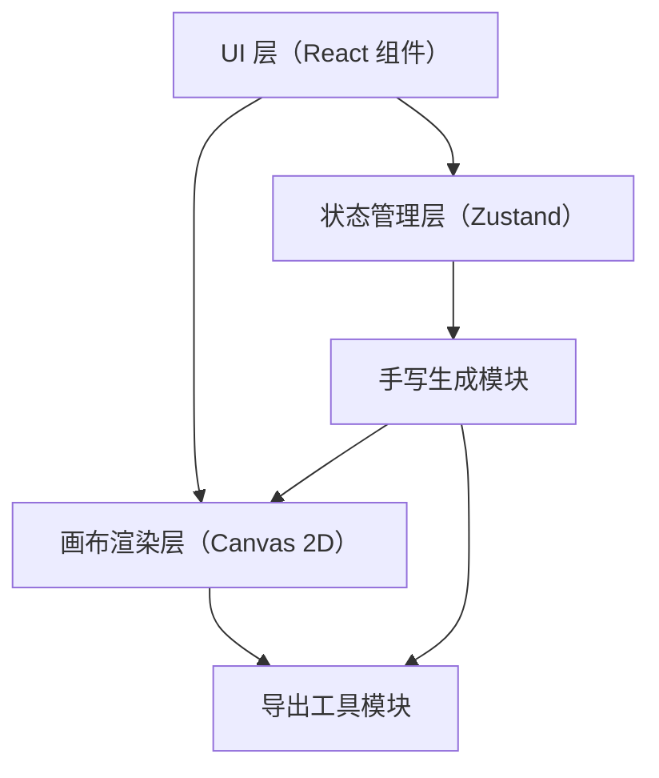

## 1. 架构设计



## 2. 技术选型

- **前端框架**：React 18 + TypeScript
- **构建工具**：Vite
- **样式预处理**：Less
- **状态管理**：Zustand
- **3D/Canvas库**：Three.js + @react-three/fiber
- **工具库**：uuid、dayjs

## 3. 文件结构

```
├── package.json
├── index.html
├── vite.config.js
├── tsconfig.json
└── src/
    ├── main.tsx
    ├── App.tsx
    ├── store/
    │   └── appStore.ts
    ├── components/
    │   └── ControlPanel.tsx
    ├── modules/
    │   ├── handwritingGenerator.ts
    │   └── canvasRenderer.ts
    └── utils/
        └── exporter.ts
```

## 4. 模块职责说明

| 模块 | 职责 |
|------|------|
| `src/main.tsx` | React 应用入口，挂载根组件 |
| `src/App.tsx` | 主布局组件，整合控制面板与画布区域，响应式布局处理 |
| `src/store/appStore.ts` | Zustand 全局状态管理：手写风格参数、文本内容、对比样本、背景纹理、UI状态 |
| `src/components/ControlPanel.tsx` | 左侧控制面板：文本输入、风格选择、参数滑块、背景纹理选择 |
| `src/modules/handwritingGenerator.ts` | 核心业务：5种手写风格贝塞尔曲线算法、动画轨迹计算、输出SVG路径数组 |
| `src/modules/canvasRenderer.ts` | Canvas 渲染：逐字动画渲染、双栏分割线拖拽、放大镜交互 |
| `src/utils/exporter.ts` | 导出工具：PNG导出、SVZ导出、SVG代码复制、背景与文字层合并 |

## 5. 数据模型

### 5.1 手写风格配置

```typescript
type HandwritingStyle = 'roundChild' | 'elegantRunning' | 'neatRegular' | 'cursiveScript' | 'retroBrush';

interface StyleParams {
  strokeWidth: number;      // 笔触粗细 1-20px
  inkDensity: number;       // 墨迹浓度 0.3-1.0
  skewAngle: number;        // 倾斜角度 -30° 到 30°
  animationDuration: number; // 动画时长 1-5秒
}

interface CharacterPath {
  char: string;
  paths: string[];          // SVG path 数据
  totalLength: number;
}
```

### 5.2 背景纹理

```typescript
type BackgroundTexture = 
  | 'kraftPaper' 
  | 'chalkboard' 
  | 'ricePaper' 
  | 'linen' 
  | 'frostedGlass' 
  | 'gradient';

interface BackgroundConfig {
  texture: BackgroundTexture;
  opacity: number;          // 0.2-1.0
}
```

### 5.3 应用状态

```typescript
interface AppState {
  text: string;
  style: HandwritingStyle;
  styleParams: StyleParams;
  background: BackgroundConfig;
  comparisonSample: {
    enabled: boolean;
    type: 'system' | 'saved';
    font?: string;
    savedStyle?: HandwritingStyle;
    savedParams?: StyleParams;
  } | null;
  dividerPosition: number;  // 0-100 百分比
  magnifier: {
    visible: boolean;
    x: number;
    y: number;
  };
  uiState: {
    panelOpen: boolean;
    exportModalOpen: boolean;
  };
}
```

## 6. 核心算法说明

### 6.1 手写风格生成算法

1. **圆润童体**：使用低阶贝塞尔曲线，端点圆润化处理，添加轻微随机抖动模拟儿童书写
2. **潇洒行书**：笔画间添加连接曲线，提高连贯性，加入笔锋渐变效果
3. **工整楷体**：规整直线与曲线组合，端点清晰，笔画间距均匀
4. **潦草连笔**：字符间用平滑曲线连接，部分笔画简化或省略，增加书写速度感
5. **复古毛笔**：笔触宽度随笔画方向动态变化，起笔收笔加重，模拟毛笔飞白效果

### 6.2 动画轨迹计算

- 使用 SVG path `getTotalLength()` 和 `getPointAtLength()` 计算逐帧绘制位置
- 按字符分配动画时长，实现逐字依次绘制效果
- 笔触末端添加渐隐效果模拟真实书写

### 6.3 性能优化策略

- 手写路径计算结果缓存（按文本+风格参数组合键）
- Canvas 分层渲染：背景层、网格层、文字层、放大镜层
- requestAnimationFrame 驱动动画，插值计算确保帧率稳定
- 使用 OffscreenCanvas（如支持）进行离屏渲染
