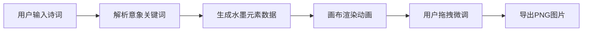

## 1. 产品概述

诗词水墨画意境生成器是一款将中国古典诗词与传统水墨画艺术相结合的创意工具。用户输入诗词后，系统自动解析其中的意象元素，并生成一幅具有水墨风格的数字画作，让用户直观感受诗词中的意境之美。

- **核心价值**：将抽象的文字意境转化为可视化的水墨艺术，为诗词爱好者和艺术创作者提供灵感
- **目标用户**：诗词爱好者、学生、设计师、文化创意从业者
- **市场定位**：文化创意类轻应用，兼具教育性与艺术性

## 2. 核心功能

### 2.1 功能模块

1. **诗词输入面板**：诗词文本输入、意象解析、历史生成记录
2. **水墨画布预览**：SVG水墨元素渲染、元素拖拽缩放、诗词书法排版
3. **导出与控制**：PNG图片导出、随机种子刷新、重新解析意象

### 2.2 页面详情

| 页面名称 | 模块名称 | 功能描述 |
|---------|---------|---------|
| 主页面 | 输入面板 | 诗词文本输入、生成按钮、最近生成列表展示 |
| 主页面 | 画布区域 | 水墨意象可视化、元素拖拽调整、书法文字排版 |
| 主页面 | 控制面板 | 导出PNG、刷新随机种子、重新解析意象 |

## 3. 核心流程

用户输入诗词文本 → 系统解析提取意象关键词 → 根据意象组合生成水墨元素 → 画布按序渲染动画 → 用户拖拽微调元素位置 → 导出PNG图片

## 4. 用户界面设计

### 4.1 设计风格

- **主色调**：浅米色 #f5f0e8（背景）、深棕色 #5a3e2b（品牌色）、水彩色渐变（画布背景）
- **设计风格**：东方雅致、水墨意境、宣纸质感
- **字体**：毛笔楷体风格（标题）、优雅宋体/衬线字体（正文）
- **按钮风格**：圆角按钮，悬停上移+阴影放大，点击涟漪扩散动画
- **视觉元素**：宣纸纹理、毛玻璃效果、水墨晕染、柔和阴影

### 4.2 页面设计概览

| 页面名称 | 模块名称 | UI元素 |
|---------|---------|--------|
| 主页面 | 输入面板 | 毛玻璃标题栏、多行文本输入框、生成按钮、标签式历史列表 |
| 主页面 | 画布区域 | 渐变水彩背景、SVG山峦/树木/飞鸟/月亮、书法文字 |
| 主页面 | 控制面板 | 半透明悬浮面板、功能按钮组 |

### 4.3 动效设计

- **加载动画**：左侧面板从左滑入，右侧画布淡入
- **生成动画**：元素依次浮现（山峦→树木→飞鸟/文字），间隔300ms
- **交互反馈**：按钮悬停上移+阴影放大，点击涟漪扩散
- **滚动效果**：历史列表平滑滚动

### 4.4 响应式设计

- **桌面端**（≥768px）：左右分栏布局，左侧340px固定宽度，右侧自适应
- **移动端**（<768px）：左侧面板折叠为顶部抽屉式，画布铺满全屏
- **触摸优化**：拖拽元素支持触摸操作，按钮尺寸适配手指点击

