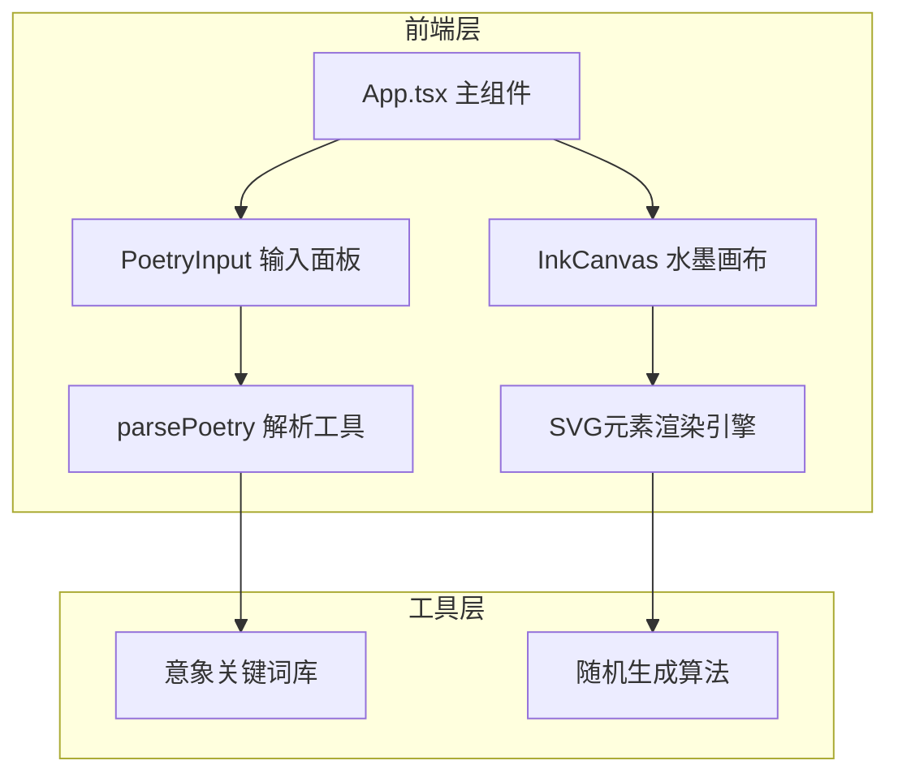

## 1. 架构设计



## 2. 技术选型

- **前端框架**：React 18 + TypeScript
- **构建工具**：Vite 5
- **样式方案**：原生 CSS + CSS 变量
- **图形渲染**：SVG 矢量图形
- **唯一标识**：uuid
- **路径别名**：@ 指向 src 目录

## 3. 目录结构

```
├── src/
│   ├── components/
│   │   ├── PoetryInput.tsx    # 诗词输入面板组件
│   │   └── InkCanvas.tsx      # 水墨画布组件
│   ├── utils/
│   │   └── parsePoetry.ts     # 诗词解析工具函数
│   ├── styles/
│   │   └── global.css         # 全局样式
│   ├── App.tsx                # 主应用组件
│   └── main.tsx               # 应用入口
├── index.html                 # HTML入口
├── vite.config.js             # Vite配置
├── tsconfig.json              # TypeScript配置
└── package.json               # 项目依赖
```

## 4. 数据模型

### 4.1 意象数据结构

```typescript
interface PoetryImagery {
  title: string;
  content: string;
  imagery: ImageryItem[];
}

interface ImageryItem {
  type: 'mountain' | 'water' | 'moon' | 'flower' | 'bird' | 'tree' | 'cloud';
  count: number;
  position?: { x: number; y: number };
  scale?: number;
}
```

### 4.2 画布元素数据

```typescript
interface CanvasElement {
  id: string;
  type: string;
  x: number;
  y: number;
  scale: number;
  rotation: number;
  opacity: number;
}
```

## 5. 核心算法

### 5.1 诗词意象解析

- 使用正则表达式匹配关键词
- 内置意象关键词库（山、水、月、花、鸟、云、树等）
- 统计各意象出现频次，确定元素数量

### 5.2 水墨元素生成

- 基于随机种子生成可复现的布局
- 使用贝塞尔曲线绘制山峦轮廓
- 添加随机抖动模拟毛笔笔触效果
- 按景深层次排列元素（远山、中树、近景）

### 5.3 元素拖拽交互

- SVG 元素鼠标事件监听
- 坐标变换计算
- 碰撞边界检测

## 6. 性能指标

- 五言绝句生成时间：≤ 500ms
- 画布渲染帧率：≥ 50fps
- 首屏加载时间：≤ 2s
- 动画流畅度：无明显卡顿
