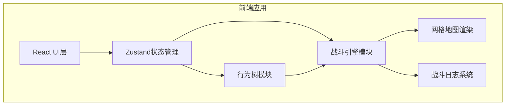

## 1. 架构设计



## 2. 技术描述

- **前端框架**：React 18 + TypeScript
- **构建工具**：Vite
- **UI组件库**：Ant Design
- **状态管理**：Zustand
- **唯一ID生成**：uuid
- **样式方案**：CSS Modules + 内联样式

## 3. 模块结构

| 模块 | 文件路径 | 职责 |
|------|----------|------|
| 行为树模块 | src/modules/behavior-tree.ts | 节点类型定义、序列化/反序列化、行为树执行逻辑 |
| 战斗引擎模块 | src/modules/battle-engine.ts | 网格地图、单位管理、A*寻路、伤害计算、回合执行 |
| 行为树编辑器 | src/components/Editor/BTEditor.tsx | 节点拖拽、画布渲染、连线、属性编辑 |
| 网格地图 | src/components/Editor/GridMap.tsx | 6x8网格渲染、地形绘制、单位显示 |
| 模拟控制 | src/components/Simulator/SimControl.tsx | 开始/暂停/单步/重置、日志面板 |
| 状态管理 | src/store/useGameStore.ts | 全局状态：行为树列表、单位状态、战斗日志 |

## 4. 数据模型

### 4.1 行为树数据模型

```typescript
type NodeType = 'condition' | 'sequence' | 'selector' | 'action';

interface BTNode {
  id: string;
  type: NodeType;
  name: string;
  position: { x: number; y: number };
  children?: string[];
  condition?: string;
  actionType?: string;
  targetType?: string;
}

interface BehaviorTree {
  id: string;
  name: string;
  rootId: string;
  nodes: Record<string, BTNode>;
}
```

### 4.2 战斗单位数据模型

```typescript
type UnitClass = 'warrior' | 'archer' | 'mage' | 'assassin';
type Team = 'red' | 'blue';

interface Unit {
  id: string;
  name: string;
  unitClass: UnitClass;
  team: Team;
  position: { x: number; y: number };
  hp: number;
  maxHp: number;
  attack: number;
  defense: number;
  moveRange: number;
  attackRange: number;
  behaviorTreeId: string;
  isAlive: boolean;
}
```

### 4.3 地形数据模型

```typescript
type TerrainType = 'grass' | 'forest' | 'rock' | 'river';

interface TerrainInfo {
  type: TerrainType;
  moveCost: number;
  passable: boolean;
  color: string;
}

interface GridCell {
  x: number;
  y: number;
  terrain: TerrainType;
}
```

### 4.4 战斗日志数据模型

```typescript
interface BattleLog {
  id: string;
  timestamp: number;
  turn: number;
  unitId: string;
  unitName: string;
  action: string;
  details: {
    from?: { x: number; y: number };
    to?: { x: number; y: number };
    damage?: number;
    originalDamage?: number;
    remainingHp?: number;
    targetId?: string;
    targetName?: string;
  };
}
```

## 5. 核心算法

### 5.1 A*寻路算法
- 使用曼哈顿距离作为启发函数
- 考虑地形移动消耗
- 支持不可通行地形（河流）

### 5.2 行为树执行
- 深度优先遍历
- 序列节点：按顺序执行子节点，全部成功则成功
- 选择节点：按优先级执行子节点，第一个成功则成功
- 条件节点：判断条件是否满足
- 行动节点：执行具体动作（移动、攻击、守卫）

### 5.3 伤害计算
- 基础伤害 = 攻击力 - 防御力
- 随机浮动 ±20%
- 最低伤害为1

## 6. 性能优化

- 节点拖拽使用 requestAnimationFrame 保持60fps
- 日志列表超过50条启用虚拟滚动
- 单位移动使用 CSS transition 平滑插值
- 战斗状态更新使用批量处理
