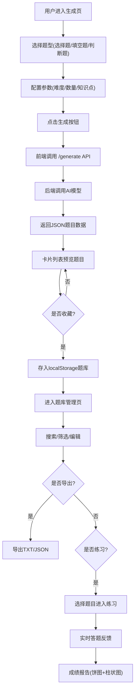

## 1. 产品概述
智能练习题生成器是一款面向在线教育平台教师的高效出题工具，支持多种题型自动生成、题库管理和互动练习模式，解决手动出题效率低、题型单一的问题。
- 目标用户：在线教育平台教师及教育内容创作者
- 核心价值：AI驱动的自动出题，3秒内生成结构化练习题，大幅提升出题效率

## 2. 核心功能

### 2.1 用户角色
| 角色 | 注册方式 | 核心权限 |
|------|----------|----------|
| 教师 | 邮箱注册 | 配置参数、生成题目、管理题库、练习模式 |
| 内容创作者 | 邮箱注册 | 配置参数、生成题目、管理题库、导出题目 |

### 2.2 功能模块
1. **题目生成页**：题型选择、参数配置、AI生成、题目预览
2. **题库管理页**：题库列表、搜索筛选、编辑题目、批量导出
3. **练习模式页**：选择题目、实时答题、正误反馈、成绩报告

### 2.3 页面详情
| 页面名称 | 模块名称 | 功能描述 |
|----------|----------|----------|
| 题目生成页 | 配置面板 | 支持选择题(单选/多选)、填空题、判断题三种题型的独立配置，含难度1-5、数量1-10、知识点标签过滤，选项卡切换 |
| 题目生成页 | 生成按钮 | 点击后调用后端AI模型生成题目，显示旋转加载条进度动画 |
| 题目生成页 | 题目预览 | 卡片列表展示题干、选项和正确答案(默认隐藏)，支持一键展开/收起答案 |
| 题目生成页 | 收藏功能 | 一键收藏到本地题库(localStorage) |
| 题库管理页 | 题库表格 | 表格展示所有收藏题目，按题型/难度/知识点搜索和筛选 |
| 题库管理页 | 编辑功能 | 编辑题干、选项和答案 |
| 题库管理页 | 导出功能 | 批量导出为TXT或JSON文件 |
| 练习模式页 | 练习面板 | 从题库选择题目进入练习，答题实时反馈(正确绿色高亮/错误红色闪烁) |
| 练习模式页 | 统计模块 | 自动统计正确率和用时，结束后显示成绩报告(饼图+柱状图) |

## 3. 核心流程

**题目生成流程**：用户选择题型 → 配置参数(难度/数量/知识点) → 点击生成 → 前端发送请求到后端 → 后端调用AI模型生成题目 → 返回JSON格式题目 → 前端卡片列表预览 → 可选收藏到题库

**题库管理流程**：查看题库列表 → 搜索/筛选 → 编辑题目 → 导出文件

**练习模式流程**：从题库选择题目 → 进入练习 → 逐题作答 → 实时反馈正误 → 练习结束 → 查看成绩报告

## 4. 用户界面设计

### 4.1 设计风格
- 主色调：渐变蓝色(#4A90D9到#357ABD)，辅以清爽的蓝白配色
- 背景色：柔和米白色(#F8F9FA)
- 按钮风格：圆角12px、轻微阴影、悬停阴影加深并上浮动画(transform: translateY(-4px))
- 字体：标题使用粗体渐变蓝，正文使用深灰色(#333)
- 布局风格：左侧固定320px配置面板(毛玻璃效果)，右侧弹性内容区
- 动效：生成进度彩色渐变条纹动画、涟漪动效、答题反馈平滑过渡(0.3s)及放大缩小微动效

### 4.2 页面设计概览
| 页面名称 | 模块名称 | UI元素 |
|----------|----------|--------|
| 题目生成页 | 配置面板 | 毛玻璃效果背景、选项卡切换、滑块(难度)、数字输入(数量)、标签选择(知识点)、渐变蓝生成按钮 |
| 题目生成页 | 题目预览区 | 白色卡片列表、展开/收起动画、涟漪按钮、彩色渐变进度条 |
| 题库管理页 | 搜索筛选栏 | 搜索框、下拉筛选(题型/难度/知识点)、涟漪动效 |
| 题库管理页 | 题库表格 | 表格行悬停高亮、编辑弹窗、导出按钮(渐变蓝) |
| 练习模式页 | 答题面板 | 选项卡片、正确绿色高亮/错误红色闪烁(0.3s过渡)、放大缩小微动效 |
| 练习模式页 | 成绩报告 | 饼图(各题型正确率)、柱状图(每日练习数量)、渐变蓝统计卡片 |

### 4.3 响应式设计
- 桌面优先设计，768px以下左侧面板折叠为顶部导航栏
- 所有交互元素(按钮、选项卡、搜索框)带有悬停和点击涟漪动效
- 移动端触控优化，按钮和卡片适配触控操作

### 4.4 3D场景指导
- 不适用
