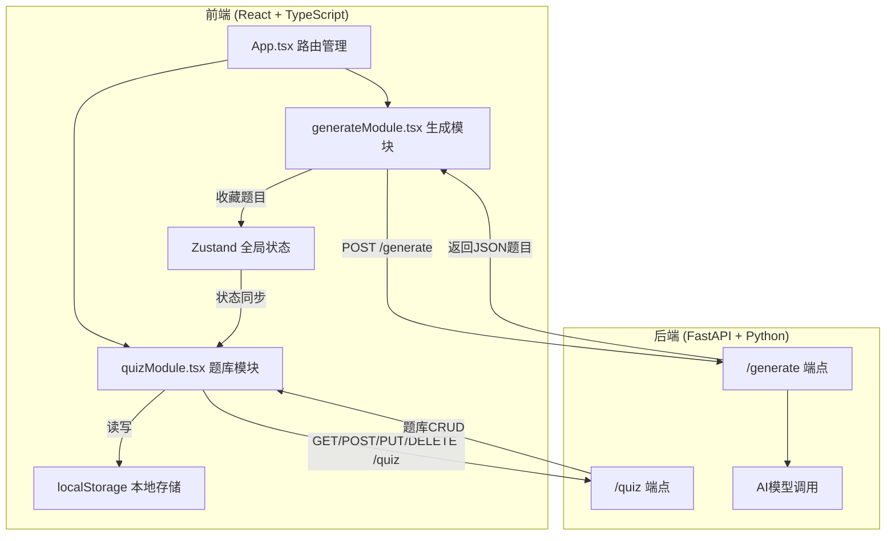
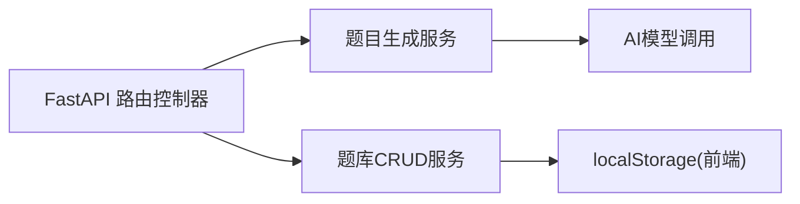
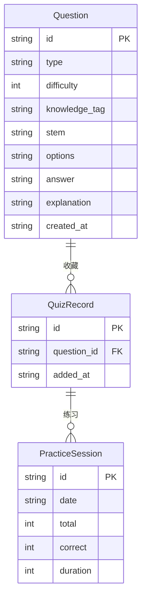

## 1. 架构设计



## 2. 技术说明
- 前端：React@18 + TypeScript(严格模式) + Vite + TailwindCSS + Zustand + Axios + MathJS
- 初始化工具：vite-init (react-ts模板)
- 后端：FastAPI (Python) + Uvicorn
- 数据库：localStorage (前端本地存储，无需外部数据库)
- 图表库：内嵌Canvas绘制（饼图和柱状图）

## 3. 路由定义
| 路由 | 用途 |
|------|------|
| / | 题目生成页 - 题型选择、参数配置、AI生成、题目预览 |
| /quiz | 题库管理页 - 题库列表、搜索筛选、编辑、导出 |
| /practice | 练习模式页 - 选择题目、实时答题、成绩报告 |

## 4. API定义

### 4.1 TypeScript类型定义

```typescript
interface Question {
  id: string;
  type: "choice" | "multi_choice" | "fill_blank" | "true_false";
  difficulty: number;
  knowledge_tag: string;
  stem: string;
  options?: string[];
  answer: string | string[];
  explanation: string;
  created_at: string;
}

interface GenerateRequest {
  question_type: "choice" | "multi_choice" | "fill_blank" | "true_false";
  difficulty: number;
  count: number;
  knowledge_tags: string[];
}

interface GenerateResponse {
  questions: Question[];
}

interface QuizRecord {
  id: string;
  question: Question;
  added_at: string;
}

interface PracticeResult {
  total: number;
  correct: number;
  duration: number;
  by_type: Record<string, { total: number; correct: number }>;
}
```

### 4.2 请求/响应模式

**POST /generate**
- 请求体：GenerateRequest
- 响应体：GenerateResponse
- 说明：调用AI模型生成题目，返回JSON格式题目数组

**GET /quiz**
- 响应体：QuizRecord[]
- 说明：获取所有题库记录（前端localStorage备用）

**POST /quiz**
- 请求体：QuizRecord
- 响应体：{ success: boolean }
- 说明：添加题目到题库

**PUT /quiz/{id}**
- 请求体：Partial<Question>
- 响应体：{ success: boolean }
- 说明：编辑题目

**DELETE /quiz/{id}**
- 响应体：{ success: boolean }
- 说明：删除题目

## 5. 服务端架构图



## 6. 数据模型

### 6.1 数据模型定义



### 6.2 数据存储说明
- 题库数据存储在前端localStorage中，键名为 `quiz_bank`
- 练习历史存储在localStorage中，键名为 `practice_history`
- 后端仅负责AI题目生成，不持久化数据

## 7. 文件结构与调用关系

```
auto11/
├── package.json              # 依赖：react, react-dom, react-router-dom, axios, zustand, mathjs
├── vite.config.js            # React构建配置，代理/api到后端
├── tsconfig.json             # 严格模式TypeScript配置
├── index.html                # 入口页面
├── src/
│   ├── App.tsx               # 主组件，管理路由和全局状态，调用generateModule和quizModule
│   ├── main.tsx              # 入口文件
│   ├── generateModule.tsx    # 生成模块：接收用户配置，调用后端API，返回题目对象数组
│   ├── quizModule.tsx        # 题库模块：调用localStorage API，管理题库CRUD，渲染练习面板
│   ├── components/           # 可复用组件
│   │   ├── ConfigPanel.tsx   # 配置面板组件
│   │   ├── QuestionCard.tsx  # 题目卡片组件
│   │   ├── QuizTable.tsx     # 题库表格组件
│   │   ├── PracticePanel.tsx # 练习面板组件
│   │   └── ChartReport.tsx   # 图表报告组件
│   ├── hooks/                # 自定义Hooks
│   │   ├── useQuizStore.ts   # Zustand状态管理
│   │   └── useLocalStorage.ts # localStorage封装Hook
│   ├── utils/                # 工具函数
│   │   ├── api.ts            # Axios API调用封装
│   │   └── exportUtils.ts    # 导出TXT/JSON工具
│   └── styles/               # 全局样式
│       └── global.css        # 全局CSS(含动画定义)
├── backend/
│   └── main.py               # FastAPI后端：/generate和/quiz端点，调用LLM生成题目
```

**数据流向**：
1. 用户配置 → generateModule.tsx → api.ts(POST /generate) → backend/main.py → AI模型 → 返回Question[]
2. generateModule.tsx → useQuizStore.ts(收藏) → useLocalStorage.ts → localStorage
3. quizModule.tsx ← useQuizStore.ts ← useLocalStorage.ts ← localStorage
4. quizModule.tsx → exportUtils.ts → 文件下载
5. PracticePanel.tsx ← quizModule.tsx(选择题目) → 实时反馈 → ChartReport.tsx(成绩报告)
