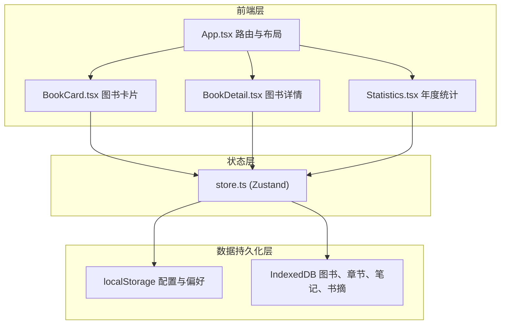
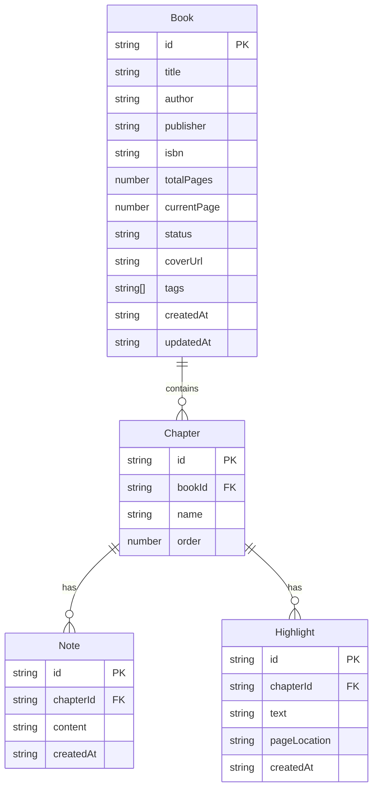

## 1. 架构设计

## 2. 技术说明

- 前端：React@18 + TypeScript + Ant Design + Vite
- 状态管理：Zustand（管理图书列表、当前图书、阅读计时、笔记书摘、统计状态）
- 图表：Recharts（柱状图、环形图、折线图）
- 数据持久化：localStorage（用户偏好）+ IndexedDB（图书数据，离线缓存）
- 构建工具：Vite（React+TypeScript配置）
- 无后端服务，纯前端离线应用

## 3. 路由定义

| 路由 | 用途 |
|------|------|
| #/ | 图书管理主页，卡片网格展示图书列表 |
| #/book/:id | 图书详情页，章节目录+笔记书摘+计时器 |
| #/statistics | 年度统计仪表盘 |

## 4. API定义

无后端API，所有数据通过Zustand store操作，持久化至IndexedDB和localStorage。

### Store Actions

| Action | 参数 | 说明 |
|--------|------|------|
| addBook | Book | 添加图书 |
| updateProgress | bookId, pages | 更新阅读进度 |
| addNote | bookId, chapterId, Note | 添加笔记 |
| addHighlight | bookId, chapterId, Highlight | 添加书摘 |
| getStats | year | 获取年度统计数据 |
| startTimer | bookId, chapterId | 启动计时器 |
| pauseTimer | - | 暂停计时器 |
| addChapter | bookId, chapterName | 添加章节 |

## 5. 数据模型

### 5.1 数据模型定义

### 5.2 数据定义语言

IndexedDB使用idb库操作，主要Object Store：

- **books**: 主键id，索引status、tags
- **chapters**: 主键id，索引bookId
- **notes**: 主键id，索引chapterId、createdAt
- **highlights**: 主键id，索引chapterId、createdAt
