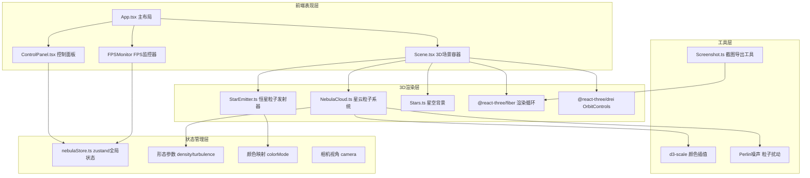

## 1. 架构设计



## 2. 技术说明

- **前端框架**：React@18 + TypeScript
- **构建工具**：Vite@5
- **3D渲染引擎**：Three.js@0.160 + @react-three/fiber@8 + @react-three/drei@9
- **状态管理**：Zustand@4
- **颜色处理**：d3-scale@7 + d3-scale-chromatic@3
- **样式方案**：原生CSS（CSS Modules）+ CSS Variables

## 3. 项目目录结构

```
d:\P\tasks\auto112\
├── package.json
├── vite.config.js
├── tsconfig.json
├── index.html
└── src/
    ├── main.tsx                    # React入口
    ├── App.tsx                     # 主布局组件
    ├── index.css                   # 全局样式
    ├── store/
    │   └── nebulaStore.ts          # zustand状态管理
    ├── modules/
    │   ├── scene/
    │   │   ├── Scene.tsx           # 3D场景主组件
    │   │   ├── NebulaCloud.ts      # 星云粒子类
    │   │   ├── StarEmitter.ts      # 粒子发射器类
    │   │   └── Stars.tsx           # 星空背景组件
    │   └── controls/
    │       ├── ControlPanel.tsx    # 控制面板组件
    │       ├── Slider.tsx          # 自定义滑块组件
    │       ├── ColorPicker.tsx     # 颜色渐变选择器
    │       └── Screenshot.ts       # 截图工具
    └── utils/
        ├── noise.ts                # Perlin噪声算法
        └── colors.ts               # 颜色渐变配置
```

## 4. 核心数据模型

### 4.1 Zustand Store 状态定义

```typescript
interface NebulaState {
  // 形态参数
  density: number;        // 0.1 - 1.0，粒子数量比例
  turbulence: number;     // 0 - 100，扰动强度
  
  // 颜色映射
  colorMode: 'red-blue' | 'purple-green' | 'orange-cyan';
  
  // 视角参数
  cameraPosition: [number, number, number];
  
  // 性能参数
  particleScale: number;  // 粒子数量缩放（性能降级）
  currentFPS: number;
  
  // 操作方法
  setDensity: (v: number) => void;
  setTurbulence: (v: number) => void;
  setColorMode: (v: NebulaState['colorMode']) => void;
  setCameraPosition: (v: [number, number, number]) => void;
  setParticleScale: (v: number) => void;
  setCurrentFPS: (v: number) => void;
}
```

### 4.2 颜色渐变配置

```typescript
const COLOR_SCHEMES = {
  'red-blue': {
    name: '红蓝渐变',
    stops: ['#1a0033', '#660066', '#cc0066', '#ff3366', '#0066ff', '#00ccff'],
  },
  'purple-green': {
    name: '紫绿渐变',
    stops: ['#0d001a', '#3d0066', '#7a00cc', '#00cc66', '#66ff99'],
  },
  'orange-cyan': {
    name: '橙青渐变',
    stops: ['#1a0a00', '#4d1f00', '#ff6600', '#ffcc00', '#00ffff', '#66ffff'],
  },
};
```

### 4.3 粒子发射器配置

```typescript
interface EmitterConfig {
  position: THREE.Vector3;   // 发射器位置（星云内部随机）
  emitRate: number;          // 发射频率（粒子/秒）
  particleLifetime: [number, number];  // 寿命范围 2-5秒
  particleSpeed: [number, number];     // 速度范围 0.1-0.5
  particleCount: number;     // 最大粒子池大小
}
```

## 5. 关键算法说明

### 5.1 星云粒子生成算法
1. 基于球坐标系生成均匀分布的基础粒子位置 (r, θ, φ)
2. 对r值施加径向密度衰减（中心密外围疏）
3. 使用3D Perlin噪声对坐标进行扰动，产生湍流效果
4. 根据density参数控制实际生成的粒子比例

### 5.2 颜色映射算法
1. 使用d3-scale的scaleLinear + interpolateRgb创建颜色插值器
2. 将粒子的alpha透明度值(0-1)映射到颜色渐变
3. 颜色切换时，通过requestAnimationFrame线性插值RGB值，持续1秒

### 5.3 粒子发射器更新循环
1. 维护粒子对象池（位置、速度、寿命、透明度属性）
2. 每帧：更新位置 += 速度 * deltaTime，减少寿命
3. 寿命到期粒子回收，按发射率补充新粒子
4. 透明度根据剩余寿命做线性fade-out

### 5.4 性能降级策略
1. 每0.5秒采样计算FPS（基于requestAnimationFrame间隔）
2. 连续3次FPS < 45时，将particleScale设为0.7
3. 连续5次FPS >= 55时，particleScale恢复为1.0
