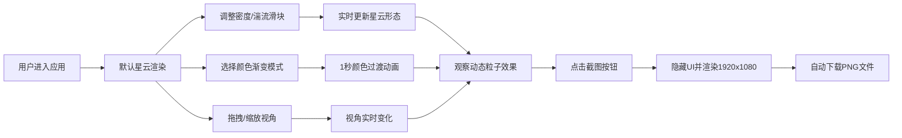

## 1. 产品概述

在线交互式3D星云形态生成与动态着色编辑应用，面向天文爱好者、数字艺术家和创意工作者，提供可视化的星云云团创建与编辑体验。用户可以实时调整三维星云的形态参数、颜色映射和粒子发射效果，生成独特的宇宙视觉作品，并导出为高分辨率图片。

- 核心价值：将复杂的天体物理视觉效果转化为直观的参数化创作工具
- 目标用户：天文爱好者、视觉设计师、游戏美术、教育工作者

## 2. 核心特性

### 2.1 用户角色

| 角色 | 注册方式 | 核心权限 |
|------|---------|---------|
| 普通用户 | 无需注册，直接使用 | 完整使用所有参数调整、颜色编辑和截图导出功能 |

### 2.2 功能模块

1. **3D星云渲染场景**：星云雾状体渲染、星空背景、视角交互（旋转/缩放）
2. **形态参数控制**：密度滑块、湍流度滑块、实时预览更新
3. **颜色映射编辑**：3种预设渐变模式选择、1秒平滑过渡动画
4. **动态粒子发射系统**：星云内部多发射器、粒子寿命与速度控制、气体喷流模拟
5. **高分辨率截图导出**：1920x1080 PNG导出、自动下载
6. **性能监控**：实时FPS计数器、自动降质保流畅

### 2.3 页面详情

| 页面名称 | 模块名称 | 功能描述 |
|---------|---------|---------|
| 主页面 | 3D场景区（左侧70%） | 渲染星云粒子系统、OrbitControls交互、深空背景渐变、星空点缀 |
| 主页面 | 控制面板（右侧320px） | 磨砂玻璃效果、参数滑块组、颜色模式选择器、截图按钮 |
| 主页面 | FPS监控器（右下角） | 白色文字半透明黑底、低于45FPS自动降低粒子数 |

## 3. 核心流程

## 4. 用户界面设计

### 4.1 设计风格

- **主色调**：深空蓝紫渐变背景 (#0b0b1a → #1a1a3e)，强调色 #6c7cf0（按钮主色），滑块轨道 #3a3a5e，滑块按钮 #7c8cf0
- **按钮样式**：圆角设计，悬停时亮度提升10%，0.2秒 ease-in-out 过渡
- **字体**：现代无衬线字体，分组标题 16px/600/#d0d0e0，值标签可编辑
- **布局风格**：左右分栏布局，右侧320px固定宽度控制面板，磨砂玻璃效果（backdrop-filter: blur(12px), rgba(255,255,255,0.08)）
- **视觉元素**：粒子光晕效果、颜色渐变条预览

### 4.2 页面设计概览

| 页面名称 | 模块名称 | UI元素 |
|---------|---------|---------|
| 主页面 | 3D场景区 | 全屏WebGL画布、深空渐变背景、随机1-2px白点星空、OrbitControls光标 |
| 主页面 | 控制面板-形态组 | 分组标题、密度滑块(0.1-1.0)、湍流度滑块(0-100)、可编辑数值标签 |
| 主页面 | 控制面板-颜色组 | 分组标题、3个渐变预览卡片（选中高亮边框）、卡片悬停微放大 |
| 主页面 | 控制面板-操作区 | 主色圆角截图按钮、按钮悬停亮度动画 |
| 主页面 | FPS监控 | 固定右下角、半透明黑底白字、数值实时更新 |

### 4.3 响应式设计

- 桌面端优先（>1280px）：左右分栏，控制面板320px固定宽度
- 平板端（768-1280px）：控制面板宽度降至280px
- 移动端（<768px）：上下堆叠布局，控制面板固定底部可折叠

### 4.4 3D场景指南

- **环境氛围**：深空宇宙感，低环境光配合粒子自发光
- **光照设置**：微弱环境光 (0.1强度)，主要依赖粒子材质自发光颜色
- **相机设置**：PerspectiveCamera，fov 60，初始位置 (0, 0, 8)，OrbitControls启用阻尼
- **构图焦点**：星云居中，半径约3-4单位，粒子系统为核心视觉
- **交互动画**：星云缓慢自转（0.001rad/帧），粒子发射持续动态更新
- **后期处理**：轻微辉光效果提升星云氛围感
- **性能预算**：基础粒子数20000，动态粒子500，目标FPS ≥ 50
