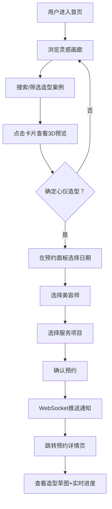

## 1. 产品概述

宠尚造型馆是一个在线宠物美容预约与造型灵感平台，旨在让宠物主人轻松浏览不同品种宠物的造型案例、预约专业美容师服务，并在预约后通过实时通知了解造型进度和最终效果对比。目标用户为有宠物美容需求的宠物主人，核心价值在于将灵感发现与预约服务无缝连接，提供沉浸式的3D造型预览体验。

## 2. 核心功能

### 2.1 用户角色

| 角色 | 注册方式 | 核心权限 |
|------|----------|----------|
| 宠物主人 | 邮箱注册 | 浏览造型案例、预约美容师、查看预约进度 |

### 2.2 功能模块

1. **首页**：灵感画廊面板（左侧）+ 预约面板（右侧），顶部毛玻璃导航栏
2. **登录/注册页**：用户身份认证
3. **预约详情页**：预约信息、造型草图、实时进度条

### 2.3 页面详情

| 页面名称 | 模块名称 | 功能描述 |
|----------|----------|----------|
| 首页 | 顶部导航栏 | 毛玻璃效果导航，左侧卡通爪印Logo+名称，右侧登录/注册/我的预约胶囊按钮 |
| 首页 | 灵感画廊面板 | 瀑布流卡片展示宠物造型案例，搜索栏+品种/风格筛选，点击卡片弹出3D预览 |
| 首页 | 预约面板 | 日期选择器（90天内），美容师列表，服务项目选择，确认预约按钮 |
| 首页 | 3D预览弹窗 | 360度旋转宠物3D模型，造型参数展示（毛发长度、修剪形状等） |
| 首页 | 通知组件 | WebSocket推送预约成功通知，带倒计时动画 |
| 登录/注册页 | 认证表单 | 邮箱+密码登录/注册 |
| 预约详情页 | 预约信息 | 预约时间、美容师、服务项目详情 |
| 预约详情页 | 造型草图 | 手绘风格SVG展示预期造型效果 |
| 预约详情页 | 实时进度条 | WebSocket驱动的造型进度实时更新 |

## 3. 核心流程

用户进入首页后，在左侧灵感画廊浏览造型案例卡片，可通过搜索和筛选快速定位感兴趣的品种和风格。点击卡片弹出3D预览窗口，旋转查看360度造型效果和详细参数。确定心仪造型后，在右侧预约面板选择日期、美容师和服务项目，确认预约后通过WebSocket收到成功通知（带倒计时动画），随后跳转至预约详情页查看造型草图和实时进度。

## 4. 用户界面设计

### 4.1 设计风格

- 主色调：暖橙色(#e67e22)与珊瑚粉(#f39c12)渐变，浅暖色背景(#fff7e6)
- 辅助色：淡金色(#d4a574)用于边框装饰
- 按钮风格：圆角胶囊按钮，渐变背景，悬停加深
- 字体：标题使用 Playfair Display，正文使用 Noto Sans SC
- 布局风格：双栏布局，左侧灵感画廊(380px) + 右侧预约面板
- 图标风格：Lucide图标库 + 卡通爪印Logo
- 卡片风格：白色圆角卡片，柔和阴影，瀑布流排列

### 4.2 页面设计概览

| 页面名称 | 模块名称 | UI元素 |
|----------|----------|--------|
| 首页 | 顶部导航栏 | 毛玻璃效果(rgba(255,255,255,0.7), blur 8px, 1px #d4a574边框)，左侧Logo+名称，右侧3个胶囊按钮(渐变暖橙到珊瑚粉) |
| 首页 | 灵感画廊面板 | 380px宽，白色圆角20px，柔和阴影，瀑布流卡片(宠物照片+品种+风格标签+星级)，顶部搜索栏+下拉筛选 |
| 首页 | 3D预览弹窗 | 居中模态窗口，Three.js渲染360度旋转模型(0.02rad/s)，造型参数面板 |
| 首页 | 预约面板 | 日期选择器(90天)，美容师卡片列表(头像+擅长风格+时段)，服务项目(含价格+时长)，确认按钮 |
| 首页 | 通知组件 | 右上角弹出，倒计时动画，WebSocket驱动 |
| 登录/注册页 | 认证表单 | 居中卡片表单，暖色主题 |
| 预约详情页 | 预约信息卡 | 预约详情展示 |
| 预约详情页 | 造型草图区 | 手绘风格SVG |
| 预约详情页 | 进度条 | 实时更新进度 |

### 4.3 响应式设计

桌面优先设计，在1024px以下时双栏布局切换为单栏，画廊面板和预约面板上下堆叠。触屏设备优化卡片点击区域。

### 4.4 3D场景指引

- 环境氛围：温暖柔和的室内光线，淡暖色环境光
- 灯光设置：主方向光(暖白色) + 环境光(淡黄色) + 补光
- 相机设置：围绕宠物模型自动旋转，速度0.02弧度/秒，用户可拖拽交互
- 构图焦点：宠物3D模型居中，造型参数面板在侧边
- 交互：鼠标拖拽旋转模型，滚轮缩放
- 后处理：柔和阴影，轻微抗锯齿
- 性能预算：保持60FPS帧率，简化几何体
