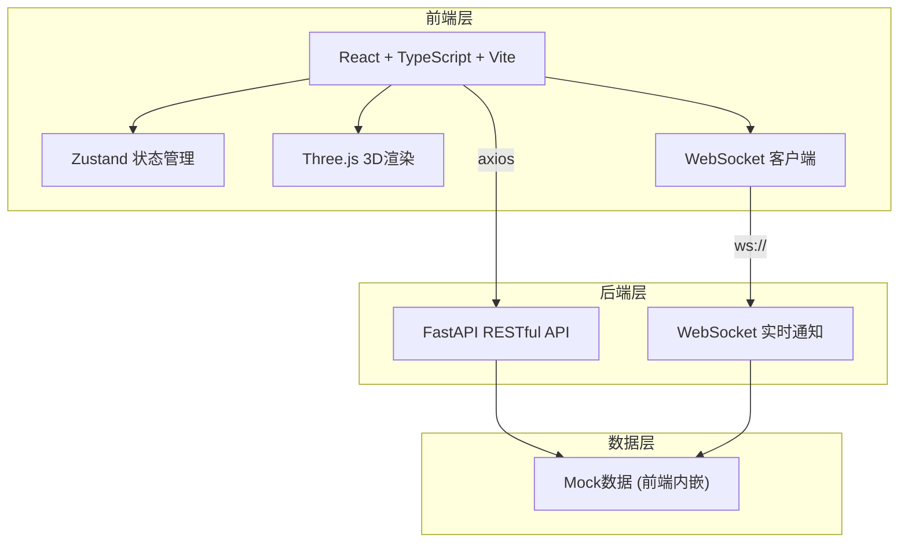
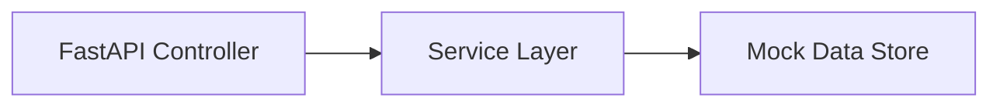
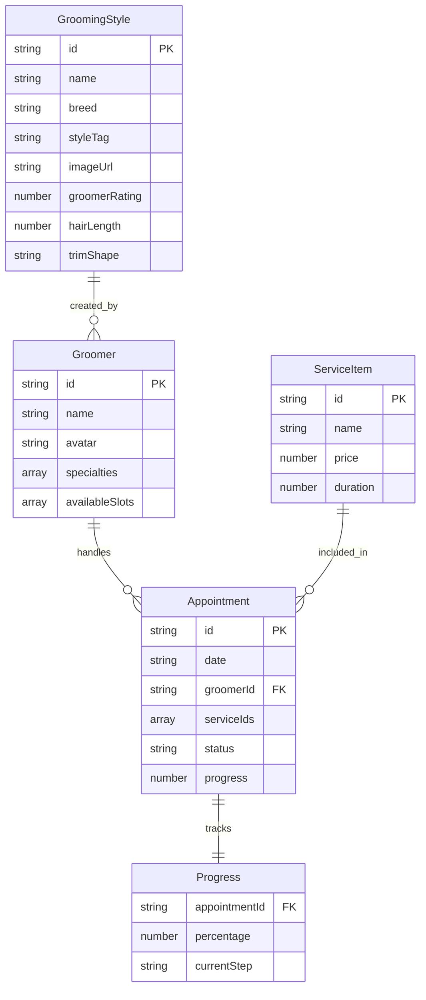

## 1. 架构设计



## 2. 技术说明

- 前端：React@18 + TypeScript + Vite + SCSS
- 初始化工具：vite-init (react-ts 模板)
- 3D渲染：three + @react-three/fiber + @react-three/drei
- 状态管理：zustand
- 路由：react-router-dom
- HTTP客户端：axios
- 日期处理：dayjs
- 样式：Sass (SCSS)
- 后端：FastAPI (Python) 提供 RESTful API 和 WebSocket 实时通知
- 数据库：Mock数据内嵌于前端，后端API为模拟接口

## 3. 路由定义

| 路由 | 用途 |
|------|------|
| / | 首页，集成灵感画廊和预约面板 |
| /login | 登录/注册页面 |
| /appointment/:id | 预约详情页，显示预约信息、造型草图和实时进度 |

## 4. API定义

### 4.1 RESTful API

```typescript
interface GroomingStyle {
  id: string
  name: string
  breed: string
  styleTag: string
  imageUrl: string
  groomerRating: number
  hairLength: number
  trimShape: string
}

interface Groomer {
  id: string
  name: string
  avatar: string
  specialties: string[]
  availableSlots: string[]
  portfolio: string[]
}

interface ServiceItem {
  id: string
  name: string
  price: number
  duration: number
}

interface Appointment {
  id: string
  date: string
  groomerId: string
  serviceIds: string[]
  status: 'confirmed' | 'in_progress' | 'completed'
  progress: number
}

interface ApiResponse<T> {
  code: number
  data: T
  message: string
}
```

### 4.2 WebSocket消息格式

```typescript
interface WSMessage {
  type: 'appointment_confirmed' | 'progress_update' | 'style_complete'
  payload: {
    appointmentId: string
    progress?: number
    message?: string
  }
  timestamp: string
}
```

## 5. 服务端架构图



## 6. 数据模型

### 6.1 数据模型定义



### 6.2 数据定义

使用前端Mock数据，无需DDL。所有数据通过TypeScript接口定义，初始数据内嵌在services/api.ts中。
