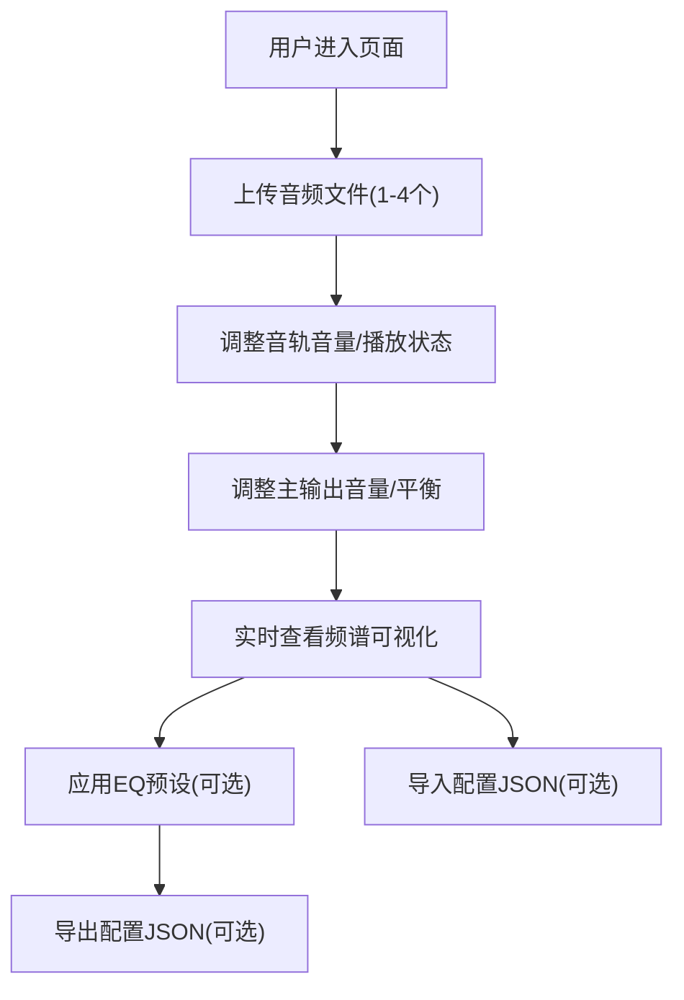

## 1. 产品概述
在线音乐创作工具，让用户在浏览器中实时混音并可视化音频频谱。解决音乐爱好者和入门制作人难以直观理解不同音轨叠加效果以及频率分布变化的问题。
- 主要目的：提供直观的多轨音频混音和频谱可视化体验
- 目标用户：音乐爱好者、入门级音乐制作人、音频学习者
- 产品价值：降低混音学习门槛，通过视觉化方式帮助理解音频频率分布

## 2. 核心功能

### 2.1 功能模块
1. **音轨管理模块**：支持最多4个音轨的上传、播放控制、音量调节
2. **混音控制模块**：主输出音量、声道平衡、播放进度控制
3. **频谱可视化模块**：实时频率分布柱状图展示，支持交互播放纯音
4. **预设与导出模块**：EQ预设应用、配置文件导入导出

### 2.3 页面详情
| 页面名称 | 模块名称 | 功能描述 |
|-----------|-------------|---------------------|
| 主页面 | 顶部控制栏 | 播放/暂停、停止、导出、导入按钮，毛玻璃效果 |
| 主页面 | 频谱可视化面板 | 300px高度Canvas，实时频率柱状图，20Hz-20kHz对数刻度，红（低）/绿（中）/蓝（高）三色渐变 |
| 主页面 | 主输出控制区 | 总音量滑块（0-100%）、声道平衡滑块（-50到+50）、进度条跳转 |
| 主页面 | 音轨面板 | 水平滚动卡片，最多4个音轨，每个卡片包含上传、波形缩略图、播放/暂停、音量滑块 |
| 主页面 | 预设选择区 | 流行、电子、古典三种EQ预设一键应用 |

## 3. 核心流程
用户上传最多4个音频文件 → 调整各音轨音量和主输出参数 → 实时查看频谱可视化效果 → 应用EQ预设或自定义参数 → 导出/导入混音配置

## 4. 用户界面设计

### 4.1 设计风格
- 主背景：深灰蓝渐变（#1a1a2e → #16213e）
- 控制栏：半透明毛玻璃效果（rgba(255,255,255,0.1)，模糊12px）
- 按钮：圆角设计，悬停时1.05倍放大和发光box-shadow效果
- 频谱柱状条：宽度4px，间距1px，颜色从红→绿→蓝渐变
- 音轨卡片：280px × 120px，背景rgba(255,255,255,0.05)，圆角10px
- 字体：现代无衬线字体，深色背景上使用浅色文本确保可读性

### 4.2 页面设计概述
| 页面名称 | 模块名称 | UI元素 |
|-----------|-------------|-------------|
| 主页面 | 顶部控制栏 | 毛玻璃背景、圆角按钮、悬停动效 |
| 主页面 | 频谱可视化 | Canvas绘制、30fps以上、对数刻度频率分布、三色渐变 |
| 主页面 | 主输出控制 | 自定义滑块样式、进度条可点击跳转 |
| 主页面 | 音轨面板 | 水平滚动布局、卡片式设计、波形缩略图 |
| 主页面 | 预设选择 | 三列按钮布局、选中状态高亮 |

### 4.3 响应式设计
- 桌面端（≥1200px）：音轨卡片水平滚动排列
- 移动端（<1200px）：音轨卡片垂直堆叠排列
- 触控优化：滑块和按钮增大点击区域，确保移动端可操作

## 5. 性能要求
- 频谱可视化渲染帧率稳定在30fps以上
- 音频处理延迟控制在100ms以内
- 支持最长30秒的音频文件
- 支持WAV和MP3格式
