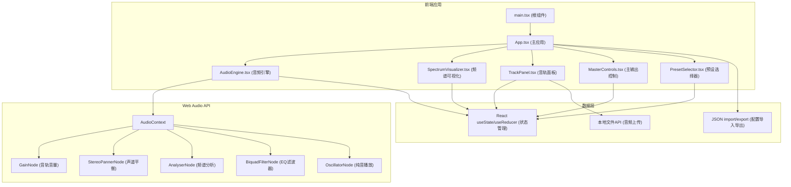

## 1. 架构设计



## 2. 技术描述

- **前端框架**: React 18 + TypeScript
- **构建工具**: Vite 5
- **音频处理**: Web Audio API (原生)
- **可视化**: Canvas 2D API
- **样式**: 原生CSS + CSS变量
- **状态管理**: React Hooks (useState, useCallback, useRef, useEffect)

### 核心技术要点：
1. **AudioEngine组件**：封装所有Web Audio API节点连接，管理音频上下文、音轨播放状态、频谱数据提取
2. **SpectrumVisualizer组件**：使用requestAnimationFrame实现30fps+的Canvas渲染，对数刻度频率映射
3. **TrackPanel组件**：处理文件上传（拖拽+点击）、波形缩略图生成、单轨音量控制
4. **性能优化**：使用useMemo/useCallback避免不必要重渲染，Canvas离屏渲染优化

## 3. 目录结构

```
auto115/
├── package.json
├── vite.config.js
├── tsconfig.json
├── index.html
└── src/
    ├── main.tsx              # React入口
    ├── App.tsx               # 主应用组件
    ├── types/
    │   └── audio.ts          # TypeScript类型定义
    ├── components/
    │   ├── AudioEngine.tsx   # 音频引擎
    │   ├── SpectrumVisualizer.tsx  # 频谱可视化
    │   ├── TrackPanel.tsx    # 音轨面板
    │   ├── MasterControls.tsx # 主输出控制
    │   └── PresetSelector.tsx # 预设选择器
    ├── hooks/
    │   └── useAudioEngine.ts # 音频引擎Hook
    ├── utils/
    │   ├── audioUtils.ts     # 音频处理工具函数
    │   └── canvasUtils.ts    # Canvas绘制工具函数
    └── styles/
        └── global.css        # 全局样式
```

## 4. 类型定义

```typescript
interface Track {
  id: string;
  name: string;
  duration: number;
  volume: number; // 0-100
  isPlaying: boolean;
  audioBuffer: AudioBuffer | null;
  waveformData: number[];
  sourceNode: AudioBufferSourceNode | null;
  gainNode: GainNode | null;
}

interface MixConfig {
  masterVolume: number; // 0-100
  masterPan: number; // -50 to +50
  currentTime: number;
  duration: number;
  eqPreset: string;
  tracks: TrackConfig[];
}

interface TrackConfig {
  id: string;
  name: string;
  volume: number;
}

interface EQPreset {
  name: string;
  lows: number; // dB增益
  mids: number;
  highs: number;
}

type PresetType = 'pop' | 'electronic' | 'classical';
```

## 5. 核心数据流

1. 用户上传音频文件 → FileReader → AudioContext.decodeAudioData → 生成AudioBuffer和波形数据
2. 播放控制 → AudioBufferSourceNode.start/stop → 连接到GainNode → 连接到主输出
3. 频谱数据 → AnalyserNode.getByteFrequencyData → 传递给SpectrumVisualizer → Canvas绘制
4. EQ预设 → 更新BiquadFilterNode频率和增益 → 实时影响音频输出
5. 导出配置 → 序列化为JSON → Blob下载；导入配置 → JSON.parse → 恢复状态

## 6. 性能优化策略

1. **频谱渲染优化**：
   - 使用requestAnimationFrame实现与显示器刷新率同步
   - 批量绘制柱状条，减少Canvas API调用
   - 缓存渐变对象，避免重复创建

2. **音频处理优化**：
   - 复用AudioContext，避免重复创建
   - 音频文件解码使用Web Worker（可选）
   - AnalyserNode.fftSize设置为2048，平衡精度和性能

3. **React渲染优化**：
   - 使用React.memo包装子组件
   - 频繁更新的频谱数据使用useRef而非state
   - 事件处理函数使用useCallback缓存
