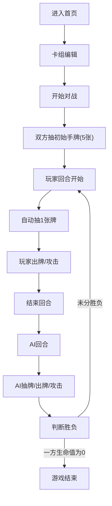

## 1. 产品概述

在线TCG卡牌对战模拟与卡组管理应用，用户可以创建管理自己的卡组，在6x4棋盘上与AI对手进行回合制对战。

- 主要目的：提供完整的TCG卡牌游戏体验，包括卡组构建、策略对战和AI对抗
- 目标用户：卡牌游戏爱好者、策略游戏玩家
- 产品价值：轻量级在线卡牌对战体验，无需下载即开即玩

## 2. 核心功能

### 2.1 用户角色
| 角色 | 注册方式 | 核心权限 |
|------|----------|----------|
| 玩家 | 无需注册 | 卡组编辑、对战AI、查看日志 |

### 2.2 功能模块
1. **卡组编辑器**：卡牌池浏览、卡组构建、数量统计
2. **对战系统**：6x4棋盘、回合制对战、手牌管理
3. **技能系统**：主动技能、被动技能、特效提示
4. **AI对手**：决策树AI、自动出牌、智能攻击
5. **对战日志**：实时记录、类型着色、时间戳

### 2.3 页面详情
| 页面名称 | 模块名称 | 功能描述 |
|----------|----------|----------|
| 首页/导航 | 顶部导航 | 切换卡组编辑和对战模式 |
| 卡组编辑页 | 卡牌池 | 展示50张预设卡牌，支持筛选和搜索 |
| 卡组编辑页 | 卡组区 | 网格展示已选卡牌，支持拖拽移除 |
| 卡组编辑页 | 统计栏 | 显示卡牌数量、平均费用 |
| 对战页面 | 棋盘区域 | 6行4列棋盘，卡牌召唤和交互 |
| 对战页面 | 控制面板 | 手牌、费用、生命值、结束回合 |
| 对战页面 | 对战日志 | 滚动显示对战记录，类型着色 |

## 3. 核心流程

### 主要对战流程
用户进入首页 → 编辑卡组（从卡牌池拖拽卡牌到卡组）→ 开始对战 → 双方抽初始手牌 → 回合循环（抽牌→出牌→攻击→结束回合）→ 一方生命值归零 → 游戏结束

## 4. 用户界面设计

### 4.1 设计风格
- **主色调**：深蓝黑(#1a1a2e)背景，深邃神秘的游戏氛围
- **强调色**：亮金色(#ffd700)卡牌边框和按钮高光，高贵感
- **稀有度配色**：普通灰(#888)、稀有蓝(#4a9eff)、史诗紫(#b34aff)、传说橙(#ff8c00)
- **按钮风格**：金色渐变圆角按钮，悬停有光泽效果
- **字体**：标题使用游戏风格字体，正文使用清晰易读的无衬线字体
- **布局风格**：左侧棋盘+右侧控制面板的经典对战布局
- **图标风格**：简约线性图标，金色描边

### 4.2 页面设计概述
| 页面名称 | 模块名称 | UI元素 |
|----------|----------|--------|
| 卡组编辑页 | 卡牌池 | 网格布局、卡牌悬停放大、稀有度边框 |
| 卡组编辑页 | 卡组区 | 网格列表、已选高亮、拖拽移除 |
| 卡组编辑页 | 底部统计 | 卡牌数量、平均费用、开始按钮 |
| 对战页面 | 棋盘区域 | 6x4网格、半透明渐变背景、网格线、飞入动画 |
| 对战页面 | 控制面板 | 毛玻璃效果、手牌横向滚动、圆形费用、生命进度条 |
| 对战页面 | 对战日志 | 右侧面板、滚动列表、时间戳、类型颜色 |

### 4.3 响应式
- 桌面端（默认）：左侧棋盘居中，右侧控制面板320px宽度
- 平板端：控制面板宽度自适应缩小
- 移动端：控制面板下沉到底部，棋盘缩放到适配屏幕宽度
- 支持触摸操作，拖拽优化

### 4.4 动效设计
- 卡牌召唤：从手牌飞向目标格子，缩放+位移动画
- 攻击效果：卡牌前冲动画，伤害数字飘出
- 技能释放：文字特效提示，1-2秒渐隐
- 悬停效果：卡牌放大1.1倍，显示技能描述卡片
- 回合切换：淡入淡出过渡，当前玩家高亮
