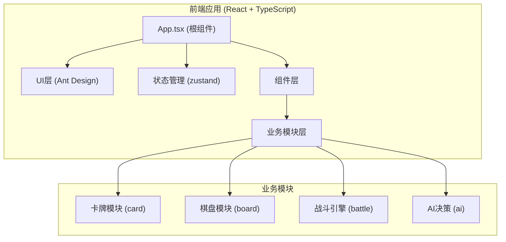
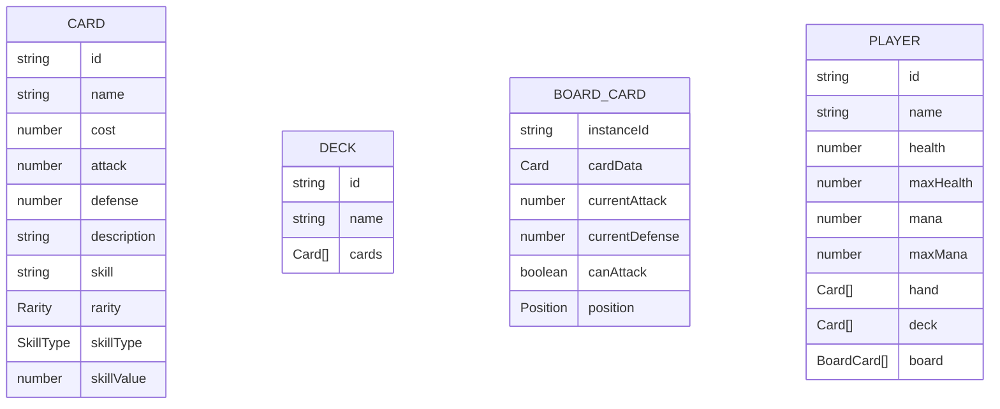

## 1. 架构设计



## 2. 技术描述

- **前端框架**：React 18 + TypeScript
- **构建工具**：Vite 5
- **UI组件库**：Ant Design 5
- **状态管理**：zustand 4
- **唯一ID生成**：uuid 9
- **编程语言**：TypeScript (严格模式)
- **模块系统**：ESNext
- **后端**：无（纯前端应用）
- **数据**：Mock数据（内置50张预设卡牌）

## 3. 路由定义

| 路由 | 用途 |
|------|------|
| / | 首页/导航页 |
| /deck-builder | 卡组编辑器 |
| /battle | 对战页面 |

## 4. 文件结构

```
src/
├── App.tsx                 # 根组件，路由配置
├── main.tsx               # 入口文件
├── index.css              # 全局样式
├── store/
│   └── useGameStore.ts    # zustand全局状态
├── modules/
│   ├── card/
│   │   ├── CardTypes.ts   # 卡牌类型定义和技能枚举
│   │   ├── CardData.ts    # 50张预设卡牌数据
│   │   └── CardDeck.ts    # 卡组构建、洗牌、抽牌逻辑
│   ├── board/
│   │   └── GameBoard.tsx  # 棋盘渲染和交互
│   ├── battle/
│   │   └── BattleEngine.ts # 战斗引擎
│   └── ai/
│       └── AIDecision.ts  # AI决策模块
├── pages/
│   ├── Home.tsx           # 首页
│   ├── DeckBuilder.tsx    # 卡组编辑页
│   └── BattlePage.tsx     # 对战页面
└── components/
    ├── CardItem.tsx       # 卡牌组件
    ├── HandCards.tsx      # 手牌区组件
    ├── BattleLog.tsx      # 对战日志组件
    └── ControlPanel.tsx   # 控制面板组件
```

## 5. 数据模型

### 5.1 卡牌数据模型



### 5.2 枚举定义

- **Rarity（稀有度）**：COMMON, RARE, EPIC, LEGENDARY
- **SkillType（技能类型）**：
  - ACTIVE_SUMMON（召唤时触发）
  - ACTIVE_ATTACK（攻击时触发）
  - PASSIVE_GLOBAL（全局被动）
  - PASSIVE_BUFF（增益被动）
- **LogType（日志类型）**：PLAYER, AI, SYSTEM

### 5.3 游戏状态

- 当前回合玩家
- 回合数
- 游戏阶段（准备、战斗中、结束）
- 双方玩家数据
- 对战日志列表
- 选中的卡牌
- 拖拽状态
