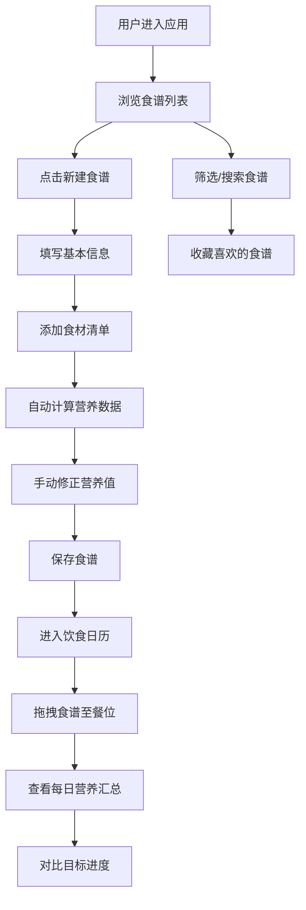

## 1. 产品概述

个人创意食谱管理与营养分析应用，为美食爱好者提供系统化的食谱记录、营养计算和饮食规划工具。解决用户在记录食谱、计算营养成分和规划饮食时缺乏专业工具的痛点。

- 目标用户：家庭厨师、健身爱好者、美食博主、注重健康饮食的人群
- 产品价值：一站式管理食谱营养，智能可视化分析，科学规划每日饮食

## 2. 核心功能

### 2.1 用户角色

| 角色 | 注册方式 | 核心权限 |
|------|----------|----------|
| 普通用户 | 本地使用（无注册） | 创建编辑食谱、查看营养分析、规划饮食日历、收藏食谱 |

### 2.2 功能模块

1. **食谱列表页**：菜谱搜索、筛选、收藏、网格卡片展示
2. **食谱编辑器**：创建/编辑食谱，富文本步骤编辑，食材管理，营养计算
3. **饮食日历**：周计划拖拽排餐，每日营养汇总，目标进度对比
4. **个人中心**：每日营养目标设置，收藏食谱查看

### 2.3 页面详情

| 页面名称 | 模块名称 | 功能描述 |
|----------|----------|----------|
| 食谱列表页 | 搜索筛选栏 | 按菜系、烹饪时间、难度多维度筛选 |
| 食谱列表页 | 食谱卡片网格 | 缩略图、标题、评分、收藏按钮展示 |
| 食谱编辑器 | 基本信息表单 | 标题、图片、烹饪时间、难度星级 |
| 食谱编辑器 | 富文本步骤 | 多段落编辑，加粗、列表标记 |
| 食谱编辑器 | 食材清单 | 名称、数量、单位，食材库搜索补全 |
| 食谱编辑器 | 营养可视化 | Canvas四色饼图，0.5秒呼吸动画，手动修正 |
| 饮食日历 | 周日历拖拽 | 周一至周日早/中/晚餐槽位，拖拽食谱 |
| 饮食日历 | 营养汇总面板 | 每日营养总和，目标对比进度条（绿→红渐变） |
| 个人中心 | 目标设置 | 每日卡路里目标值设置 |

## 3. 核心流程

## 4. 用户界面设计

### 4.1 设计风格

- **主背景色**：浅木色 #f7f1e3，温暖自然的美食氛围
- **主色按钮**：#4a7c59 深绿色，悬停变深，健康有机感
- **卡片面板**：白色背景，圆角16px，柔和阴影 rgba(0,0,0,0.06)
- **导航栏**：半透明毛玻璃 rgba(255,255,255,0.75)，模糊10px，淡米色细边框
- **交互过渡**：0.2秒 ease-in-out，按钮/拖拽悬停反馈
- **字体**：使用 Playfair Display（标题）+ Lora（正文）优雅衬线组合
- **动画**：饼图0.5秒呼吸动画，收藏爱心缩放动画

### 4.2 页面设计概览

| 页面名称 | 模块名称 | UI元素 |
|----------|----------|----------|
| 食谱列表 | 顶部导航 | 毛玻璃效果，左标题右三按钮，圆角16px |
| 食谱列表 | 筛选栏 | 菜系/时间/难度下拉选择器，圆角设计 |
| 食谱列表 | 卡片网格 | 3列桌面布局，悬停上浮阴影，爱心角标 |
| 食谱编辑器 | 表单区域 | 标签+输入框，星级评分组件，图片上传区 |
| 食谱编辑器 | 富文本区 | 工具栏（加粗/列表），多段落文本框 |
| 食谱编辑器 | 营养饼图 | Canvas四色饼图，色块呼吸闪烁效果 |
| 饮食日历 | 周视图 | 7列×3行网格，拖拽高亮指示 |
| 饮食日历 | 进度条 | 绿→红渐变色，百分比数字标注 |

### 4.3 响应式设计

- **桌面端（≥1200px）**：三栏布局（导航+内容+统计面板），统计面板最小宽320px
- **平板端（768-1199px）**：导航折叠为汉堡菜单，两栏布局
- **移动端（<768px）**：内容区全宽单列，底部Tab导航
