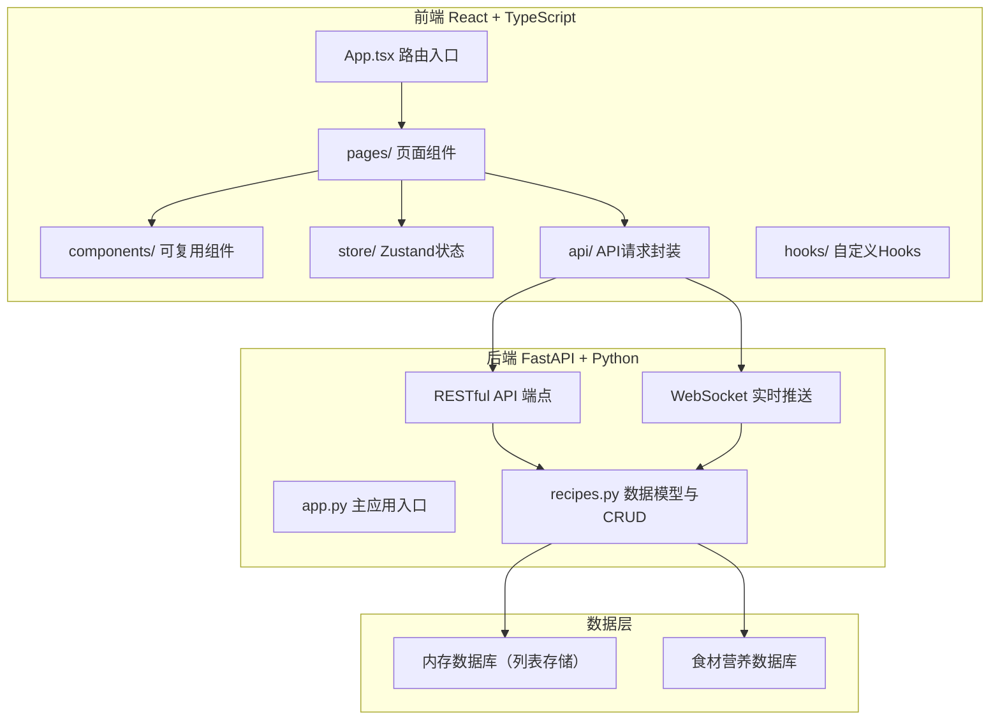
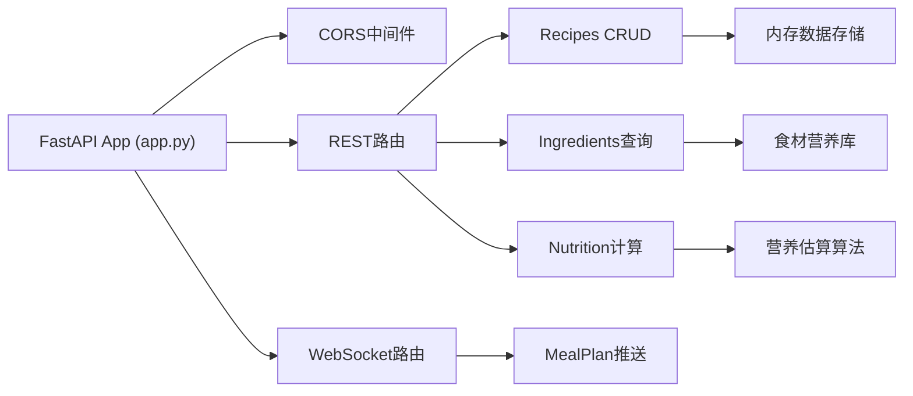
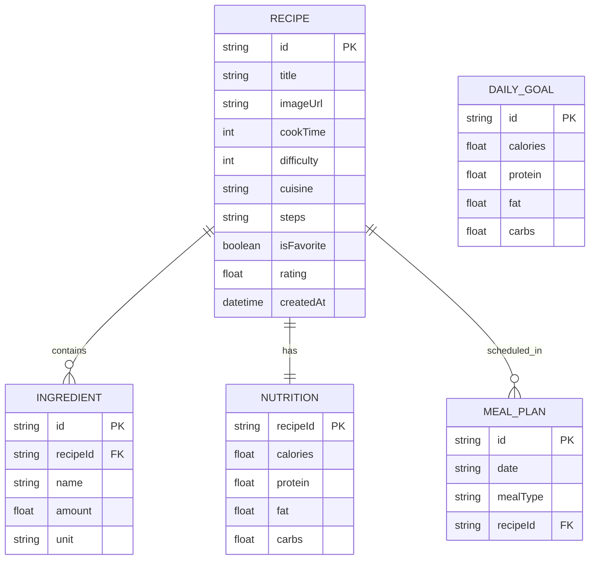

## 1. 架构设计



## 2. 技术描述

- **前端**：React 18 + TypeScript + Vite
- **前端依赖**：react-router-dom, axios, recharts, zustand, socket.io-client, uuid, dayjs
- **状态管理**：Zustand 轻量级全局状态
- **图表**：Canvas原生绘制饼图 + Recharts备用
- **后端**：FastAPI + Uvicorn
- **实时通信**：WebSocket
- **数据存储**：内存数据库（列表模拟），食材营养预设数据
- **构建工具**：Vite 5，端口3000

## 3. 路由定义

| 路由 | 用途 |
|------|------|
| /recipes | 食谱列表页，搜索筛选收藏 |
| /recipes/new | 新建食谱 |
| /recipes/:id/edit | 编辑已有食谱 |
| /calendar | 饮食日历与周计划 |
| /profile | 个人中心与目标设置 |

## 4. API 定义

```typescript
// 数据模型
interface Ingredient {
  id: string;
  name: string;
  amount: number;
  unit: 'g' | 'ml' | '个' | '勺' | '杯';
  caloriesPer100g?: number;
  proteinPer100g?: number;
  fatPer100g?: number;
  carbsPer100g?: number;
}

interface Recipe {
  id: string;
  title: string;
  imageUrl?: string;
  cookTime: number; // 分钟
  difficulty: 1 | 2 | 3 | 4 | 5;
  cuisine: string;
  steps: string; // 富文本HTML
  ingredients: Ingredient[];
  nutrition: {
    calories: number;
    protein: number;
    fat: number;
    carbs: number;
  };
  isFavorite: boolean;
  rating: number;
  createdAt: string;
}

interface MealPlan {
  id: string;
  date: string; // YYYY-MM-DD
  mealType: 'breakfast' | 'lunch' | 'dinner';
  recipeId: string;
}

interface DailyGoal {
  calories: number;
  protein: number;
  fat: number;
  carbs: number;
}

// API端点
// GET /ingredients?search=xxx - 搜索食材库
// GET /recipes - 获取食谱列表（支持筛选参数）
// GET /recipes/:id - 获取单个食谱
// POST /recipes - 创建食谱
// PUT /recipes/:id - 更新食谱
// DELETE /recipes/:id - 删除食谱
// POST /nutrition/calculate - 计算食材营养
// GET /meal-plans - 获取周饮食计划
// POST /meal-plans - 添加饮食计划
// DELETE /meal-plans/:id - 删除饮食计划
// WS /ws/daily-summary - 每日汇总实时推送
```

## 5. 服务端架构



## 6. 数据模型

### 6.1 ER图



### 6.2 初始化数据

预置常见食材营养数据库（每100g含量）：
- 米饭：热量116kcal，蛋白2.6g，脂肪0.3g，碳水25.9g
- 鸡胸肉：热量133kcal，蛋白19.4g，脂肪5g，碳水2.5g
- 鸡蛋：热量144kcal，蛋白13.3g，脂肪8.8g，碳水2.8g
- 西兰花：热量33kcal，蛋白4.1g，脂肪0.6g，碳水4.3g
- 等等共30+常见食材
