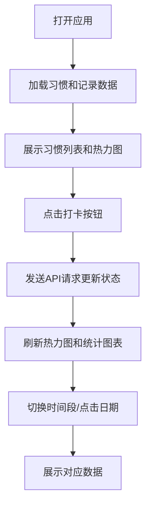

## 1. 产品概述

个人习惯追踪与数据可视化仪表盘应用，帮助用户记录每日习惯完成情况（如阅读、运动、喝水、早睡），通过可视化图表展示长期趋势，激励用户养成良好习惯。

- 核心价值：让习惯养成过程可视化、数据化，通过热力图和统计图表直观展示进步
- 目标用户：希望培养健康生活习惯、需要数据反馈来保持动力的个人用户

## 2. 核心功能

### 2.1 用户角色
| 角色 | 注册方式 | 核心权限 |
|------|----------|----------|
| 普通用户 | 无需注册，本地使用 | 管理习惯、记录完成情况、查看数据统计 |

### 2.2 功能模块
1. **习惯管理面板**：添加、编辑、删除习惯，最多支持10个习惯
2. **今日快速记录**：一键打卡，动画反馈完成状态
3. **日历热力图**：展示一年习惯完成情况，颜色深浅表示完成度
4. **统计图表**：折线图展示完成率趋势，饼图展示习惯占比
5. **日期详情**：点击热力图日期查看当日详细记录

### 2.3 页面详情
| 页面名称 | 模块名称 | 功能描述 |
|---------|----------|----------|
| 主仪表盘 | 左侧习惯面板 | 习惯列表展示、添加习惯、编辑删除操作 |
| 主仪表盘 | 今日打卡区 | 快速记录今日习惯完成情况 |
| 主仪表盘 | 日历热力图 | 年度习惯完成可视化，支持日期点击查看详情 |
| 主仪表盘 | 统计图表区 | 完成率趋势折线图、习惯占比饼图，支持时间段切换 |

## 3. 核心流程

用户打开应用 → 查看已添加的习惯列表 → 点击打卡按钮记录今日完成 → 热力图和图表自动刷新 → 切换时间段查看不同周期的统计数据 → 点击特定日期查看当日详情

## 4. 用户界面设计

### 4.1 设计风格
- **主色调**：绿色系（#196127, #239a3b, #7bc96f, #c6e48b）象征健康和成长
- **背景色**：#f9fafb（浅灰背景），卡片背景#ffffff
- **习惯标签色**：阅读#7b68ee，运动#ff6b6b，喝水#4ecdc4，早睡#45b7d1
- **按钮样式**：圆角设计，hover时背景色变深5%或放大1.05倍，0.2秒过渡
- **字体**：现代无衬线字体，清晰的层级关系
- **布局**：左侧固定面板（320px）+ 右侧主内容区，卡片式设计
- **阴影**：柔和阴影 rgba(0,0,0,0.05)，圆角12px

### 4.2 页面设计概览
| 页面名称 | 模块名称 | UI元素 |
|---------|----------|--------|
| 主仪表盘 | 习惯面板 | 彩色标签卡片、左色带设计、编辑删除下拉菜单、添加输入框 |
| 主仪表盘 | 打卡按钮 | 圆形图标、完成时显示对勾、0.2秒翻转动画和缩放效果 |
| 主仪表盘 | 热力图 | Ant Design Charts Heatmap、绿阶渐变色、tooltip显示详情 |
| 主仪表盘 | 折线图 | 平滑曲线、数据点tooltip、时间段切换按钮、淡入过渡动画 |
| 主仪表盘 | 饼图 | 柔和渐变色、图例说明、0.3秒淡入过渡 |

### 4.3 响应式设计
- 桌面端（>768px）：左侧固定面板320px，右侧主内容区自适应
- 移动端（≤768px）：左侧面板变为可折叠抽屉，主区域占满全宽
- 触摸优化：按钮尺寸≥44px，适合手指点击

