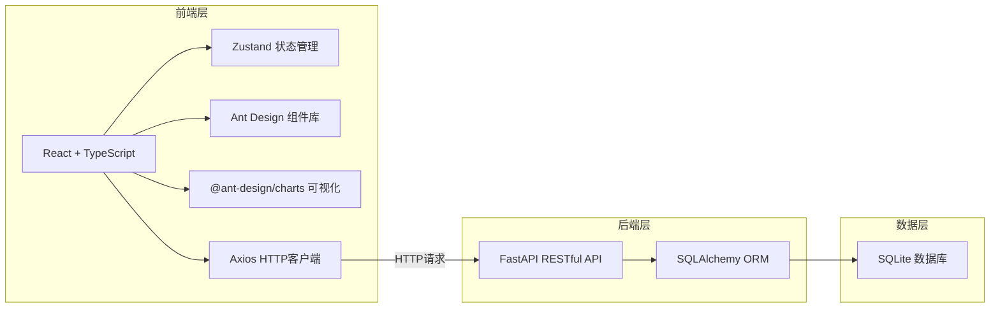
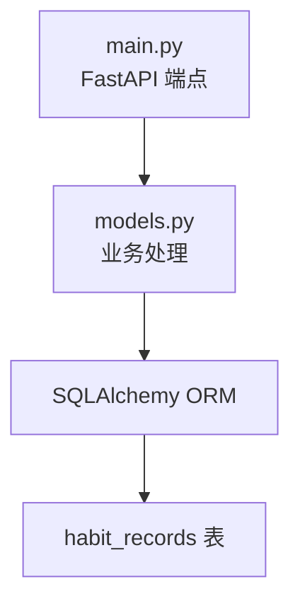
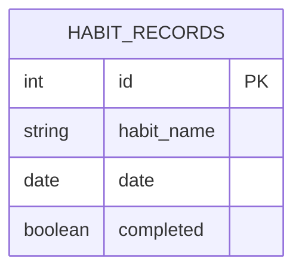

## 1. 架构设计



## 2. 技术描述

- **前端**：React@18 + TypeScript + Vite
- **UI框架**：Ant Design@5 + @ant-design/charts
- **状态管理**：Zustand
- **HTTP客户端**：Axios
- **日期处理**：Day.js
- **后端**：FastAPI + Uvicorn
- **ORM**：SQLAlchemy 2.x
- **数据库**：SQLite
- **数据验证**：Pydantic

## 3. 项目结构

```
auto119/
├── package.json
├── vite.config.js
├── tsconfig.json
├── index.html
├── src/
│   ├── main.tsx
│   ├── App.tsx
│   ├── hooks/
│   │   └── useHabits.ts
│   ├── components/
│   │   ├── CalendarHeatmap.tsx
│   │   └── StatsChart.tsx
│   └── store/
│       └── useHabitsStore.ts
└── backend/
    ├── main.py
    ├── models.py
    └── requirements.txt
```

## 4. API 定义

### 4.1 TypeScript 类型定义

```typescript
interface HabitRecord {
  id: number;
  habit_name: string;
  date: string;
  completed: boolean;
}

interface Habit {
  name: string;
  color: string;
}

interface DailyStats {
  date: string;
  completed_count: number;
  total_habits: number;
  completion_rate: number;
}

interface HabitStats {
  habit_name: string;
  completed_days: number;
}

interface HeatmapData {
  date: string;
  value: number;
}
```

### 4.2 API 端点

| 方法 | 路径 | 参数 | 描述 |
|------|------|------|------|
| GET | /habits | - | 获取所有习惯名称列表 |
| POST | /habits | {habit_name: string} | 添加新习惯 |
| DELETE | /habits/{habit_name} | - | 删除习惯 |
| POST | /habits/toggle | {habit_name: string, date: string} | 切换习惯完成状态 |
| GET | /records | date?: string | 获取指定日期的记录 |
| GET | /stats | days: number = 30 | 获取统计数据 |
| GET | /heatmap | year?: number | 获取年度热力图数据 |

### 4.3 响应格式

```typescript
// GET /habits
{
  "habits": ["阅读", "运动", "喝水", "早睡"]
}

// GET /records
{
  "records": [
    {"id": 1, "habit_name": "阅读", "date": "2026-06-20", "completed": true}
  ]
}

// GET /stats
{
  "daily_stats": [
    {"date": "2026-06-20", "completed_count": 3, "total_habits": 4, "completion_rate": 75}
  ],
  "habit_stats": [
    {"habit_name": "阅读", "completed_days": 25}
  ]
}

// GET /heatmap
{
  "data": [
    {"date": "2026-01-01", "value": 3}
  ]
}
```

## 5. 服务器架构



## 6. 数据模型

### 6.1 ER 图



### 6.2 数据库表定义

```sql
CREATE TABLE habit_records (
    id INTEGER PRIMARY KEY AUTOINCREMENT,
    habit_name TEXT NOT NULL,
    date TEXT NOT NULL,
    completed BOOLEAN NOT NULL DEFAULT 0,
    UNIQUE(habit_name, date)
);

CREATE INDEX idx_habit_date ON habit_records(habit_name, date);
CREATE INDEX idx_date ON habit_records(date);
```

### 6.3 Pydantic 模型

```python
from pydantic import BaseModel
from datetime import date

class HabitName(BaseModel):
    habit_name: str

class ToggleRecord(BaseModel):
    habit_name: str
    date: str

class HabitRecord(BaseModel):
    id: int
    habit_name: str
    date: str
    completed: bool
```

## 7. 性能要求

- API响应时间 ≤ 300ms（本地环境）
- 热力图渲染 ≤ 1.5秒（365条数据）
- 图表动画帧率 ≥ 30fps
- 数据库查询使用索引优化

