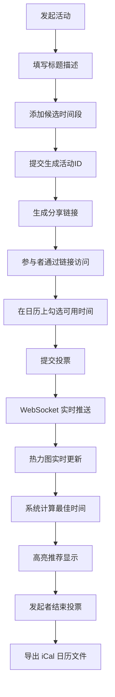

# 在线活动投票与日程协调应用 PRD

## 1. 产品概述

在线活动投票与日程协调应用，帮助团队快速找到最佳会议时间。用户发起活动并提供候选时间段，参与者投票提交可用时段，系统自动计算重合度最高的时间窗口，并支持实时更新和日历导出。

- 解决问题：多人协调会议时间低效，需要反复沟通确认
- 目标用户：项目团队、活动组织者、远程协作团队
- 产品价值：将协调时间从数天缩短至数分钟，自动推荐最优方案

## 2. 核心功能

### 2.1 用户角色

| 角色 | 参与方式 | 核心权限 |
|------|----------|----------|
| 活动发起者 | 创建活动 | 管理活动、查看统计、结束投票、导出结果 |
| 参与者 | 通过链接访问 | 提交可用时段、查看实时投票热力图 |

### 2.2 功能模块

1. **发起活动页**：表单输入活动信息，添加多个候选时间段，生成分享链接
2. **投票页**：日历展示候选时段，用户勾选可用时间，实时显示叠加热力图
3. **智能推荐**：自动计算最佳时间窗口（覆盖≥50%参与者，时长≥1小时），高亮显示
4. **统计面板**：饼图展示各时段支持人数，投票进度实时更新
5. **活动管理**：结束投票、冻结提交、导出 iCal 日历文件
6. **实时更新**：WebSocket 推送新投票，淡入动画提示

### 2.3 页面详情

| 页面名称 | 模块名称 | 功能描述 |
|----------|----------|----------|
| 发起活动页 | 活动表单 | 标题、描述输入，候选时间段增删 |
| 发起活动页 | 时间选择器 | 日期选择 + 起止时间输入，支持多时段 |
| 发起活动页 | 分享链接 | 提交后生成唯一链接，一键复制 |
| 投票页 | 日历视图 | 周视图展示候选时段，支持勾选和拖拽选择 |
| 投票页 | 热力叠加层 | 半透明色块叠加，颜色深度表示参与人数 |
| 投票页 | 推荐时间条 | 顶部高亮显示最佳时间窗口及覆盖比例 |
| 投票页 | 统计饼图 | Canvas 绘制动态饼图，实时更新投票占比 |
| 投票页 | 参与者列表 | 显示已投票用户及其颜色标识 |
| 活动管理面板 | 统计信息 | 投票人数、各时段支持数 |
| 活动管理面板 | 操作按钮 | 结束投票、导出 iCal 文件 |

## 3. 核心流程

**发起活动流程：**
用户填写活动信息 → 添加候选时间段 → 提交生成活动 → 获取分享链接 → 分享给参与者

**参与投票流程：**
访问活动链接 → 查看候选时间段 → 勾选/拖拽选择可用时段 → 提交投票 → 实时看到结果更新

**系统推荐流程：**
收集所有投票数据 → 按时间片统计覆盖人数 → 寻找连续≥1小时且覆盖≥50%的窗口 → 推荐最优方案

## 4. 用户界面设计

### 4.1 设计风格

- **主题**：深色模式（深灰背景 #0F172A），高对比度内容
- **主色调**：靛蓝 #4F46E5，用于按钮、高亮、强调
- **辅助色**：从调色板随机分配用户颜色（紫、青、绿、橙、粉等）
- **卡片风格**：圆角 12px，柔光阴影（box-shadow: 0 4px 24px rgba(79, 70, 229, 0.15)）
- **字体**：现代无衬线字体，使用 rem 单位保证缩放一致性
- **图标**：Feather Icons 风格（线性图标）
- **交互**：所有可点击元素 hover 放大 1.05 倍，颜色微变，0.2s cubic-bezier 过渡

### 4.2 页面设计概览

| 页面名称 | 模块名称 | UI 元素 |
|----------|----------|---------|
| 发起活动页 | Hero 区域 | 大标题、副标题、引导文案 |
| 发起活动页 | 表单卡片 | 深色卡片，输入框带下划线样式 |
| 发起活动页 | 时间片段 | 可删除的时间块，带日期和起止时间 |
| 发起活动页 | 分享弹窗 | 居中模态框，链接展示 + 复制按钮 |
| 投票页 | 顶部推荐条 | 靛蓝渐变背景，最佳时间和覆盖率 |
| 投票页 | 统计饼图 | Canvas 动态饼图，悬浮显示详情 |
| 投票页 | 日历组件 | FullCalendar 周视图，渐变星期标题栏 |
| 投票页 | 用户色块 | 半透明圆角矩形，叠加显示深度 |
| 投票页 | 投票表单 | 底部固定，用户名输入 + 提交按钮 |

### 4.3 响应式设计

- **桌面端**（≥1024px）：日历周视图（一行 7 天），侧边栏显示统计
- **平板端**（768-1023px）：日历周视图压缩，统计移至顶部
- **移动端**（<768px）：切换为列表视图，按日期折叠展开，统计饼图缩小

### 4.4 动效设计

- 页面加载：元素错峰淡入（staggered fade-in）
- 新投票到达：色块从 0 透明度淡入，微微上浮
- 按钮 hover：scale(1.05) + 颜色加深 + 阴影增强
- 日历切换：平滑滑动过渡
- 饼图更新：数值变化带动画过渡
