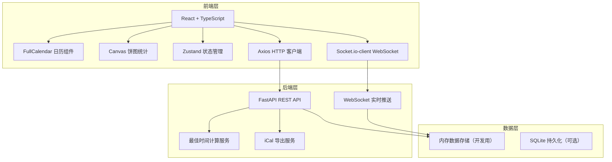
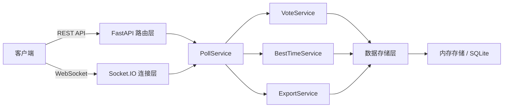
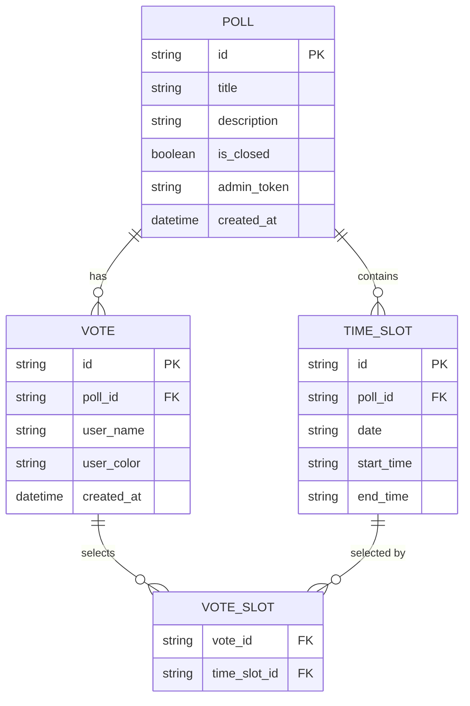

# 在线活动投票与日程协调应用 技术架构文档

## 1. 架构设计



## 2. 技术描述

- **前端**：React 18 + TypeScript + Vite
- **UI 框架**：Tailwind CSS 3 + 自定义深色主题
- **状态管理**：Zustand
- **日历组件**：@fullcalendar/react + @fullcalendar/daygrid + @fullcalendar/timegrid
- **HTTP 客户端**：Axios
- **WebSocket**：socket.io-client
- **日期处理**：date-fns
- **图标**：lucide-react（Feather Icons 风格）
- **后端**：FastAPI (Python) + uvicorn
- **实时通信**：python-socketio 或 FastAPI WebSocket
- **数据存储**：内存存储（演示用），可扩展至 SQLite
- **构建工具**：Vite 5

## 3. 路由定义

| 路由路径 | 页面组件 | 功能描述 |
|----------|----------|----------|
| `/` | CreatePoll | 发起活动首页 |
| `/poll/:id` | VotePoll | 活动投票页面 |
| `/poll/:id/admin` | AdminPoll | 活动管理页面（可选） |

## 4. API 定义

### 4.1 TypeScript 类型定义

```typescript
// 时间段
interface TimeSlot {
  id: string;
  date: string;      // YYYY-MM-DD
  startTime: string; // HH:mm
  endTime: string;   // HH:mm
}

// 参与者投票
interface Vote {
  id: string;
  pollId: string;
  userName: string;
  userColor: string;
  availableSlots: string[]; // TimeSlot id 列表
  createdAt: string;
}

// 活动投票
interface Poll {
  id: string;
  title: string;
  description: string;
  timeSlots: TimeSlot[];
  votes: Vote[];
  isClosed: boolean;
  createdAt: string;
  adminToken: string;
}

// 最佳时间推荐
interface BestTimeRecommendation {
  date: string;
  startTime: string;
  endTime: string;
  coverage: number;     // 0-1 覆盖率
  participantCount: number;
  totalParticipants: number;
}

// 创建活动请求
interface CreatePollRequest {
  title: string;
  description: string;
  timeSlots: Omit<TimeSlot, 'id'>[];
}

// 提交投票请求
interface SubmitVoteRequest {
  userName: string;
  availableSlotIds: string[];
}
```

### 4.2 RESTful API 接口

| 方法 | 路径 | 功能 | 请求体 | 响应 |
|------|------|------|--------|------|
| POST | `/api/polls` | 创建活动 | CreatePollRequest | Poll |
| GET | `/api/polls/:id` | 获取活动详情 | - | Poll |
| POST | `/api/polls/:id/votes` | 提交投票 | SubmitVoteRequest | Vote |
| GET | `/api/polls/:id/best-time` | 获取最佳时间推荐 | - | BestTimeRecommendation |
| POST | `/api/polls/:id/close` | 结束投票 | { adminToken: string } | Poll |
| GET | `/api/polls/:id/export` | 导出 iCal 文件 | - | binary (.ics) |

### 4.3 WebSocket 事件

| 事件名 | 方向 | 数据 | 描述 |
|--------|------|------|------|
| `join_poll` | 客户端→服务端 | { pollId: string } | 加入活动房间 |
| `new_vote` | 服务端→客户端 | Vote | 新投票提交通知 |
| `poll_updated` | 服务端→客户端 | Poll | 活动状态更新 |

## 5. 服务端架构图



## 6. 数据模型

### 6.1 ER 图



### 6.2 核心数据结构（内存版）

```python
# polls 字典存储所有活动
polls = {
    "poll_id": {
        "id": "poll_id",
        "title": "团队周会",
        "description": "讨论本周工作进度",
        "time_slots": [
            {"id": "slot1", "date": "2024-01-15", "start_time": "09:00", "end_time": "11:00"},
            {"id": "slot2", "date": "2024-01-16", "start_time": "14:00", "end_time": "16:00"},
        ],
        "votes": [
            {
                "id": "vote1",
                "user_name": "张三",
                "user_color": "#8B5CF6",
                "available_slot_ids": ["slot1", "slot2"],
                "created_at": "2024-01-10T08:00:00"
            }
        ],
        "is_closed": False,
        "admin_token": "admin_secret",
        "created_at": "2024-01-10T08:00:00"
    }
}
```

## 7. 前端项目结构

```
src/
├── App.tsx              # 主应用组件，路由配置
├── main.tsx             # 入口文件
├── index.css            # 全局样式，Tailwind 配置
├── pages/
│   ├── CreatePoll.tsx   # 发起活动页面
│   └── VotePoll.tsx     # 投票页面
├── components/
│   ├── CalendarView.tsx # 日历视图组件
│   ├── PieChart.tsx     # 饼图统计组件
│   ├── TimeSlotForm.tsx # 时间段表单组件
│   ├── BestTimeBar.tsx  # 最佳时间推荐条
│   └── ParticipantList.tsx # 参与者列表
├── utils/
│   ├── api.ts           # API 客户端封装
│   └── computeBestTime.ts # 最佳时间计算
├── store/
│   └── usePollStore.ts  # Zustand 状态管理
└── types/
    └── index.ts         # TypeScript 类型定义
```

## 8. 性能优化策略

- **React.memo**：对日历事件块、参与者列表项等进行 memo 优化
- **虚拟列表**：参与者列表使用虚拟滚动（当 > 50 人时）
- **防抖处理**：投票提交防抖，避免重复提交
- **WebSocket 合并**：批量更新减少重渲染
- **CSS 硬件加速**：transform + opacity 动画使用 GPU 加速
- **颜色缓存**：用户颜色分配使用哈希缓存，保证同一用户颜色一致

## 9. 后端初始化说明

由于用户指定 FastAPI 作为后端技术栈，需要：
1. 创建 `backend/` 目录存放 Python 后端代码
2. 使用 `uvicorn` 作为 ASGI 服务器
3. Vite 开发服务器代理 `/api` 和 `/ws` 到后端端口
4. 前后端分别启动开发服务器
