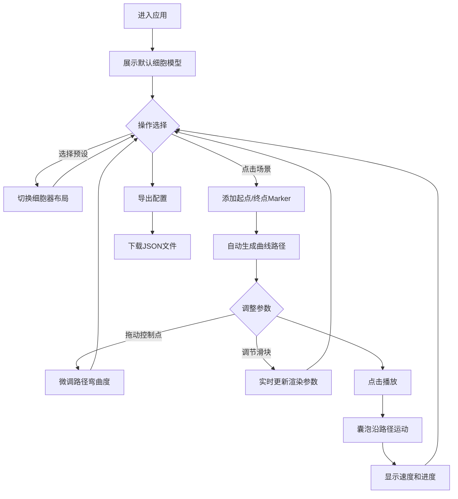

## 1. 产品概述
生物医学交互式3D细胞内物质运输模拟平台，用于在浏览器中动态展示和编辑细胞内部微观运动过程。
- 面向科研教育工作者，提供直观的细胞器建模、路径编辑和运输动画功能
- 填补现有工具难以灵活编辑和播放微观运动的空白，提升生物医学演示效果

## 2. 核心功能

### 2.1 用户角色
| 角色 | 注册方式 | 核心权限 |
|------|----------|----------|
| 科研教育用户 | 无需注册，直接访问 | 编辑场景、播放动画、导出配置 |

### 2.2 功能模块
1. **主页面**：3D场景渲染区、右侧控制面板
2. **细胞模型模块**：细胞器预设、动态渲染、参数调节
3. **路径编辑模块**：起终点标记、曲线生成、控制点拖拽
4. **动画模拟模块**：囊泡运输、尾迹效果、进度显示
5. **配置导出模块**：JSON格式序列化、文件下载

### 2.3 页面详情
| 页面名称 | 模块名称 | 功能描述 |
|----------|----------|----------|
| 主页面 | 3D场景区 | 渲染细胞模型、Marker标记、路径曲线、囊泡动画、尾迹效果，支持鼠标交互 |
| 主页面 | 预设选择标签页 | 提供肝细胞/神经细胞/肌肉细胞三种预设布局，一键切换细胞器配置 |
| 主页面 | 路径编辑标签页 | 显示当前路径信息，提供添加起点/终点、删除路径、播放/暂停控制 |
| 主页面 | 参数调整标签页 | 环境光强度、细胞膜透明度、囊泡大小、尾迹长度滑块调节 |
| 主页面 | 底部操作栏 | 重置场景、播放/暂停、导出JSON配置文件按钮 |

## 3. 核心流程
用户进入页面后，默认展示标准细胞模型，可选择预设布局，通过点击3D场景添加路径起终点，系统自动生成曲线路径，调整参数后播放动画，最后导出配置文件。

## 4. 用户界面设计

### 4.1 设计风格
- **主色调**：科技感暗色主题，蓝紫色调固定色 #7c3aed 和 #3b82f6
- **按钮样式**：渐变色按钮（#00d2ff → #3a7bd5），圆角，点击内陷+波纹反馈
- **字体**：无衬线字体，白色文字，深色背景
- **布局风格**：左右分栏（70% 3D场景，30% 控制面板），毛玻璃半透明面板
- **视觉效果**：柔和边缘光晕、抗锯齿、渐变发光、动态高光

### 4.2 页面设计概述
| 页面名称 | 模块名称 | UI元素 |
|----------|----------|--------|
| 主页面 | 3D场景区 | 深蓝到黑渐变背景、三方向光源、半透明细胞膜、细胞器模型、路径曲线、Marker、囊泡及尾迹 |
| 主页面 | 控制面板 | 毛玻璃背景(rgba(30,30,60,0.85))、backdrop-filter: blur(12px)、圆角16px、内边距20px |
| 主页面 | 标签页切换 | 预设选择/路径编辑/参数调整三标签，0.3秒淡入过渡 |
| 主页面 | 滑块控件 | 数字输入框、颜色渐变进度条、悬停tooltip显示数值 |
| 主页面 | 操作按钮 | 渐变色导出按钮、重置/播放按钮，悬停高亮、点击波纹 |

### 4.3 响应式
桌面端优先，左右分栏固定布局。控制面板固定宽度30%，3D场景自适应剩余空间。触控设备支持屏幕点击添加Marker和双指缩放场景。

### 4.4 3D场景指引
- **环境**：深蓝(#0a0a2a)到纯黑(#000000)径向渐变背景，营造深邃微观氛围
- **光照**：主光从右上45°入射，辅助光从左下，背光从正后方，三光源组合提供柔和立体感
- **相机**：PerspectiveCamera，初始距离15单位，可通过OrbitControls环绕、缩放、平移
- **构图**：细胞居中，细胞器围绕中心细胞核分布，视觉焦点突出
- **交互**：点击添加Marker、拖拽控制点、鼠标滚轮缩放、右键平移
- **后处理**：抗锯齿(MSAA)、Bloom光晕效果增强视觉表现
- **性能**：目标60FPS，低多边形模型，InstancedMesh优化尾迹渲染
