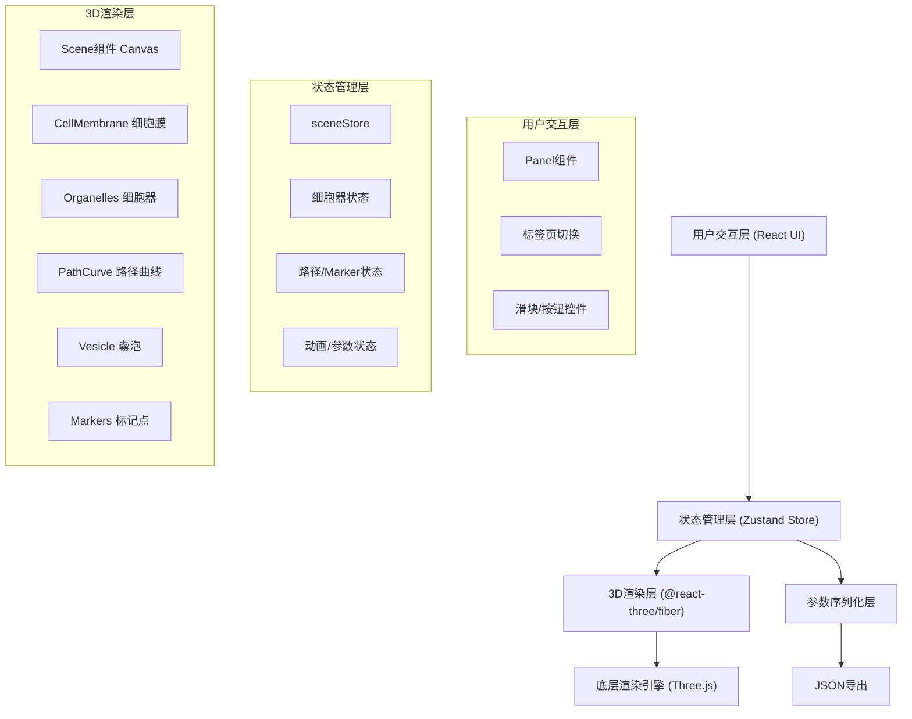
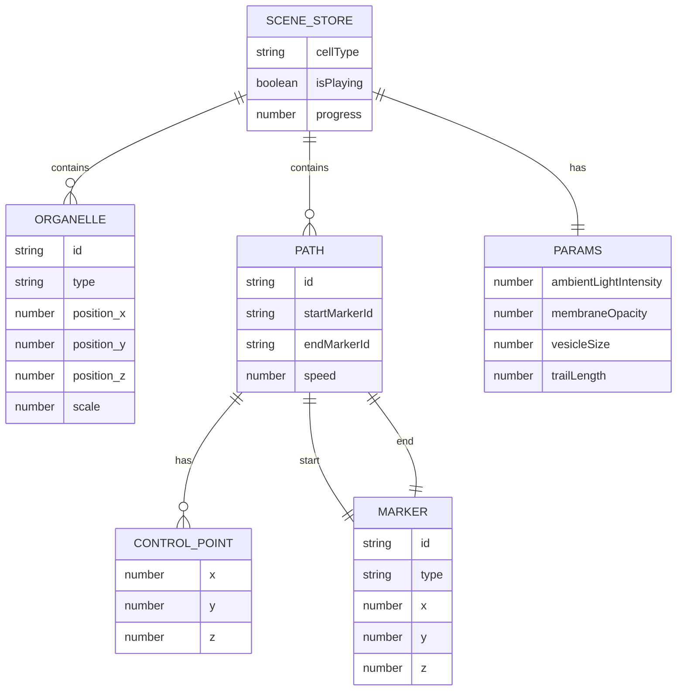

## 1. 架构设计



## 2. 技术描述
- **前端框架**：React@18 + TypeScript
- **构建工具**：Vite
- **3D渲染**：three, @react-three/fiber, @react-three/drei, @react-three/postprocessing
- **状态管理**：zustand
- **UI组件**：原生React + CSS，无额外UI库
- **其他依赖**：uuid（唯一标识）、dat.gui（可选调试用）

## 3. 路由定义
| 路由 | 用途 |
|------|------|
| / | 主应用页面，包含3D场景和控制面板 |

## 4. API定义
纯前端应用，无后端API。本地文件导出使用Blob + URL.createObjectURL实现。

导出配置数据结构：
```typescript
interface ExportConfig {
  cellType: 'default' | 'liver' | 'neuron' | 'muscle';
  organelles: Array<{
    id: string;
    type: 'nucleus' | 'mitochondria' | 'er';
    position: [number, number, number];
    scale: number;
  }>;
  paths: Array<{
    id: string;
    startPoint: [number, number, number];
    endPoint: [number, number, number];
    controlPoints: Array<[number, number, number]>;
    speed: number;
  }>;
  params: {
    ambientLightIntensity: number;
    membraneOpacity: number;
    vesicleSize: number;
    trailLength: number;
  };
}
```

## 5. 数据模型

### 5.1 数据模型定义



### 5.2 Zustand Store 状态定义
```typescript
interface SceneState {
  cellType: 'default' | 'liver' | 'neuron' | 'muscle';
  organelles: Organelle[];
  paths: Path[];
  activePathId: string | null;
  isPlaying: boolean;
  progress: number;
  params: SceneParams;
  updateOrganelle: (id: string, data: Partial<Organelle>) => void;
  addPath: (start: Vec3, end: Vec3) => void;
  removePath: (id: string) => void;
  setCellType: (type: CellType) => void;
  updateParams: (params: Partial<SceneParams>) => void;
  setPlaying: (playing: boolean) => void;
  setProgress: (progress: number) => void;
  resetScene: () => void;
  exportConfig: () => ExportConfig;
}
```

## 6. 项目文件结构

```
src/
├── App.tsx                    # 根组件，组合Scene和Panel
├── store/
│   └── sceneStore.ts          # Zustand全局状态管理
├── components/
│   ├── Scene.tsx              # 3D场景容器(Canvas)
│   ├── Panel.tsx              # 右侧控制面板
│   ├── cell/
│   │   ├── CellMembrane.tsx   # 细胞膜组件
│   │   ├── Nucleus.tsx        # 细胞核组件
│   │   ├── Mitochondria.tsx   # 线粒体组件
│   │   └── EndoplasmicReticulum.tsx  # 内质网组件
│   ├── transport/
│   │   ├── PathCurve.tsx      # 路径曲线组件
│   │   ├── Vesicle.tsx        # 囊泡组件(含尾迹)
│   │   └── Marker.tsx         # Marker标记点
│   └── panel/
│       ├── PresetTab.tsx      # 预设选择标签页
│       ├── PathTab.tsx        # 路径编辑标签页
│       ├── ParamsTab.tsx      # 参数调整标签页
│       └── Slider.tsx         # 通用滑块组件
├── types/
│   └── index.ts               # TypeScript类型定义
├── utils/
│   ├── pathUtils.ts           # 路径生成工具函数
│   └── exportUtils.ts         # 导出工具函数
└── constants/
    └── presets.ts             # 细胞器预设配置
```

**文件调用关系与数据流向**：
1. App.tsx → 读取store → 将状态传递给Scene和Panel
2. Panel.tsx → 用户操作 → 调用store action → 更新状态
3. Scene.tsx → 订阅store → 响应状态变化 → 重新渲染3D对象
4. sceneStore.ts → 集中管理所有状态 → 通知订阅者更新
5. PathCurve → 使用pathUtils生成CatmullRom曲线
6. Vesicle → 读取paths数据 → 每帧更新位置 → 驱动动画
7. ParamsTab/Slider → 修改params → store → Scene实时调整
