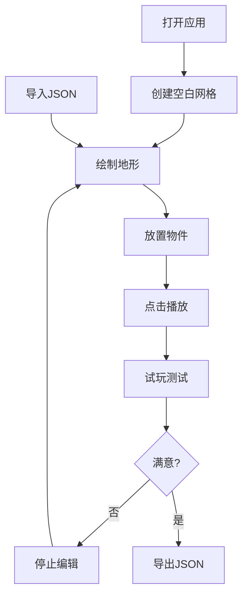

## 1. 产品概述
2D平台跳跃关卡编辑器，为独立游戏开发者提供快速设计关卡地形、放置敌人和机关的可视化工具，并支持实时测试跳跃手感与碰撞逻辑。
- 目标用户：独立游戏开发者、关卡设计师、像素游戏爱好者
- 核心价值：降低关卡设计门槛，提供即时反馈，加速游戏原型迭代

## 2. 核心功能

### 2.1 功能模块
1. **地形网格编辑器**：8x12网格区域绘制，支持三种地形主题切换，快捷键快速填充/清空
2. **物件放置与图层管理**：拖拽放置玩家出生点、尖刺陷阱、移动平台、金币，支持选中微调与删除
3. **实时物理模拟与试玩**：基于Canvas的物理引擎，WASD/方向键控制，60FPS稳定运行
4. **关卡序列化与导出**：JSON格式导入导出，支持复制到剪贴板

### 2.2 页面详情
| 页面名称 | 模块名称 | 功能描述 |
|-----------|-------------|---------------------|
| 主编辑页 | 左侧工具面板 | 280px宽度，深色背景，工具按钮带SVG图标，悬停高亮 |
| 主编辑页 | 中央网格画布 | 最小宽度600px，#1a1a1a背景，1px浅灰网格线，支持点击绘制 |
| 主编辑页 | 顶部操作栏 | 半透明背景，模糊效果，包含播放/停止、导出、导入按钮 |
| 主编辑页 | 右侧预览区域 | 显示导出的JSON字符串，提供复制按钮 |

## 3. 核心流程
1. 用户打开应用，默认创建空白8x12网格
2. 用户选择地形主题，点击网格绘制地形，使用G/D快捷键快速编辑
3. 用户从左侧面板拖拽物件到网格中放置，右键删除不需要的物件
4. 点击播放按钮，进入试玩模式，使用WASD/方向键控制角色测试关卡
5. 点击停止按钮返回编辑模式，继续调整关卡
6. 点击导出按钮生成JSON，复制或保存关卡数据
7. 点击导入按钮，粘贴JSON数据恢复之前的关卡

## 4. 用户界面设计

### 4.1 设计风格
- **主色调**：深色主题，背景#1a1a1a，面板#2d2d2d，操作栏rgba(0,0,0,0.6)
- **强调色**：草地绿(#4ade80)、石砖灰(#9ca3af)、泥土棕(#92400e)、玩家蓝(#3b82f6)、陷阱红(#ef4444)、平台橙(#f97316)、金币黄(#fbbf24)
- **按钮样式**：播放/停止为渐变圆形，导出/导入为矩形按钮，悬停亮度提升20%，点击缩放反馈
- **字体**：等宽字体（如JetBrains Mono），适合代码和数据展示
- **布局风格**：三栏式布局，左侧工具面板、中央画布、右侧JSON预览

### 4.2 页面设计概述
| 页面名称 | 模块名称 | UI元素 |
|-----------|-------------|-------------|
| 主编辑页 | 工具面板 | 地形主题选择器、物件拖拽项、操作说明，圆角8px，SVG白色图标 |
| 主编辑页 | 网格画布 | 8x12网格单元，点击切换填充/空白，网格线1px#333，物件可选中拖拽 |
| 主编辑页 | 操作栏 | 半透明毛玻璃效果，播放(绿)/停止(红)圆形按钮，导出(蓝)/导入(紫)矩形按钮 |
| 主编辑页 | JSON预览 | 代码块样式展示JSON，复制按钮，导入时的文本输入框 |

### 4.3 响应性
- 桌面端优先设计，Canvas画布最小宽度600px
- 右侧JSON预览区域可折叠
- 支持窗口大小调整，Canvas自适应缩放

### 4.4 交互体验
- 网格绘制时悬停高亮效果
- 物件拖拽时半透明预览
- 播放按钮点击时缩放动画
- 物理模拟流畅60FPS
- 键盘快捷键即时响应
