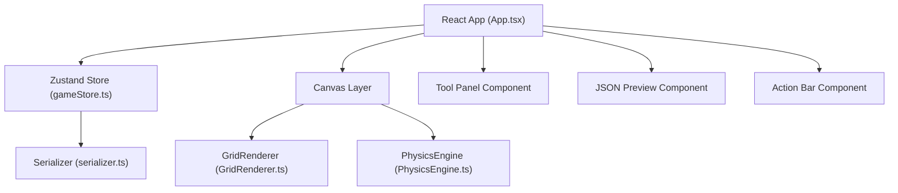

## 1. 架构设计



## 2. 技术描述
- **前端框架**：React@18 + TypeScript
- **构建工具**：Vite@5
- **状态管理**：zustand@4
- **绘图引擎**：Canvas 2D API
- **其他依赖**：uuid（物件唯一标识）、@types/react、@types/react-dom

## 3. 文件结构
```
auto122/
├── package.json
├── index.html
├── tsconfig.json
├── vite.config.js
└── src/
    ├── main.tsx           # React入口，挂载App组件
    ├── App.tsx            # 主布局组件
    ├── store/
    │   └── gameStore.ts   # Zustand全局状态管理
    ├── canvas/
    │   └── GridRenderer.ts # 网格与物件渲染器
    ├── physics/
    │   └── PhysicsEngine.ts # 物理引擎（重力、碰撞、玩家控制）
    └── utils/
        └── serializer.ts  # 关卡序列化与反序列化
```

## 4. 核心数据模型

### 4.1 状态类型定义
```typescript
// 地形主题类型
type TerrainTheme = 'grass' | 'stone' | 'dirt';

// 物件类型
type ObjectType = 'spawn' | 'spike' | 'movingPlatform' | 'coin';

// 网格单元
interface GridCell {
  filled: boolean;
  theme: TerrainTheme;
}

// 游戏物件
interface GameObject {
  id: string;
  type: ObjectType;
  gridX: number;
  gridY: number;
  // 移动平台额外属性
  moveRange?: number;
  moveSpeed?: number;
}

// 玩家状态
interface PlayerState {
  x: number;
  y: number;
  vx: number;
  vy: number;
  width: number;
  height: number;
  onGround: boolean;
}

// 游戏状态
interface GameState {
  grid: GridCell[][]; // 12行 x 8列
  objects: GameObject[];
  selectedTool: TerrainTheme | ObjectType | null;
  selectedObjectId: string | null;
  isPlaying: boolean;
  player: PlayerState;
  exportedJson: string;
}
```

### 4.2 导出JSON格式
```json
{
  "grid": [
    [{"filled": false, "theme": "grass"}, ...],
    ...
  ],
  "objects": [
    {"id": "uuid", "type": "spawn", "gridX": 1, "gridY": 10},
    ...
  ]
}
```

## 5. 模块职责

### 5.1 gameStore.ts
- 管理网格数据（8列x12行二维数组）
- 管理物件列表（独立数组存储）
- 管理编辑模式、播放状态
- 提供绘制、放置、删除、选择等操作方法
- 提供导出/导入关卡的方法

### 5.2 GridRenderer.ts
- Canvas绘制地形（根据主题色填充网格）
- 绘制网格线（1px浅灰色）
- 绘制各类物件（玩家出生点、尖刺、移动平台、金币）
- 绘制玩家角色（16x16像素方块）
- 提供drawFrame方法供主循环调用

### 5.3 PhysicsEngine.ts
- 独立类，包含重力计算（GRAVITY = 0.5）
- 碰撞检测（AABB碰撞，网格碰撞检测）
- 玩家输入处理（WASD/方向键）
- requestAnimationFrame独立循环
- 输出玩家位置供渲染
- 与编辑状态完全分离

### 5.4 serializer.ts
- exportLevel: 将grid和objects序列化为JSON字符串
- importLevel: 解析JSON并校验格式，更新store状态

## 6. 性能优化
- 物理引擎固定时间步长（16.67ms = 60FPS）
- Canvas分层绘制，仅重绘变化区域
- 物件选中状态使用脏标记
- 键盘事件防抖处理
- requestAnimationFrame循环内避免GC
