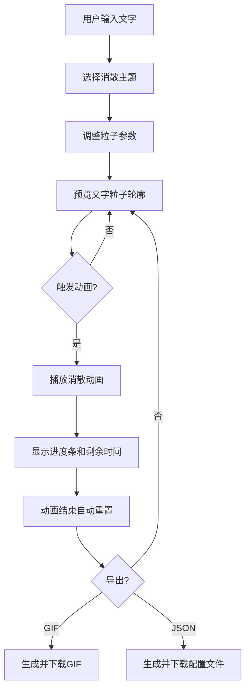

## 1. 产品概述

在线交互式文字粒子消散动画编辑器，用户可输入文字并选择火焰、冰雪、沙尘、花瓣四种消散主题，实时预览粒子消散动画效果，调整各项参数，并导出GIF动图或JSON配置文件。

- 主要目的：为设计师、内容创作者提供便捷的文字粒子特效生成工具，无需专业设计软件即可创建精美的文字消散动画
- 目标用户：设计师、内容创作者、短视频制作者、前端开发者

## 2. 核心功能

### 2.1 功能模块

1. **文字输入模块**：文本输入框，支持中/英文字符，带字符数限制和实时统计
2. **主题选择模块**：四种消散主题卡片（火焰、冰雪、沙尘、花瓣），选中状态高亮，带微缩预览动画
3. **参数调节模块**：三个滑块控件（粒子大小、消散速度、方向随机性），实时响应调整
4. **动画预览模块**：Canvas渲染区，实时预览粒子动画，支持点击触发/暂停
5. **动画控制模块**：播放/暂停/重置按钮，进度条显示，键盘快捷键支持
6. **导出模块**：GIF导出和JSON配置导出两种方式

### 2.2 页面详情

| 页面名称 | 模块名称 | 功能描述 |
|----------|----------|----------|
| 主编辑页面 | 顶部导航栏 | 应用名称展示、导出按钮（GIF/JSON） |
| 主编辑页面 | 左侧控制面板 | 文字输入、主题选择、参数滑块、控制按钮 |
| 主编辑页面 | 右侧预览区域 | Canvas粒子动画预览、进度条、剩余时间显示 |

## 3. 核心流程

用户输入文字 → 选择消散主题 → 调整粒子参数（可选）→ 预览区实时显示文字粒子轮廓 → 点击触发消散动画 → 动画播放完毕自动重置 → 导出GIF或JSON配置

## 4. 用户界面设计

### 4.1 设计风格

- **主色调**：深色主题，背景色 #1a1a2e，导航栏渐变 #16213e → #0f3460
- **主题色**：#e94560（玫红色），悬停态 #ff6b81
- **辅助色**：四种主题各自配色（火焰红橙、冰雪蓝白、沙尘黄褐、花瓣粉）
- **按钮样式**：圆角矩形，主题色背景，0.2s过渡动画
- **字体**：使用现代无衬线字体，层次分明
- **布局风格**：双栏布局（左侧控制面板+右侧预览区），顶部固定导航栏
- **卡片样式**：12px圆角，1px边框，选中态放大1.05倍

### 4.2 页面设计概览

| 页面名称 | 模块名称 | UI元素 |
|----------|----------|--------|
| 主编辑页面 | 顶部导航栏 | 渐变背景+毛玻璃效果，左侧应用名，右侧导出按钮组 |
| 主编辑页面 | 文字输入框 | 深色边框，聚焦时主题色发光效果，字符计数显示 |
| 主编辑页面 | 主题卡片 | 2x2网格，微缩粒子动画预览，选中态边框+放大效果 |
| 主编辑页面 | 参数滑块 | 白色标签，深灰轨道，主题色圆形滑块按钮 |
| 主编辑页面 | 控制按钮 | 播放（主题色背景）、重置（灰色边框） |
| 主编辑页面 | 预览区Canvas | 黑色背景，抗锯齿+发光效果 |
| 主编辑页面 | 进度条 | 顶部细线，主题色随变化 |

### 4.3 响应式设计

- **桌面端（≥768px）**：双栏布局，左侧控制面板320px固定宽度，右侧预览区自适应
- **移动端（<768px）**：控制面板折叠为底部栏，高度自适应，预览区占据全屏
- **触控优化**：按钮最小44px点击区域，滑块增大触控区域

### 4.4 交互动效

- 所有控件悬停/点击过渡：0.2s ease
- 输入框聚焦：边框发光 + 微放大
- 主题卡片选中：1.05倍缩放 + 主题色边框
- 粒子消散：按主题特效飞散，带发光/模糊等视觉效果
