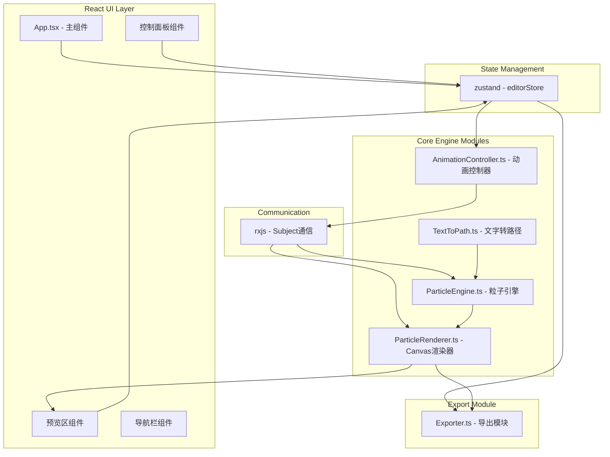

## 1. 架构设计



## 2. 技术描述

- **前端框架**：React 18 + TypeScript
- **构建工具**：Vite 5
- **状态管理**：zustand（轻量级状态管理）
- **响应式编程**：rxjs（模块间通信，Subject模式）
- **图形渲染**：HTML5 Canvas 2D API（requestAnimationFrame驱动）
- **GIF导出**：gifshot（浏览器端GIF生成库）
- **项目初始化**：使用 vite-init 创建 react-ts 模板

## 3. 文件结构

```
d:\P\tasks\auto123\
├── package.json              # 项目依赖配置
├── index.html                # 入口HTML
├── vite.config.js            # Vite配置
├── tsconfig.json             # TypeScript配置
├── src/
│   ├── main.tsx              # React入口
│   ├── App.tsx               # 主组件
│   ├── ParticleEngine.ts     # 粒子引擎模块
│   ├── ParticleRenderer.ts   # Canvas渲染模块
│   ├── AnimationController.ts# 动画控制模块
│   ├── TextToPath.ts         # 文字路径解析模块
│   ├── Exporter.ts           # 导出模块
│   └── stores/
│       └── editorStore.ts    # zustand状态仓库
└── .trae/documents/
    ├── PRD.md                # 产品需求文档
    └── TechArch.md           # 技术架构文档
```

## 4. 核心模块职责

### 4.1 ParticleEngine.ts（粒子引擎）
- 输入：文字点阵坐标、主题配置、粒子参数
- 输出：每帧粒子状态数组（位置、速度、颜色、透明度、大小、形状）
- 功能：
  - 根据笔画复杂度计算粒子数量（1000-3000，上限5000）
  - 粒子初始化（位置、初始速度按主题方向）
  - 每帧更新粒子物理状态（位置、速度衰减、生命周期）
  - 应用方向随机性参数

### 4.2 ParticleRenderer.ts（渲染器）
- 输入：粒子数组、主题配置、Canvas上下文
- 功能：
  - 清屏 + 背景渐变过渡
  - 粒子绘制（抗锯齿、发光效果）
  - 主题特效叠加：
    - 火焰：红橙黄渐变 + 模糊光晕
    - 冰雪：蓝白半透明棱角碎片 + 闪烁
    - 沙尘：黄褐色小点 + 飘散轨迹
    - 花瓣：粉色渐变椭圆 + 旋转动画

### 4.3 AnimationController.ts（控制器）
- 管理动画状态：idle / playing / paused / finished
- 播放速度倍率：0.5x ~ 3x
- 触发方式：点击触发 / 自动循环
- 通过 rxjs Subject 广播状态和帧事件
- 键盘快捷键：空格（暂停/继续）、R（重置）

### 4.4 TextToPath.ts（文字转路径）
- 将文本绘制到离屏Canvas
- 采样像素生成点阵坐标
- 支持字体大小、粗体、斜体配置
- 笔画密度检测（用于粒子数量调整）

### 4.5 Exporter.ts（导出模块）
- GIF导出：使用gifshot录制帧序列，1920x1080分辨率
- JSON导出：序列化完整配置（文本、主题、粒子参数、动画设置）

### 4.6 editorStore.ts（状态仓库）
使用 zustand 管理全局状态：
```typescript
interface EditorState {
  // 文字配置
  text: string;
  fontSize: number;
  fontWeight: 'normal' | 'bold';
  fontStyle: 'normal' | 'italic';
  
  // 主题配置
  theme: 'fire' | 'ice' | 'sand' | 'petal';
  
  // 粒子参数
  particleSize: number;      // 2-8px
  dissolveSpeed: number;     // 0.5-5s
  directionRandomness: number; // 0-100%
  
  // 动画状态
  animationState: 'idle' | 'playing' | 'paused' | 'finished';
  playbackRate: number;      // 0.5-3x
  progress: number;          // 0-1
  remainingTime: number;     // seconds
  
  // 导出状态
  exportProgress: number;
  isExporting: boolean;
  
  // Actions
  setText: (t: string) => void;
  setTheme: (t: Theme) => void;
  setParticleSize: (s: number) => void;
  setDissolveSpeed: (s: number) => void;
  setDirectionRandomness: (r: number) => void;
  play: () => void;
  pause: () => void;
  reset: () => void;
  setPlaybackRate: (r: number) => void;
  exportGIF: () => Promise<void>;
  exportJSON: () => void;
}
```

## 5. 性能优化策略

1. **Canvas渲染优化**
   - 使用 requestAnimationFrame 驱动，避免 setInterval
   - 粒子数量上限5000，保持30FPS+
   - 离屏Canvas预处理文字路径
   - 合理使用 Canvas 状态保存/恢复（save/restore）

2. **粒子更新优化**
   - TypedArray存储粒子数据（Float32Array）
   - 每帧过滤已死亡粒子，减少遍历开销
   - 对象池复用粒子对象，避免GC压力

3. **导出优化**
   - GIF录制限定帧率（15-24fps）
   - 按需缩放至1920x1080
   - Web Worker处理GIF编码（如gifshot支持）

## 6. 主题配色规范

| 主题 | 主色 | 粒子渐变色 | 背景过渡色 |
|------|------|-----------|-----------|
| 火焰 | #e94560 | #ff0000 → #ff6600 → #ffcc00 | 深红色→透明 |
| 冰雪 | #4fc3f7 | #ffffff → #b3e5fc → #4fc3f7 | 淡蓝色→透明 |
| 沙尘 | #d4a574 | #8b6914 → #d4a574 → #f5deb3 | 米黄色→透明 |
| 花瓣 | #f48fb1 | #ffcdd2 → #f48fb1 → #e91e63 | 浅粉色→透明 |
