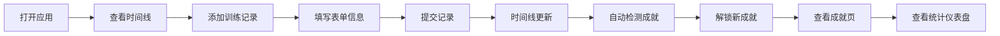

## 1. 产品概述

健身训练里程碑追踪与成就可视化应用，帮助用户记录训练、追踪进度、解锁成就，通过可视化反馈激励用户长期坚持健身。

- 解决问题：健身难以长期坚持，缺乏可视化成果展示和激励反馈
- 目标用户：有健身需求、需要动力和成就感的运动爱好者
- 产品价值：通过里程碑时间线、成就系统和数据统计，提供持续的正向激励

## 2. 核心功能

### 2.1 用户角色

| 角色 | 注册方式 | 核心权限 |
|------|----------|----------|
| 普通用户 | 本地使用，无需注册 | 添加训练记录、查看时间线、查看成就、查看统计数据 |

### 2.2 功能模块

1. **里程碑时间线页**：训练记录时间线展示，添加新训练记录
2. **成就展示页**：成就卡片网格，已解锁/未解锁状态展示
3. **统计仪表盘页**：月度训练时长柱状图，训练类型分布饼图

### 2.3 页面详情

| 页面名称 | 模块名称 | 功能描述 |
|----------|----------|----------|
| 里程碑时间线 | 时间线列表 | 按日期倒序展示所有训练记录卡片，含日期、类型、时长、感想 |
| 里程碑时间线 | 添加记录表单 | 输入训练类型、时长、日期、感想，Ctrl+Enter 快捷提交 |
| 成就展示 | 成就卡片网格 | 自适应列数展示所有成就，已解锁发光边框，未解锁灰色锁定 |
| 统计仪表盘 | 月度柱状图 | 展示当月每日训练时长，支持月份切换 |
| 统计仪表盘 | 类型饼图 | 展示当月各训练类型占比 |
| 导航栏 | 顶部导航 | 三个页面链接，当前页高亮，毛玻璃效果 |

## 3. 核心流程

用户打开应用 → 查看训练时间线 → 点击添加记录 → 填写训练信息 → 提交 → 时间线即时更新 → 系统自动检测并解锁成就 → 用户查看成就页 → 用户切换到统计页查看数据

## 4. 用户界面设计

### 4.1 设计风格

- **主色调**：深灰蓝背景 (#1a1d23)，亮橙高亮 (#ff6b35)
- **训练类型颜色**：力量训练红 (#e74c3c)，有氧蓝 (#3498db)，瑜伽绿 (#2ecc71)，其他紫 (#9b59b6)
- **卡片背景**：卡片灰 (#2a2d35)，深灰 (#23262e)
- **导航栏**：半透明毛玻璃效果，背景 rgba(26,29,35,0.8)，模糊 10px
- **字体**：现代无衬线字体，清晰可读
- **卡片样式**：圆角 12px，悬停上浮 3px 增强阴影
- **图标**：使用 emoji 作为成就图标

### 4.2 页面设计概览

| 页面名称 | 模块名称 | UI 元素 |
|----------|----------|---------|
| 时间线页 | 时间轴 | 垂直时间轴，左侧彩色圆点标记训练类型 |
| 时间线页 | 记录卡片 | 圆角卡片，交错淡入动画，悬停上浮效果 |
| 时间线页 | 添加表单 | 输入框、下拉选择、文本域，快捷提交提示 |
| 成就页 | 卡片网格 | 自适应网格布局，最小 250px，已解锁发光边框 |
| 成就页 | 成就卡片 | emoji 图标，成就名称，解锁条件描述 |
| 统计页 | 柱状图 | 亮橙色渐变，月度每日训练时长 |
| 统计页 | 饼图 | 按训练类型着色，类型分布占比 |
| 导航栏 | 导航项 | 当前页亮橙下划线，悬停文字变色 |

### 4.3 响应式

- 桌面端为主要设计基准
- 屏幕宽度小于 768px 时：时间线卡片全宽，统计图表上下排列
- 移动端适配触摸操作

### 4.4 动画效果

- 页面进入淡入动画 0.3 秒
- 卡片交错延迟加载 0.1 秒递增
- 卡片悬停上浮 3px + 阴影增强
- 导航项平滑过渡
