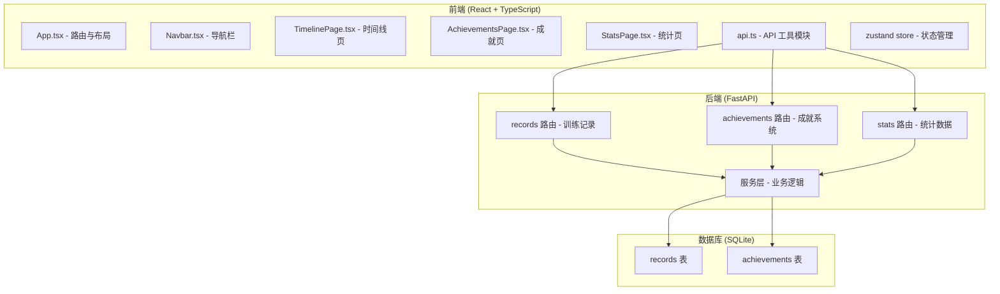
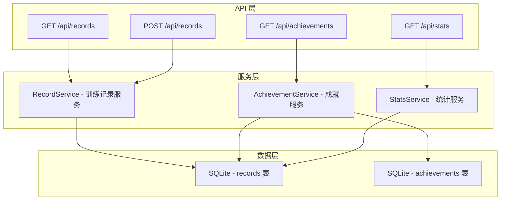
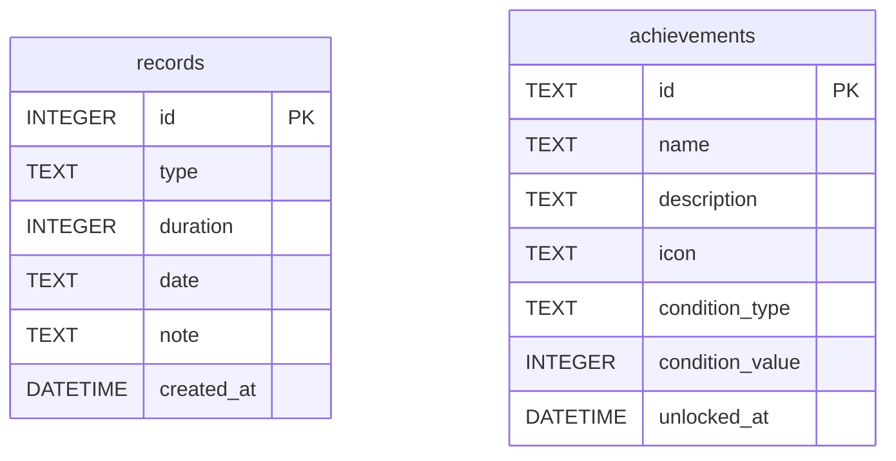

## 1. 架构设计



## 2. 技术描述

- **前端**：React 18 + TypeScript + Vite
- **状态管理**：zustand
- **路由**：react-router-dom v6
- **HTTP 客户端**：axios
- **图表库**：recharts（按需加载）
- **日期处理**：dayjs
- **构建工具**：Vite
- **后端**：FastAPI (Python)
- **数据库**：SQLite
- **样式方案**：CSS Modules / 内联样式 (dark theme)

## 3. 路由定义

| 路由 | 页面组件 | 用途 |
|------|----------|------|
| / | TimelinePage | 里程碑时间线首页 |
| /timeline | TimelinePage | 训练记录时间线 |
| /achievements | AchievementsPage | 成就展示 |
| /stats | StatsPage | 统计仪表盘 |

## 4. API 定义

### 4.1 类型定义

```typescript
interface TrainingRecord {
  id: number;
  type: 'strength' | 'cardio' | 'yoga' | 'other';
  typeName: string;
  duration: number;
  date: string;
  note: string;
}

interface Achievement {
  id: string;
  name: string;
  description: string;
  icon: string;
  unlocked: boolean;
  unlockedAt?: string;
  condition: string;
}

interface MonthStats {
  month: string;
  dailyStats: { date: string; duration: number }[];
  typeStats: { type: string; typeName: string; duration: number; color: string }[];
  totalDuration: number;
  totalRecords: number;
}
```

### 4.2 接口列表

| 方法 | 路径 | 说明 |
|------|------|------|
| GET | /api/records | 获取所有训练记录 |
| POST | /api/records | 添加新训练记录 |
| GET | /api/achievements | 获取成就列表及解锁状态 |
| GET | /api/stats?month=YYYY-MM | 获取指定月份统计数据 |

## 5. 服务器架构图



## 6. 数据模型

### 6.1 ER 图



### 6.2 DDL 语句

```sql
-- 训练记录表
CREATE TABLE IF NOT EXISTS records (
    id INTEGER PRIMARY KEY AUTOINCREMENT,
    type TEXT NOT NULL CHECK(type IN ('strength', 'cardio', 'yoga', 'other')),
    duration INTEGER NOT NULL CHECK(duration > 0),
    date TEXT NOT NULL,
    note TEXT DEFAULT '',
    created_at DATETIME DEFAULT CURRENT_TIMESTAMP
);

-- 成就表
CREATE TABLE IF NOT EXISTS achievements (
    id TEXT PRIMARY KEY,
    name TEXT NOT NULL,
    description TEXT NOT NULL,
    icon TEXT NOT NULL,
    condition_type TEXT NOT NULL,
    condition_value INTEGER NOT NULL,
    unlocked_at DATETIME
);

-- 初始成就数据
INSERT OR IGNORE INTO achievements (id, name, description, icon, condition_type, condition_value)
VALUES 
    ('first_workout', '初出茅庐', '完成第一次训练', '🌱', 'total_records', 1),
    ('week_streak', '坚持一周', '连续 7 天训练', '🔥', 'streak_days', 7),
    ('all_rounder', '全能选手', '完成 5 种不同类型训练', '💪', 'unique_types', 5),
    ('hundred_minutes', '百分钟俱乐部', '累计训练 100 分钟', '⏱️', 'total_duration', 100),
    ('thousand_minutes', '百炼成钢', '累计训练 1000 分钟', '🏆', 'total_duration', 1000),
    ('ten_workouts', '训练达人', '完成 10 次训练', '🎯', 'total_records', 10),
    ('thirty_day_streak', '月度战士', '连续 30 天训练', '⚡', 'streak_days', 30);
```

## 7. 前端目录结构

```
src/
├── App.tsx              # 路由和整体布局
├── main.tsx             # 入口文件
├── components/
│   └── Navbar.tsx       # 顶部导航栏
├── pages/
│   ├── TimelinePage.tsx    # 里程碑时间线页
│   ├── AchievementsPage.tsx # 成就展示页
│   └── StatsPage.tsx     # 统计仪表盘页
├── utils/
│   └── api.ts           # API 工具模块
├── store/
│   └── useStore.ts      # zustand 状态管理
└── types/
    └── index.ts         # TypeScript 类型定义
```

## 8. 性能优化策略

1. **代码分割**：使用 React.lazy 和 Suspense 实现路由级代码分割
2. **图表按需加载**：recharts 库动态导入，仅在统计页加载
3. **API 缓存**：使用 zustand 缓存数据，避免重复请求
4. **防抖/节流**：表单输入和月份切换优化
5. **虚拟列表**：训练记录过多时考虑虚拟滚动
