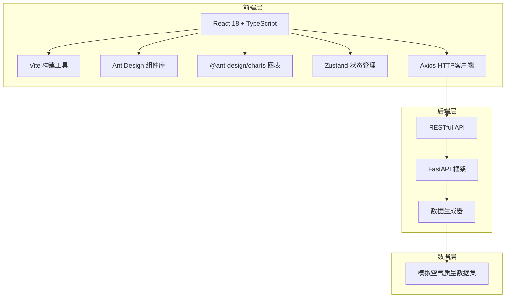
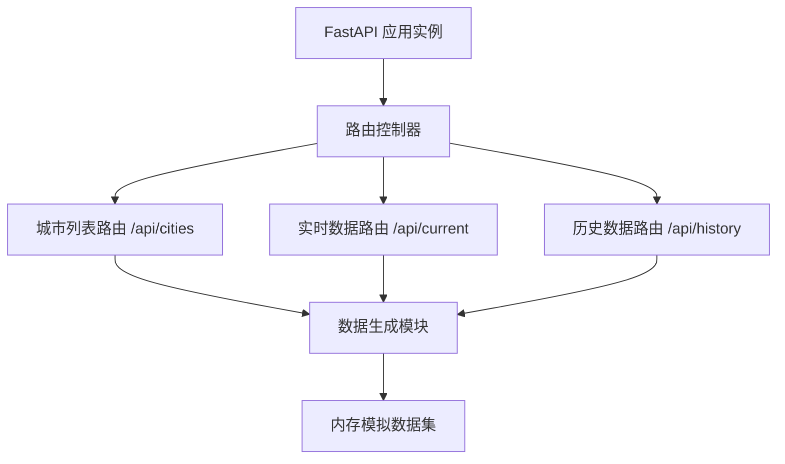
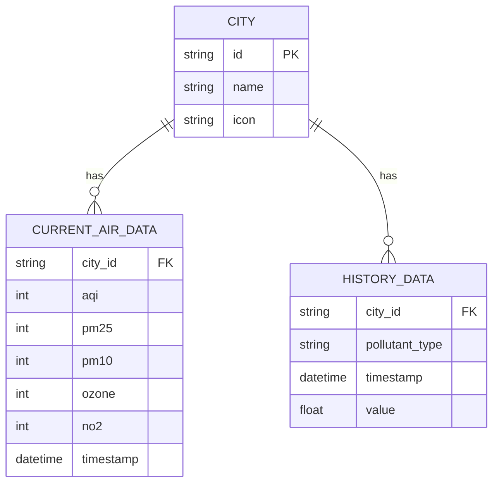

## 1. 架构设计



## 2. 技术说明

- **前端框架**：React@18 + TypeScript@5
- **构建工具**：Vite@5
- **UI组件库**：antd@5
- **图表库**：@ant-design/charts
- **状态管理**：zustand@4
- **HTTP客户端**：axios@1
- **日期处理**：dayjs@1
- **后端框架**：FastAPI@0.110
- **后端服务器**：uvicorn
- **数据处理**：pandas
- **数据来源**：模拟数据生成器

## 3. 路由定义

| 路由 | 用途 |
|-----|------|
| / | 仪表盘主页面，展示所有城市卡片和对比功能 |

## 4. API 定义

### TypeScript 类型定义

```typescript
interface City {
  id: string;
  name: string;
  icon: string;
}

interface PollutantData {
  pm25: number;
  pm10: number;
  ozone: number;
  no2: number;
}

interface CurrentAirData extends PollutantData {
  cityId: string;
  aqi: number;
  timestamp: string;
}

interface HistoryDataPoint {
  timestamp: string;
  value: number;
}

interface HistoryData {
  cityId: string;
  pm25: HistoryDataPoint[];
  pm10: HistoryDataPoint[];
  ozone: HistoryDataPoint[];
  no2: HistoryDataPoint[];
}
```

### 后端 API 接口

| 方法 | 路径 | 描述 |
|-----|------|------|
| GET | /api/cities | 获取城市列表 |
| GET | /api/current/{city_id} | 获取指定城市实时数据 |
| GET | /api/current | 获取所有城市实时数据 |
| GET | /api/history/{city_id} | 获取指定城市过去7天历史数据 |

### 响应示例

**GET /api/cities**
```json
{
  "cities": [
    { "id": "beijing", "name": "北京", "icon": "🏯" },
    { "id": "shanghai", "name": "上海", "icon": "🏙️" }
  ]
}
```

**GET /api/current/{city_id}**
```json
{
  "cityId": "beijing",
  "aqi": 78,
  "pm25": 45,
  "pm10": 82,
  "ozone": 65,
  "no2": 38,
  "timestamp": "2026-06-20T10:00:00"
}
```

## 5. 服务器架构图



## 6. 数据模型

### 6.1 数据模型定义



### 6.2 AQI 等级规则

| AQI 范围 | 等级 | 颜色 |
|---------|------|------|
| 0-50 | 优 | #00e400 |
| 51-100 | 良 | #ffff00 |
| 101-150 | 轻度污染 | #ff7e00 |
| 151-200 | 中度污染 | #ff0000 |
| 201-300 | 重度污染 | #99004c |
